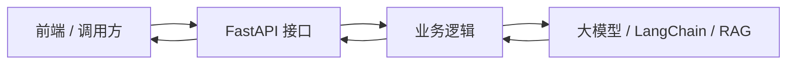

# FastAPI 基础与请求处理详解

## 1. FastAPI 是什么

FastAPI 是一个用于构建 API 的 Python Web 框架。它的核心特点是：

1. 使用 Python 类型提示声明请求参数和返回数据。
2. 自动做数据校验。
3. 自动生成 OpenAPI 规范。
4. 自动提供 Swagger UI 文档页面。
5. 原生支持异步函数。
6. 适合快速构建后端服务、AI 应用接口、内部工具接口、微服务接口。

在 AI Agent 和 RAG 项目中，FastAPI 常常扮演“服务入口”的角色：



你之后做 Naive RAG 系统时，大概率会写出这样的接口：

```python
@app.post("/chat")
def chat(request: ChatRequest):
    answer = rag_chain.invoke(request.question)
    return {"answer": answer}
```

所以第 1 天学 FastAPI，不是孤立地学 Web 框架，而是在为后面的 AI 应用工程化打基础。

## 2. 最小 FastAPI 应用

最小可运行代码如下：

```python
from fastapi import FastAPI

app = FastAPI()


@app.get("/")
def read_root():
    return {"message": "Hello FastAPI"}
```

保存为 `main.py` 后启动：

```powershell
uvicorn main:app --reload
```

命令含义：

1. `uvicorn`：ASGI 服务器，用来运行 FastAPI 应用。
2. `main`：Python 文件名 `main.py`，不写 `.py`。
3. `app`：文件中的 FastAPI 应用对象变量名。
4. `--reload`：开发模式下自动重启，代码变化后自动生效。

启动后访问：

1. `http://127.0.0.1:8000/`
2. `http://127.0.0.1:8000/docs`
3. `http://127.0.0.1:8000/redoc`
4. `http://127.0.0.1:8000/openapi.json`

其中最常用的是 `/docs`，它会展示 Swagger UI，可以直接在页面上测试接口。

## 3. 请求处理的核心模型

一个 API 请求通常由几部分组成：

```text
GET http://127.0.0.1:8000/items/100?skip=0&limit=10
```

拆开看：

1. `GET`：HTTP 方法。
2. `/items/100`：路径。
3. `100`：路径参数。
4. `?skip=0&limit=10`：查询参数。
5. 请求体：GET 通常没有请求体，POST/PUT/PATCH 常见。
6. 请求头：例如认证信息、内容类型。

FastAPI 的函数参数来源通常这样判断：

1. 参数名出现在路径中：路径参数。
2. 参数是基础类型，并且没有出现在路径中：查询参数。
3. 参数是 Pydantic 模型：请求体。

示例：

```python
@app.put("/items/{item_id}")
def update_item(item_id: int, item: Item, notify: bool = False):
    ...
```

FastAPI 会判断：

1. `item_id` 出现在 `/items/{item_id}` 中，所以是路径参数。
2. `item: Item` 是 Pydantic 模型，所以来自 JSON 请求体。
3. `notify: bool = False` 是基础类型，且没有出现在路径中，所以是查询参数。

调用方式：

```text
PUT /items/1?notify=true
Content-Type: application/json

{
  "name": "Keyboard",
  "price": 199.0
}
```

## 4. 路由是什么

路由是“HTTP 方法 + URL 路径 + 处理函数”的绑定。

```python
@app.get("/")
def read_root():
    return {"message": "Hello FastAPI"}
```

这段代码的意思是：

1. 当请求方法是 `GET`。
2. 当请求路径是 `/`。
3. 就调用 `read_root()` 函数。
4. 函数返回的字典会被 FastAPI 转成 JSON 响应。

常见路由装饰器：

```python
@app.get("/items")
@app.post("/items")
@app.put("/items/{item_id}")
@app.patch("/items/{item_id}")
@app.delete("/items/{item_id}")
```

常见 HTTP 方法语义：

| 方法   | 常见语义           | 是否常带请求体 |
| ------ | ------------------ | -------------- |
| GET    | 查询资源           | 通常不带       |
| POST   | 创建资源或提交动作 | 常带           |
| PUT    | 整体更新资源       | 常带           |
| PATCH  | 局部更新资源       | 常带           |
| DELETE | 删除资源           | 通常不带       |

## 5. 路径参数

路径参数是 URL 路径的一部分。

```python
@app.get("/items/{item_id}")
def read_item(item_id: int):
    return {"item_id": item_id}
```

访问：

```text
GET /items/123
```

FastAPI 会把路径中的 `123` 传给函数参数 `item_id`。因为我们写了 `item_id: int`，FastAPI 会尝试把 `123` 转成整数。

如果访问：

```text
GET /items/abc
```

FastAPI 会发现 `abc` 不能转换成整数，于是返回参数校验错误。

路径参数适合表示资源标识：

1. `/users/1`
2. `/articles/100`
3. `/orders/20240601`
4. `/documents/rag-intro`

不要把筛选条件都塞到路径里。筛选、分页、排序通常更适合查询参数。

## 6. 查询参数

查询参数是 URL 中问号后的键值对。

```python
@app.get("/items")
def list_items(skip: int = 0, limit: int = 10):
    return {"skip": skip, "limit": limit}
```

访问：

```text
GET /items?skip=10&limit=5
```

FastAPI 会把 `skip=10` 传给 `skip`，把 `limit=5` 传给 `limit`。

因为代码中提供了默认值：

```python
skip: int = 0
limit: int = 10
```

所以这些查询参数是可选的。如果访问 `GET /items`，会使用默认值。

查询参数适合表示：

1. 分页：`skip`、`limit`、`page`、`page_size`
2. 搜索关键词：`q`
3. 排序：`sort_by`、`order`
4. 筛选：`category`、`status`
5. 开关：`include_deleted=true`

## 7. 可选查询参数

如果一个查询参数可以不传，可以写成：

```python
@app.get("/search")
def search_items(q: str | None = None):
    if q is None:
        return {"message": "No query"}
    return {"query": q}
```

含义：

1. `q: str | None` 表示 `q` 可以是字符串，也可以是 `None`。
2. `= None` 表示默认值是 `None`。
3. 不传 `q` 时，函数中的 `q` 就是 `None`。

## 8. 请求体

请求体通常用于 POST、PUT、PATCH 这类需要提交数据的请求。

例如创建商品：

```json
{
  "name": "Keyboard",
  "price": 199.0,
  "description": "Mechanical keyboard"
}
```

在 FastAPI 中，通常用 Pydantic 模型描述请求体。

```python
from pydantic import BaseModel


class Item(BaseModel):
    name: str
    price: float
    description: str | None = None
```

然后在路由函数中使用：

```python
@app.post("/items")
def create_item(item: Item):
    return {"message": "created", "item": item}
```

FastAPI 会自动完成：

1. 读取 JSON 请求体。
2. 按照 `Item` 模型校验字段。
3. 把校验后的数据转换成 `Item` 对象。
4. 把模型结构展示到 `/docs` 页面。

## 9. Pydantic 模型是什么

Pydantic 模型是用于描述数据结构和校验规则的 Python 类。

```python
class Item(BaseModel):
    name: str
    price: float
    is_offer: bool = False
```

这个模型表达了：

1. `name` 必须是字符串。
2. `price` 必须是浮点数。
3. `is_offer` 必须是布尔值。
4. `is_offer` 不传时默认为 `False`。

FastAPI 使用 Pydantic 模型做三件事：

1. 请求数据校验。
2. 数据类型转换。
3. 自动生成接口文档。

对于初学者，先记住一句话：

> 路由函数参数里出现 Pydantic 模型，通常表示这个参数来自请求体。

## 10. 返回 JSON

FastAPI 路由函数可以直接返回字典、列表、Pydantic 模型等。

```python
@app.get("/health")
def health_check():
    return {"status": "ok"}
```

FastAPI 会自动把 Python 对象序列化成 JSON。

初学阶段建议返回结构清晰的字典，例如：

```python
return {
    "success": True,
    "data": item,
    "message": "Item created",
}
```

## 11. 状态码和错误处理

默认情况下，FastAPI 成功响应通常返回 `200 OK`。如果创建资源，可以指定状态码：

```python
@app.post("/items", status_code=201)
def create_item(item: Item):
    return {"message": "created", "item": item}
```

常见状态码：

| 状态码 | 含义             |
| ------ | ---------------- |
| 200    | 请求成功         |
| 201    | 创建成功         |
| 204    | 成功但没有响应体 |
| 400    | 请求错误         |
| 401    | 未认证           |
| 403    | 无权限           |
| 404    | 资源不存在       |
| 422    | 请求参数校验失败 |
| 500    | 服务器内部错误   |

当资源不存在时，推荐抛出 `HTTPException`：

```python
from fastapi import HTTPException


@app.get("/items/{item_id}")
def read_item(item_id: int):
    item = fake_db.get(item_id)
    if item is None:
        raise HTTPException(status_code=404, detail="Item not found")
    return item
```

## 12. 完整示例：商品 API

```python
from fastapi import FastAPI, HTTPException
from pydantic import BaseModel

app = FastAPI(title="FastAPI Basic Demo")


class Item(BaseModel):
    name: str
    price: float
    description: str | None = None
    is_offer: bool = False


items_db: dict[int, Item] = {
    1: Item(name="Keyboard", price=199.0, description="Mechanical keyboard"),
    2: Item(name="Mouse", price=89.0),
}


@app.get("/")
def read_root():
    return {"message": "Hello FastAPI"}


@app.get("/health")
def health_check():
    return {"status": "ok"}


@app.get("/items")
def list_items(skip: int = 0, limit: int = 10):
    items = list(items_db.items())[skip : skip + limit]
    return {
        "skip": skip,
        "limit": limit,
        "total": len(items_db),
        "items": [{"id": item_id, **item.model_dump()} for item_id, item in items],
    }


@app.get("/items/{item_id}")
def read_item(item_id: int):
    item = items_db.get(item_id)
    if item is None:
        raise HTTPException(status_code=404, detail="Item not found")
    return {"id": item_id, **item.model_dump()}


@app.post("/items", status_code=201)
def create_item(item: Item):
    new_id = max(items_db.keys(), default=0) + 1
    items_db[new_id] = item
    return {"message": "created", "id": new_id, "item": item}


@app.put("/items/{item_id}")
def update_item(item_id: int, item: Item, notify: bool = False):
    if item_id not in items_db:
        raise HTTPException(status_code=404, detail="Item not found")
    items_db[item_id] = item
    return {"message": "updated", "id": item_id, "notify": notify, "item": item}


@app.delete("/items/{item_id}")
def delete_item(item_id: int):
    if item_id not in items_db:
        raise HTTPException(status_code=404, detail="Item not found")
    deleted = items_db.pop(item_id)
    return {"message": "deleted", "id": item_id, "item": deleted}
```

## 13. 如何测试

启动服务：

```powershell
python -m uvicorn main:app --reload
```

浏览器打开：

```text
http://127.0.0.1:8000/docs
```

测试顺序：

1. `GET /health`
2. `GET /items`
3. `GET /items/{item_id}`，使用 `1`
4. `GET /items/{item_id}`，使用 `999`，观察 404
5. `POST /items`，创建商品
6. `PUT /items/{item_id}`，更新刚创建的商品
7. `DELETE /items/{item_id}`，删除商品

POST 请求体示例：

```json
{
  "name": "Notebook",
  "price": 12.5,
  "description": "A paper notebook",
  "is_offer": false
}
```

## 14. 常见错误

### 14.1 `uvicorn` 找不到

原因：没有安装或虚拟环境没激活。

```powershell
.\.venv\Scripts\Activate.ps1
python -m pip install fastapi uvicorn
```

### 14.2 `Fatal error in launcher`

如果你在 Windows PowerShell 中运行：

```powershell
uvicorn main:app --reload
pip install fastapi uvicorn
```

看到类似错误：

```text
Fatal error in launcher: Unable to create process using ...
```

通常不是 FastAPI 代码错误，而是 `.venv\Scripts\pip.exe` 或 `.venv\Scripts\uvicorn.exe` 这类启动器里记录的 Python 路径失效了。项目路径中包含中文、空格、括号或移动过虚拟环境时更容易遇到。

推荐统一改成：

```powershell
.\.venv\Scripts\python.exe -m pip install fastapi uvicorn
.\.venv\Scripts\python.exe -m uvicorn main:app --reload
```

如果已经激活了虚拟环境，也可以写短一点：

```powershell
python -m pip install fastapi uvicorn
python -m uvicorn main:app --reload
```

这两条命令绕开了坏掉的 `pip.exe` 和 `uvicorn.exe` 启动器，直接让当前 Python 解释器运行对应模块。

### 14.3 `Error loading ASGI app`

常见原因：

1. 文件名不是 `main.py`，但命令写了 `main:app`。
2. 应用变量名不是 `app`。
3. 当前终端不在 `main.py` 所在目录。

### 14.4 访问 `/items/abc` 报错

这是正常现象。因为代码声明了 `item_id: int`，`abc` 不能转换成整数，所以 FastAPI 返回校验错误。

### 14.5 POST 请求失败

检查：

1. 请求体是不是合法 JSON。
2. 是否缺少必填字段。
3. 字段类型是否符合模型声明。
4. `Content-Type` 是否是 `application/json`。

使用 `/docs` 测试时，Swagger UI 会自动设置请求头。

## 15. 路径参数、查询参数、请求体的选择规则

| 数据类型       | 放在哪里 | 示例                       |
| -------------- | -------- | -------------------------- |
| 资源 ID        | 路径参数 | `/items/1`               |
| 分页           | 查询参数 | `/items?skip=0&limit=10` |
| 搜索条件       | 查询参数 | `/items?q=keyboard`      |
| 创建资源的数据 | 请求体   | `POST /items` + JSON     |
| 更新资源的数据 | 请求体   | `PUT /items/1` + JSON    |
| 开关选项       | 查询参数 | `/items/1?notify=true`   |

更具体一点：

1. 如果这个值决定“访问哪个资源”，优先用路径参数。
2. 如果这个值决定“如何筛选、排序、分页”，优先用查询参数。
3. 如果这个值是一组结构化数据，优先用请求体。

## 16. 和后续 RAG 项目的关系

后面做 RAG 项目时，你会把文档问答能力包装成 API。

可能会有这些接口：

```text
POST /documents/upload
POST /documents/index
POST /chat
GET /health
```

今天只需要先掌握：

1. 路由。
2. 参数。
3. 请求体。
4. 响应。
5. 文档测试。

这些就是后续 AI 工程化的入口地基。

## 17. 官方资料入口

建议按顺序阅读：

1. FastAPI Tutorial 总入口：https://fastapi.tiangolo.com/tutorial/
2. First Steps：https://fastapi.tiangolo.com/tutorial/first-steps/
3. Path Parameters：https://fastapi.tiangolo.com/tutorial/path-params/
4. Query Parameters：https://fastapi.tiangolo.com/tutorial/query-params/
5. Request Body：https://fastapi.tiangolo.com/tutorial/body/
6. Query Parameters and String Validations：https://fastapi.tiangolo.com/tutorial/query-params-str-validations/
