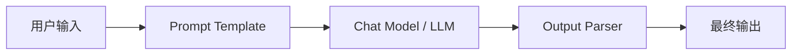
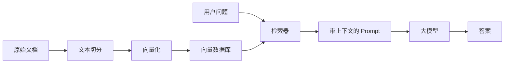

# 第2天：LangChain 核心概念学习计划

> 今日主题：LangChain 核心概念  
> 参考资料：LangChain v0.1 Quickstart：<https://python.langchain.com/v0.1/docs/get_started/quickstart/>  
> 今日目标：理解 LangChain 六大核心模块，熟练使用 LCEL，为后续手撕 Naive RAG 打基础。

## 1. 今日学习总目标

今天不是为了“背 LangChain API”，而是为了建立一个可以长期使用的心智模型：

1. 知道 LangChain 解决什么问题，不解决什么问题。
2. 理解 LangChain 六大核心模块：
   - Model I/O
   - Retrieval
   - Chains
   - Agents
   - Memory
   - Callbacks
3. 熟练掌握 LCEL，也就是 LangChain Expression Language。
4. 能够用 LCEL 写出可组合、可调试、可流式输出的小链路。
5. 能够解释一个基础 RAG 链路里每个组件的职责。
6. 能够独立完成一个“Prompt -> Model -> Parser”的最小应用。
7. 能够独立完成一个“Retriever -> Prompt -> Model -> Parser”的 Naive RAG 雏形。

## 2. 今日产出物

建议今天至少完成以下产出：

1. 一份知识笔记：阅读本目录下的 `02-LangChain核心概念与LCEL详解.md`。
2. 一份可运行代码：自己写一个 `demo_lcel.py`。
3. 一个最小链路：`prompt | model | output_parser`。
4. 一个并行链路：使用 `RunnableParallel` 同时生成多个字段。
5. 一个带检索的链路：使用 `retriever` 给模型注入上下文。
6. 一份自测记录：回答本文最后的自测题。

## 3. 推荐时间安排

如果你今天有 3 到 4 小时，可以按这个节奏走。

### 阶段一：建立整体地图，30 分钟

目标：知道 LangChain 的定位，以及六大模块之间的关系。

学习内容：

1. LangChain 是什么。
2. 为什么需要 LangChain。
3. LangChain 和直接调用大模型 API 的区别。
4. 六大核心模块各自负责什么。
5. LCEL 为什么是今天的重点。

完成标准：

1. 你能用一句话解释 LangChain：
   “LangChain 是一个把模型、提示词、检索器、工具、记忆、回调等组件组合成 LLM 应用链路的框架。”
2. 你能画出这个最小链路：



### 阶段二：理解六大核心模块，60 到 80 分钟

目标：理解每个模块的职责、常用类、输入输出、典型场景。

建议顺序：

1. Model I/O：先理解模型输入输出。
2. Chains：理解组件如何串起来。
3. LCEL：掌握 `|` 管道组合。
4. Retrieval：理解 RAG 的基础。
5. Memory：理解多轮对话状态。
6. Agents：理解模型如何选择工具。
7. Callbacks：理解日志、监控、流式输出。

完成标准：

1. 能说清楚 PromptTemplate、ChatPromptTemplate、ChatModel、OutputParser 的关系。
2. 能说清楚 Chain 和 LCEL Runnable 的关系。
3. 能说清楚 Retriever 和 VectorStore 的关系。
4. 能说清楚 Agent 和普通 Chain 的区别。
5. 能说清楚 Memory 为什么不能简单等同于“把历史消息塞进 prompt”。
6. 能说清楚 Callback 的价值是什么。

### 阶段三：LCEL 重点实战，90 分钟

目标：从“会看示例”变成“自己能写”。

必练内容：

1. 最小 LCEL：

```python
chain = prompt | model | parser
result = chain.invoke({"topic": "LangChain"})
```

2. 批处理：

```python
results = chain.batch([
    {"topic": "LCEL"},
    {"topic": "RAG"},
    {"topic": "Agents"},
])
```

3. 流式输出：

```python
for chunk in chain.stream({"topic": "LangChain"}):
    print(chunk, end="")
```

4. 并行组合：

```python
from langchain_core.runnables import RunnableParallel

chain = RunnableParallel({
    "summary": summary_chain,
    "keywords": keywords_chain,
})
```

5. 透传输入：

```python
from langchain_core.runnables import RunnablePassthrough

chain = {
    "question": RunnablePassthrough(),
    "context": retriever,
} | prompt | model | parser
```

完成标准：

1. 你能解释 `|` 左右两边传递的是什么。
2. 你能解释 `invoke`、`batch`、`stream` 的区别。
3. 你能解释 `RunnablePassthrough` 为什么常用于 RAG。
4. 你能解释 `RunnableParallel` 什么时候有用。
5. 你能把一个普通函数包装成 `RunnableLambda`。

### 阶段四：写一个 Naive RAG 雏形，60 分钟

目标：为明后天的 RAG 学习铺垫。

最小流程：



今日只要求理解，不要求把所有细节做到生产级。

完成标准：

1. 能把几段本地文本转成 Document。
2. 能用 Embeddings 建一个本地向量库。
3. 能把 VectorStore 转成 Retriever。
4. 能用 LCEL 把 `retriever -> prompt -> model -> parser` 串起来。
5. 能说明 Naive RAG 的局限：
   - 文档切分粗糙
   - 召回质量不稳定
   - 缺少重排序
   - 缺少引用来源
   - 缺少评测

## 4. 今日详细任务清单

### 任务 1：环境准备

建议新建虚拟环境：

```powershell
python -m venv .venv
.\.venv\Scripts\Activate.ps1
```

安装依赖：

```powershell
pip install "langchain==0.1.*" langchain-openai langchain-community python-dotenv faiss-cpu
```

如果使用 DeepSeek：

```powershell
$env:DEEPSEEK_API_KEY="你的 DeepSeek API Key"
$env:DEEPSEEK_BASE_URL="https://api.deepseek.com"
$env:DEEPSEEK_MODEL="deepseek-chat"
```

这里仍然使用 `langchain-openai` 中的 `ChatOpenAI`，因为 DeepSeek 提供 OpenAI-compatible 接口；核心区别是要配置 `base_url` 和 DeepSeek 的 API Key。

### 任务 2：最小 LCEL 链路

目标：理解 LCEL 的最小三段式。

```python
import os

from langchain_openai import ChatOpenAI
from langchain_core.prompts import ChatPromptTemplate
from langchain_core.output_parsers import StrOutputParser

prompt = ChatPromptTemplate.from_template("请用三句话解释：{topic}")
model = ChatOpenAI(
    model=os.getenv("DEEPSEEK_MODEL", "deepseek-chat"),
    api_key=os.getenv("DEEPSEEK_API_KEY"),
    base_url=os.getenv("DEEPSEEK_BASE_URL", "https://api.deepseek.com"),
    temperature=0,
)
parser = StrOutputParser()

chain = prompt | model | parser

print(chain.invoke({"topic": "LangChain LCEL"}))
```

你要重点观察：

1. `prompt.invoke(...)` 输出什么。
2. `model.invoke(...)` 输出什么。
3. `parser.invoke(...)` 输出什么。
4. `chain.invoke(...)` 最终输出什么。

### 任务 3：LCEL 批处理

目标：理解同一个链路可以处理多个输入。

```python
topics = [
    {"topic": "Model I/O"},
    {"topic": "Retrieval"},
    {"topic": "Agents"},
]

results = chain.batch(topics)
for item in results:
    print(item)
```

你要重点观察：

1. 输入是列表。
2. 输出也是列表。
3. 链路结构不变，只是运行方式变了。

### 任务 4：LCEL 流式输出

目标：理解面向用户体验的输出方式。

```python
for chunk in chain.stream({"topic": "LangChain 的流式输出"}):
    print(chunk, end="", flush=True)
```

你要重点观察：

1. 不是等所有 token 生成完才显示。
2. 更适合聊天机器人、写作助手、问答系统。
3. 如果使用 Web 框架，通常会和 SSE 或 WebSocket 结合。

### 任务 5：RunnableParallel

目标：理解如何并行组织多个子任务。

```python
from langchain_core.runnables import RunnableParallel

summary_prompt = ChatPromptTemplate.from_template("用一句话总结：{text}")
keywords_prompt = ChatPromptTemplate.from_template("从下面文本中提取 5 个关键词：{text}")

summary_chain = summary_prompt | model | parser
keywords_chain = keywords_prompt | model | parser

parallel_chain = RunnableParallel({
    "summary": summary_chain,
    "keywords": keywords_chain,
})

print(parallel_chain.invoke({"text": "LangChain 是一个用于开发 LLM 应用的框架。"}))
```

你要重点观察：

1. 多个子链共享同一份输入。
2. 输出是一个字典。
3. 字典的 key 来自 `RunnableParallel` 的配置。

### 任务 6：RunnablePassthrough

目标：理解 RAG 中为什么需要保留原始问题。

```python
from langchain_core.runnables import RunnablePassthrough

rag_input = {
    "question": RunnablePassthrough(),
    "context": lambda question: f"这里是和问题相关的上下文：{question}",
}

print(rag_input["question"].invoke("什么是 LCEL？"))
print(rag_input["context"]("什么是 LCEL？"))
```

在真实 RAG 中，`context` 通常不是 lambda，而是 retriever：

```python
rag_chain = {
    "context": retriever,
    "question": RunnablePassthrough(),
} | prompt | model | parser
```

你要重点观察：

1. 原始问题需要传给 prompt。
2. 同一个问题还要传给 retriever。
3. `RunnablePassthrough` 的作用就是保留原始输入。

### 任务 7：完成自测

请尝试不用看文档回答：

1. LangChain 六大核心模块分别是什么？
2. LCEL 中 `|` 的含义是什么？
3. `invoke`、`batch`、`stream` 分别适合什么场景？
4. PromptTemplate 和 ChatPromptTemplate 的区别是什么？
5. Retriever 和 VectorStore 的区别是什么？
6. Agent 和 Chain 的区别是什么？
7. Memory 在多轮对话中解决什么问题？
8. Callback 可以用来做什么？
9. RAG 链路中为什么要使用 `RunnablePassthrough`？
10. 为什么说 LCEL 是 LangChain v0.1 之后非常重要的组织方式？

## 5. 今日学习重点排序

如果时间有限，优先级如下：

1. 必须掌握：LCEL 三段式 `prompt | model | parser`。
2. 必须掌握：`invoke`、`batch`、`stream`。
3. 必须掌握：六大模块的职责。
4. 重点理解：`RunnablePassthrough` 和 RAG 的关系。
5. 重点理解：Retriever、VectorStore、Document、Embeddings 的关系。
6. 了解即可：Agents 的复杂实现细节。
7. 了解即可：Callbacks 的完整事件体系。

## 6. 今日完成标准

学完今天内容后，你应该能做到：

1. 看到 LangChain 示例代码时，知道每一段属于哪个模块。
2. 能自己写一个 LCEL chain。
3. 能把链路拆成 prompt、model、parser、retriever 等组件。
4. 能解释为什么 LCEL 让链路更容易组合。
5. 能独立搭建一个非常简化的 RAG demo。
6. 明天学习 RAG 时，不会被 LangChain 的基础对象绕晕。

## 7. 官方资料入口

1. LangChain v0.1 Quickstart：<https://python.langchain.com/v0.1/docs/get_started/quickstart/>
2. LangChain LCEL 概念文档：<https://python.langchain.com/docs/concepts/lcel/>
3. LangChain Runnable Interface：<https://python.langchain.com/docs/concepts/runnables/>
4. LangChain Components 概念入口：<https://python.langchain.com/docs/concepts/>
