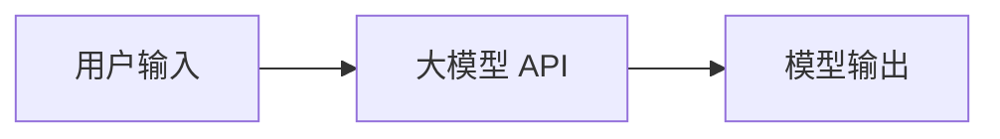
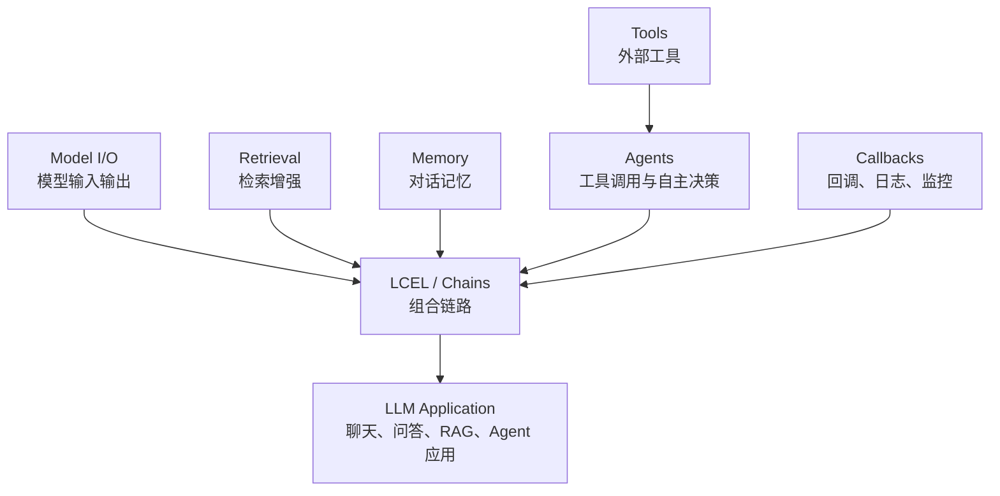
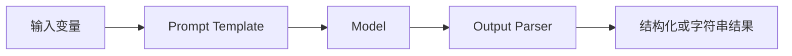
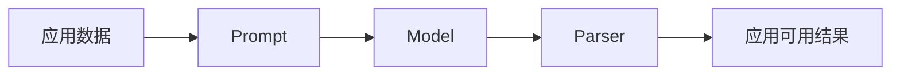
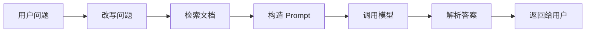
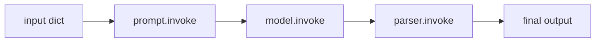
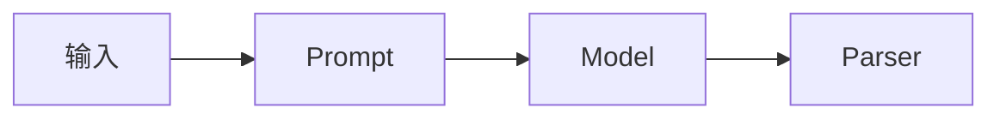
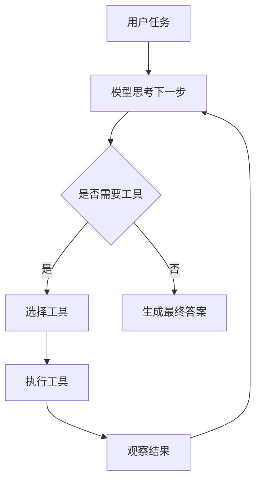
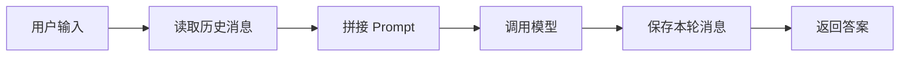
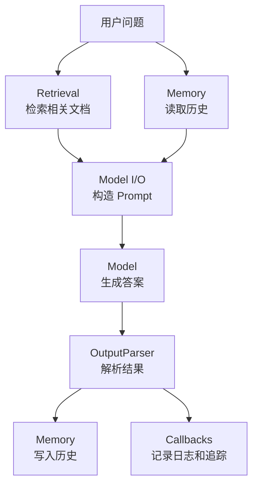

# LangChain 核心概念与 LCEL 详解

> 学习主题：LangChain 核心概念  
> 重点目标：理解六大核心模块，熟练使用 LCEL  
> 参考资料：LangChain v0.1 Quickstart：<https://python.langchain.com/v0.1/docs/get_started/quickstart/>

## 1. 先建立一个总认识

LangChain 是一个用于开发 LLM 应用的框架。

如果你直接调用大模型 API，通常只是在做这件事：



这当然可以工作，但真实应用通常不止这么简单。一个稍微完整一点的 AI 应用往往需要：

1. 把用户输入格式化成 prompt。
2. 选择合适的模型。
3. 解析模型输出。
4. 从知识库检索上下文。
5. 维护多轮对话历史。
6. 调用外部工具。
7. 记录日志、token 用量、耗时。
8. 支持流式输出。
9. 支持批量调用。
10. 支持把多个步骤组合起来。

LangChain 的核心价值，就是把这些常见能力抽象成一组可组合的组件。

可以把 LangChain 想成一套“LLM 应用积木”：



## 2. LangChain 六大核心模块

经典 LangChain 学习路线中，常把核心模块理解为下面六类：

| 模块 | 中文理解 | 解决的问题 | 常见对象 |
|---|---|---|---|
| Model I/O | 模型输入输出 | 如何组织 prompt、调用模型、解析输出 | PromptTemplate、ChatPromptTemplate、ChatModel、LLM、OutputParser |
| Retrieval | 检索增强 | 如何把外部知识注入模型上下文 | Document、Loader、TextSplitter、Embedding、VectorStore、Retriever |
| Chains | 链式组合 | 如何把多个步骤串成一个应用流程 | Chain、Runnable、LCEL |
| Agents | 智能体 | 如何让模型根据任务选择工具并迭代执行 | Agent、Tool、AgentExecutor |
| Memory | 记忆 | 如何维护多轮对话状态 | ConversationBufferMemory、ChatMessageHistory、RunnableWithMessageHistory |
| Callbacks | 回调 | 如何观测、调试、记录执行过程 | CallbackHandler、tracing、streaming callbacks |

注意：LangChain 版本在持续演进。v0.1 时代的教程常以 Chains、Agents、Memory 等模块组织知识；新版 LangChain 更强调 Runnables、LCEL、LangGraph、LangSmith 等体系。今天的重点是打基础，所以我们仍按经典六大模块理解，但代码尽量使用 LCEL 这条更现代的主线。

## 3. LangChain 应用的最小闭环

一个最小 LangChain 应用通常包含三步：



对应代码就是：

```python
import os

from langchain_openai import ChatOpenAI
from langchain_core.prompts import ChatPromptTemplate
from langchain_core.output_parsers import StrOutputParser

prompt = ChatPromptTemplate.from_template("请用三句话解释：{topic}")
model = ChatOpenAI(
    model=os.getenv("DEEPSEEK_MODEL", "deepseek-chat"),
    api_key=os.getenv("DEEPSEEK_API_KEY"),
    base_url=os.getenv("DEEPSEEK_BASE_URL", "https://api.deepseek.com"),
    temperature=0,
)
parser = StrOutputParser()

chain = prompt | model | parser

result = chain.invoke({"topic": "LangChain"})
print(result)
```

这段代码的关键不是 `ChatOpenAI`，而是这行：

```python
chain = prompt | model | parser
```

这就是 LCEL 的典型写法。

## 4. 模块一：Model I/O

Model I/O 是 LangChain 中最基础的一层。

它负责三件事：

1. 输入：如何把用户问题变成模型能理解的 prompt。
2. 模型：如何调用 LLM 或 Chat Model。
3. 输出：如何把模型返回结果解析成应用需要的数据。

### 4.1 Prompt

Prompt 是给模型的指令。

普通 prompt 可能长这样：

```text
请解释什么是 LangChain。
```

但应用中通常需要动态变量：

```text
请用 {style} 的风格解释 {topic}。
```

LangChain 用 PromptTemplate 或 ChatPromptTemplate 管理这件事。

### 4.2 PromptTemplate

PromptTemplate 更像普通字符串模板。

```python
from langchain_core.prompts import PromptTemplate

prompt = PromptTemplate.from_template(
    "请用{style}的风格解释：{topic}"
)

message = prompt.invoke({
    "style": "适合初学者",
    "topic": "LangChain",
})

print(message)
```

适合场景：

1. 传统 completion 模型。
2. 简单文本模板。
3. 不需要区分 system、human、ai message 的场景。

### 4.3 ChatPromptTemplate

ChatPromptTemplate 更适合聊天模型。

```python
from langchain_core.prompts import ChatPromptTemplate

prompt = ChatPromptTemplate.from_messages([
    ("system", "你是一名耐心的 AI 应用开发导师。"),
    ("human", "请用{level}能理解的方式解释：{topic}"),
])

messages = prompt.invoke({
    "level": "初学者",
    "topic": "LCEL",
})

print(messages)
```

它的好处是可以清晰表达不同角色：

1. system：定义模型角色、边界、输出规范。
2. human：用户输入。
3. ai：历史 AI 回复。
4. placeholder：插入历史消息。

### 4.4 LLM 和 ChatModel

LangChain 里常见两类模型接口：

| 类型 | 输入 | 输出 | 适合 |
|---|---|---|---|
| LLM | 字符串 | 字符串 | 传统补全模型 |
| ChatModel | 消息列表 | AIMessage | 聊天模型 |

现在大多数新应用优先使用 ChatModel。

示例：

```python
import os

from langchain_openai import ChatOpenAI

model = ChatOpenAI(
    model=os.getenv("DEEPSEEK_MODEL", "deepseek-chat"),
    api_key=os.getenv("DEEPSEEK_API_KEY"),
    base_url=os.getenv("DEEPSEEK_BASE_URL", "https://api.deepseek.com"),
    temperature=0,
)

response = model.invoke("请解释什么是 LangChain")
print(response)
print(response.content)
```

常见参数：

| 参数 | 作用 |
|---|---|
| model | 使用哪个模型 |
| temperature | 随机性，越低越稳定 |
| max_tokens | 最大输出长度 |
| streaming | 是否流式输出 |
| timeout | 请求超时时间 |
| max_retries | 失败重试次数 |

### 4.5 OutputParser

模型输出默认通常是文本或 AIMessage，但应用通常需要更稳定的格式。

比如你想要：

1. 字符串。
2. JSON。
3. Python 字典。
4. Pydantic 对象。
5. 带字段校验的结构化输出。

最简单的是 StrOutputParser：

```python
from langchain_core.output_parsers import StrOutputParser

parser = StrOutputParser()
```

配合 LCEL：

```python
chain = prompt | model | parser
```

这会把模型返回的 AIMessage 转成普通字符串。

### 4.6 Model I/O 的心智模型

记住这一句：

> Model I/O 负责把应用数据变成模型输入，再把模型输出变成应用数据。



## 5. 模块二：Chains

Chains 的核心思想是：

> 把多个步骤组合成一个可执行流程。

在 LangChain 早期，经常看到这样的写法：

```python
from langchain.chains import LLMChain

chain = LLMChain(llm=model, prompt=prompt)
```

但在 v0.1 之后，更推荐使用 LCEL：

```python
chain = prompt | model | parser
```

### 5.1 为什么需要 Chain

因为真实应用不是一个函数调用，而是一串步骤：



如果不用统一抽象，代码很容易变成一堆散乱的函数调用。

Chain 或 Runnable 让每个步骤都变成可组合节点。

### 5.2 Chain 的输入输出

一个 chain 本质上像一个函数：

```python
output = chain.invoke(input)
```

区别是这个函数内部可能包含很多步骤。

常见运行方式：

| 方法 | 作用 |
|---|---|
| invoke | 单次调用 |
| batch | 批量调用 |
| stream | 流式输出 |
| ainvoke | 异步单次调用 |
| abatch | 异步批量调用 |
| astream | 异步流式输出 |

### 5.3 什么时候用 Chains

适合：

1. 固定流程问答。
2. 文档总结。
3. 信息抽取。
4. RAG。
5. 多步骤文本处理。
6. 输入输出结构明确的任务。

不适合：

1. 需要模型动态选择工具的复杂任务。
2. 需要长期状态机的复杂 Agent。
3. 分支非常多、循环非常复杂的流程。

这些场景更适合 Agents 或 LangGraph。

## 6. 模块三：LCEL

LCEL 是 LangChain Expression Language。

你可以把 LCEL 理解为 LangChain 的“组合语法”。

它让你用非常简单的方式，把多个组件串起来：

```python
chain = prompt | model | parser
```

### 6.1 LCEL 的核心对象：Runnable

LCEL 的底层核心是 Runnable。

Runnable 表示一个“可运行组件”：

```text
输入 -> Runnable -> 输出
```

Prompt 是 Runnable。

Model 是 Runnable。

Parser 是 Runnable。

Retriever 也可以作为 Runnable 使用。

所以它们可以组合。

### 6.2 `|` 管道符是什么意思

这行代码：

```python
chain = prompt | model | parser
```

等价于：

```python
prompt_output = prompt.invoke(input)
model_output = model.invoke(prompt_output)
final_output = parser.invoke(model_output)
```

只是 LCEL 把它写成了可组合的声明式形式。



### 6.3 LCEL 的最小例子

```python
import os

from langchain_openai import ChatOpenAI
from langchain_core.prompts import ChatPromptTemplate
from langchain_core.output_parsers import StrOutputParser

prompt = ChatPromptTemplate.from_template(
    "请用初学者能理解的方式解释：{concept}"
)
model = ChatOpenAI(
    model=os.getenv("DEEPSEEK_MODEL", "deepseek-chat"),
    api_key=os.getenv("DEEPSEEK_API_KEY"),
    base_url=os.getenv("DEEPSEEK_BASE_URL", "https://api.deepseek.com"),
    temperature=0,
)
parser = StrOutputParser()

chain = prompt | model | parser

print(chain.invoke({"concept": "LCEL"}))
```

### 6.4 invoke

`invoke` 用于单次调用。

```python
result = chain.invoke({"concept": "Runnable"})
print(result)
```

适合：

1. 用户发来一个问题。
2. 后端处理一个请求。
3. 单条文本总结。

### 6.5 batch

`batch` 用于批量调用。

```python
inputs = [
    {"concept": "PromptTemplate"},
    {"concept": "ChatModel"},
    {"concept": "OutputParser"},
]

results = chain.batch(inputs)
print(results)
```

适合：

1. 批量生成。
2. 批量总结。
3. 批量分类。
4. 批量抽取。

### 6.6 stream

`stream` 用于流式输出。

```python
for chunk in chain.stream({"concept": "stream"}):
    print(chunk, end="", flush=True)
```

适合：

1. 聊天应用。
2. 写作助手。
3. 长文本生成。
4. 需要用户快速看到响应的场景。

### 6.7 RunnableParallel

RunnableParallel 用于并行执行多个子链。

```python
from langchain_core.runnables import RunnableParallel

summary_prompt = ChatPromptTemplate.from_template("总结这段文字：{text}")
title_prompt = ChatPromptTemplate.from_template("给这段文字起一个标题：{text}")

summary_chain = summary_prompt | model | parser
title_chain = title_prompt | model | parser

chain = RunnableParallel({
    "summary": summary_chain,
    "title": title_chain,
})

result = chain.invoke({
    "text": "LangChain 可以帮助开发者组合模型、提示词、检索器和工具。"
})

print(result)
```

输出类似：

```python
{
    "summary": "...",
    "title": "..."
}
```

### 6.8 RunnablePassthrough

RunnablePassthrough 表示“原样传递输入”。

它在 RAG 中特别常见：

```python
from langchain_core.runnables import RunnablePassthrough

rag_chain = {
    "context": retriever,
    "question": RunnablePassthrough(),
} | prompt | model | parser
```

为什么需要它？

因为同一个用户问题有两个用途：

1. 传给 retriever，用来检索相关文档。
2. 传给 prompt，用来告诉模型用户到底问了什么。

其中：

```python
"context": retriever
```

表示用问题检索上下文。

```python
"question": RunnablePassthrough()
```

表示把原始问题原样放进 prompt。

### 6.9 RunnableLambda

RunnableLambda 可以把普通 Python 函数包装成 Runnable。

```python
from langchain_core.runnables import RunnableLambda

def clean_text(text: str) -> str:
    return text.strip().replace("\n", " ")

cleaner = RunnableLambda(clean_text)

chain = cleaner | prompt | model | parser
```

适合：

1. 输入清洗。
2. 输出后处理。
3. 字段转换。
4. 简单业务逻辑。

### 6.10 LCEL 的字典写法

LCEL 中经常看到这种结构：

```python
chain = {
    "context": retriever,
    "question": RunnablePassthrough(),
} | prompt | model | parser
```

这个字典不是普通数据字典，而是一个 Runnable 映射。

它的含义是：

1. 对同一个输入，同时运行多个分支。
2. 把每个分支的输出放到对应 key 下。
3. 形成一个新字典，传给下一个 Runnable。

比如用户输入：

```python
"什么是 LCEL？"
```

经过字典映射后可能变成：

```python
{
    "context": [Document(...), Document(...)],
    "question": "什么是 LCEL？"
}
```

然后这个字典会传给 prompt。

### 6.11 LCEL 为什么重要

LCEL 重要，因为它统一了 LangChain 组件的组合方式。

它带来的好处：

1. 组合简单：用 `|` 串联。
2. 运行统一：都支持 `invoke`、`batch`、`stream`。
3. 易于替换：prompt、model、parser 可以独立替换。
4. 易于调试：每个节点都可以单独 invoke。
5. 支持并行：RunnableParallel。
6. 支持异步：ainvoke、abatch、astream。
7. 支持流式：更适合真实产品体验。
8. 支持追踪：可以和 callbacks、LangSmith 等工具配合。

## 7. 模块四：Retrieval

Retrieval 是 RAG 的基础。

RAG 是 Retrieval-Augmented Generation，也就是检索增强生成。

它的核心思想是：

> 不要只依赖模型参数里的知识，而是在回答前先从外部知识库检索相关内容，再把内容塞进 prompt。

### 7.1 为什么需要 Retrieval

LLM 本身有几个问题：

1. 知识可能过时。
2. 不知道你的私有文档。
3. 容易编造。
4. 长上下文成本高。
5. 不能保证答案有来源。

Retrieval 的作用是：

1. 从外部文档中找相关内容。
2. 把相关内容提供给模型。
3. 降低幻觉概率。
4. 让模型能回答私有知识问题。

### 7.2 Retrieval 的核心对象

| 对象 | 作用 |
|---|---|
| Document | 文档对象，通常包含 page_content 和 metadata |
| DocumentLoader | 从文件、网页、数据库加载文档 |
| TextSplitter | 把长文档切成小块 |
| Embeddings | 把文本转成向量 |
| VectorStore | 存储和搜索向量 |
| Retriever | 根据 query 取回相关 Document |

### 7.3 Document

Document 是 LangChain 中表示文档的基础对象。

```python
from langchain_core.documents import Document

docs = [
    Document(
        page_content="LangChain 是一个用于开发 LLM 应用的框架。",
        metadata={"source": "note-1"},
    ),
    Document(
        page_content="LCEL 可以把 prompt、model、parser 组合成链。",
        metadata={"source": "note-2"},
    ),
]
```

Document 通常有两部分：

1. `page_content`：正文。
2. `metadata`：来源、标题、页码、URL 等信息。

### 7.4 TextSplitter

TextSplitter 用于切分长文档。

为什么要切分？

1. 文档太长，不能全部塞进 prompt。
2. 向量检索通常以 chunk 为单位。
3. chunk 太大，召回不精准。
4. chunk 太小，上下文不完整。

示例：

```python
from langchain_text_splitters import RecursiveCharacterTextSplitter

splitter = RecursiveCharacterTextSplitter(
    chunk_size=500,
    chunk_overlap=80,
)

chunks = splitter.split_documents(docs)
```

关键参数：

| 参数 | 作用 |
|---|---|
| chunk_size | 每个文本块的大致长度 |
| chunk_overlap | 相邻文本块重叠长度 |
| separators | 切分优先级 |

### 7.5 Embeddings

Embeddings 把文本转换成向量。

```text
"什么是 LangChain？" -> [0.12, -0.03, 0.88, ...]
```

为什么要向量？

因为向量可以表达语义相似度。

比如：

1. “什么是 LCEL？”
2. “LangChain 的表达式语言是什么？”

这两句话字面不同，但语义接近。向量检索可以找到相关文档。

### 7.6 VectorStore

VectorStore 负责存储向量并执行相似度搜索。

常见向量库：

1. FAISS
2. Chroma
3. Milvus
4. Weaviate
5. Pinecone
6. Qdrant

本地学习阶段可以先用 FAISS 或 Chroma。

### 7.7 Retriever

Retriever 是“检索器”。

它的职责是：

```text
query -> relevant documents
```

通常从 VectorStore 得到：

```python
retriever = vectorstore.as_retriever(search_kwargs={"k": 3})
```

然后可以调用：

```python
docs = retriever.invoke("什么是 LCEL？")
```

### 7.8 最小 RAG 链路

```python
import os

from langchain_openai import ChatOpenAI, OpenAIEmbeddings
from langchain_core.documents import Document
from langchain_core.prompts import ChatPromptTemplate
from langchain_core.output_parsers import StrOutputParser
from langchain_core.runnables import RunnablePassthrough
from langchain_community.vectorstores import FAISS

docs = [
    Document(page_content="LangChain 是一个用于开发 LLM 应用的框架。"),
    Document(page_content="LCEL 是 LangChain Expression Language，用于组合 Runnable。"),
    Document(page_content="RAG 是检索增强生成，会先检索相关文档，再生成答案。"),
]

embeddings = OpenAIEmbeddings()
vectorstore = FAISS.from_documents(docs, embeddings)
retriever = vectorstore.as_retriever(search_kwargs={"k": 2})

prompt = ChatPromptTemplate.from_template("""
请只根据下面上下文回答问题。

上下文：
{context}

问题：
{question}
""")

model = ChatOpenAI(
    model=os.getenv("DEEPSEEK_MODEL", "deepseek-chat"),
    api_key=os.getenv("DEEPSEEK_API_KEY"),
    base_url=os.getenv("DEEPSEEK_BASE_URL", "https://api.deepseek.com"),
    temperature=0,
)
parser = StrOutputParser()

rag_chain = {
    "context": retriever,
    "question": RunnablePassthrough(),
} | prompt | model | parser

answer = rag_chain.invoke("什么是 LCEL？")
print(answer)
```

说明：这里的聊天模型已经接入 DeepSeek；`OpenAIEmbeddings` 只是示例中的向量化模型。实际项目里如果你不使用 OpenAI embedding，可以替换成任意 LangChain 支持的 embedding provider。

### 7.9 格式化检索结果

上面的 `context` 可能是 Document 列表。有时你需要先转成字符串：

```python
from langchain_core.runnables import RunnableLambda

def format_docs(docs):
    return "\n\n".join(doc.page_content for doc in docs)

rag_chain = {
    "context": retriever | RunnableLambda(format_docs),
    "question": RunnablePassthrough(),
} | prompt | model | parser
```

这更接近真实项目。

## 8. 模块五：Agents

Agent 是让模型具备“选择工具并执行”的能力。

普通 Chain 是固定流程：



Agent 是动态流程：



### 8.1 Agent 解决什么问题

Agent 适合任务步骤不固定的场景。

比如：

1. 用户问天气，需要调用天气 API。
2. 用户问“帮我查资料并总结”，需要搜索、阅读、总结。
3. 用户问“计算这个表达式”，需要调用计算器。
4. 用户问“查询数据库并解释结果”，需要调用 SQL 工具。

### 8.2 Tool

Tool 是 Agent 可以调用的工具。

一个工具通常包含：

1. 名称。
2. 描述。
3. 输入参数。
4. 执行函数。

简单示例：

```python
from langchain_core.tools import tool

@tool
def multiply(a: int, b: int) -> int:
    """Multiply two integers."""
    return a * b
```

模型会根据工具描述决定什么时候调用它。

### 8.3 Agent 和 Chain 的区别

| 对比项 | Chain | Agent |
|---|---|---|
| 流程 | 固定 | 动态 |
| 控制权 | 开发者定义 | 模型参与决策 |
| 适合 | RAG、总结、抽取 | 工具调用、多步骤任务 |
| 可控性 | 高 | 较低 |
| 调试难度 | 较低 | 较高 |
| 成本 | 通常较低 | 可能较高 |

### 8.4 什么时候不要用 Agent

如果任务流程明确，就先用 Chain。

不要为了“智能”而滥用 Agent。

例如：

1. 文档问答：优先 RAG Chain。
2. 摘要生成：优先普通 Chain。
3. 结构化抽取：优先 prompt + model + parser。
4. 固定业务流程：优先 LCEL 或普通代码。

Agent 更适合流程不确定、需要工具选择的场景。

## 9. 模块六：Memory

Memory 解决多轮对话中的上下文问题。

没有 Memory 时：

```text
用户：我叫小明。
AI：你好，小明。
用户：我叫什么？
AI：我不知道。
```

因为第二轮调用模型时，如果没有把第一轮历史传进去，模型确实不知道。

### 9.1 Memory 的本质

Memory 的本质不是“模型真的记住了”，而是：

> 应用把历史对话保存下来，并在后续请求中重新提供给模型。



### 9.2 常见 Memory 类型

| 类型 | 思路 | 优点 | 缺点 |
|---|---|---|---|
| Buffer Memory | 保存完整历史 | 简单直接 | 历史太长会超上下文 |
| Window Memory | 只保留最近 k 轮 | 控制长度 | 会丢失早期信息 |
| Summary Memory | 总结历史 | 节省 token | 总结可能丢细节 |
| Vector Memory | 用检索找历史 | 适合长期记忆 | 实现复杂 |

### 9.3 v0.1 里常见写法

早期常见：

```python
from langchain.memory import ConversationBufferMemory

memory = ConversationBufferMemory(return_messages=True)
```

但在 LCEL 体系中，更常见的是通过消息历史管理，比如 `RunnableWithMessageHistory`。

你今天先理解思想即可：

1. 历史消息要存储。
2. 每次调用前要取出历史。
3. 调用后要把新消息写回。
4. 需要控制历史长度，防止 token 爆炸。

### 9.4 Memory 和 RAG 的区别

| 对比项 | Memory | Retrieval |
|---|---|---|
| 数据来源 | 对话历史 | 外部知识库 |
| 主要目的 | 保持上下文连续 | 注入外部知识 |
| 生命周期 | 通常和用户会话相关 | 通常长期存在 |
| 典型内容 | 用户偏好、上文问题 | 文档、手册、知识库 |

它们可以结合：

```text
用户问题 + 对话历史 + 检索上下文 -> 模型回答
```

## 10. 模块七：Callbacks

虽然今天说“六大核心模块”，Callbacks 经常也被列为核心模块之一，因为它是观测和调试链路的重要能力。

Callbacks 负责在链路执行的关键节点触发事件。

比如：

1. LLM 开始调用。
2. LLM 调用结束。
3. Chain 开始执行。
4. Chain 执行结束。
5. Tool 开始调用。
6. Tool 调用结束。
7. 出现错误。
8. 收到新 token。

### 10.1 Callbacks 能做什么

常见用途：

1. 打印日志。
2. 统计耗时。
3. 统计 token。
4. 实现流式输出。
5. 记录中间步骤。
6. 对接监控系统。
7. 对接 LangSmith 追踪。

### 10.2 为什么 Callbacks 很重要

LLM 应用最大的问题之一是“不透明”。

你经常需要知道：

1. 最终 prompt 到底长什么样？
2. 模型实际返回了什么？
3. 检索器取回了哪些文档？
4. Agent 为什么调用这个工具？
5. 哪一步最慢？
6. 哪一步最贵？
7. 哪一步出错？

Callbacks 和 tracing 就是为了解决这些问题。

## 11. 六大模块放到一个 RAG 应用里

下面是一条典型 RAG 链路：



对应模块职责：

| 模块 | 在 RAG 中的角色 |
|---|---|
| Model I/O | 构造 prompt、调用模型、解析回答 |
| Retrieval | 根据问题检索上下文 |
| Chains / LCEL | 组织整个执行流程 |
| Agents | 如果需要工具选择，可扩展为 Agentic RAG |
| Memory | 保存多轮对话历史 |
| Callbacks | 记录检索、模型调用、token、错误 |

## 12. LCEL 常见模式总结

### 12.1 顺序模式

```python
chain = step1 | step2 | step3
```

适合固定流程。

### 12.2 并行模式

```python
from langchain_core.runnables import RunnableParallel

chain = RunnableParallel({
    "a": chain_a,
    "b": chain_b,
})
```

适合同一输入生成多个结果。

### 12.3 字段构造模式

```python
chain = {
    "context": retriever,
    "question": RunnablePassthrough(),
} | prompt | model | parser
```

适合 RAG。

### 12.4 函数包装模式

```python
from langchain_core.runnables import RunnableLambda

chain = RunnableLambda(my_func) | next_step
```

适合业务逻辑转换。

### 12.5 调试模式

每个节点都可以单独运行：

```python
prompt_result = prompt.invoke({"topic": "LCEL"})
model_result = model.invoke(prompt_result)
parser_result = parser.invoke(model_result)
```

这对排查问题非常有用。

## 13. 初学者最容易混淆的概念

### 13.1 Prompt 和 Chain

Prompt 只是输入模板。

Chain 是执行流程。

```text
Prompt: 负责组织话术
Chain: 负责组织步骤
```

### 13.2 Model 和 Parser

Model 负责生成。

Parser 负责整理输出。

```text
Model: AIMessage / text / raw output
Parser: string / JSON / object / business data
```

### 13.3 VectorStore 和 Retriever

VectorStore 是存储和搜索向量的地方。

Retriever 是面向链路的检索接口。

```text
VectorStore: 数据库能力
Retriever: query -> docs 的抽象
```

### 13.4 Chain 和 Agent

Chain 是固定流程。

Agent 是动态决策。

如果流程清楚，优先 Chain。

如果需要模型自己决定下一步，才考虑 Agent。

### 13.5 Memory 和 Retrieval

Memory 是对话历史。

Retrieval 是外部知识。

它们经常一起用，但不是一回事。

### 13.6 LCEL 和 LangChain

LangChain 是框架。

LCEL 是 LangChain 里组织组件的一种表达方式。

你可以把 LCEL 看成 LangChain 应用链路的“胶水语法”。

## 14. 建议你今天手写的完整练习

下面是一个适合作为今日练习的完整脚本。

文件名建议：`demo_lcel_rag.py`

```python
import os

from langchain_openai import ChatOpenAI, OpenAIEmbeddings
from langchain_core.documents import Document
from langchain_core.prompts import ChatPromptTemplate
from langchain_core.output_parsers import StrOutputParser
from langchain_core.runnables import RunnableLambda, RunnablePassthrough
from langchain_community.vectorstores import FAISS


def format_docs(docs):
    return "\n\n".join(
        f"来源：{doc.metadata.get('source', 'unknown')}\n内容：{doc.page_content}"
        for doc in docs
    )


docs = [
    Document(
        page_content="LangChain 是一个用于开发大模型应用的框架，它提供模型、提示词、检索器、工具、记忆等组件。",
        metadata={"source": "langchain-note"},
    ),
    Document(
        page_content="LCEL 是 LangChain Expression Language，它可以用管道符把 Runnable 组合成链路。",
        metadata={"source": "lcel-note"},
    ),
    Document(
        page_content="RAG 是检索增强生成，它先从外部知识库检索相关内容，再让模型基于上下文生成答案。",
        metadata={"source": "rag-note"},
    ),
    Document(
        page_content="Agent 可以让模型根据任务选择工具，并根据工具结果继续推理。",
        metadata={"source": "agent-note"},
    ),
]

embeddings = OpenAIEmbeddings()
vectorstore = FAISS.from_documents(docs, embeddings)
retriever = vectorstore.as_retriever(search_kwargs={"k": 2})

prompt = ChatPromptTemplate.from_messages([
    ("system", "你是一名严谨的 AI 应用开发导师。请只根据上下文回答，不要编造。"),
    ("human", "上下文：\n{context}\n\n问题：{question}"),
])

model = ChatOpenAI(
    model=os.getenv("DEEPSEEK_MODEL", "deepseek-chat"),
    api_key=os.getenv("DEEPSEEK_API_KEY"),
    base_url=os.getenv("DEEPSEEK_BASE_URL", "https://api.deepseek.com"),
    temperature=0,
)
parser = StrOutputParser()

rag_chain = {
    "context": retriever | RunnableLambda(format_docs),
    "question": RunnablePassthrough(),
} | prompt | model | parser

question = "LCEL 在 LangChain 中有什么作用？"
answer = rag_chain.invoke(question)

print(answer)
```

说明：这里的聊天模型使用 DeepSeek；embedding 模型可以按你的实际供应商替换，不影响后面的 LCEL 主链路结构。

你要尝试改造它：

1. 把 `k` 从 2 改为 1、3，观察回答变化。
2. 删除某条文档，观察模型是否答不上来。
3. 修改 system prompt，让模型必须输出“依据来源”。
4. 把 `invoke` 改成 `stream`。
5. 在 `format_docs` 中把 metadata 打印得更清楚。

## 15. 面试级理解问题

### 15.1 LangChain 的核心抽象是什么？

可以回答：

LangChain 的核心抽象是把 LLM 应用中常见的组件标准化，比如 prompt、model、parser、retriever、tool、memory 等，并通过 Chain 或 LCEL Runnable 把它们组合成可执行链路。

### 15.2 LCEL 的价值是什么？

可以回答：

LCEL 提供了一种声明式组合方式，让 prompt、model、retriever、parser 等 Runnable 可以用管道符组合。同时它统一支持 invoke、batch、stream、异步调用、并行执行和追踪，因此更适合构建可维护的 LLM 应用链路。

### 15.3 RAG 的核心流程是什么？

可以回答：

RAG 的核心流程是：加载文档、切分文档、向量化、写入向量库、根据用户问题检索相关文档、把检索结果和问题一起放进 prompt、调用模型生成答案。

### 15.4 Agent 和 RAG 有什么区别？

可以回答：

RAG 主要解决外部知识注入问题，流程通常比较固定。Agent 主要解决动态工具调用和多步骤决策问题，流程由模型参与决定。RAG 可以作为 Agent 的一个工具，也可以扩展成 Agentic RAG。

### 15.5 Memory 为什么不能无限保存？

可以回答：

因为模型上下文窗口有限，历史消息越多，token 成本越高，噪声也越多。实际应用中需要窗口截断、摘要、长期记忆检索或用户画像等策略。

## 16. 今日自测答案

### 问题 1：LangChain 六大核心模块是什么？

Model I/O、Retrieval、Chains、Agents、Memory、Callbacks。

### 问题 2：LCEL 中 `|` 的含义是什么？

表示把左侧 Runnable 的输出传给右侧 Runnable，形成顺序执行链路。

### 问题 3：`invoke`、`batch`、`stream` 的区别是什么？

`invoke` 是单次调用，`batch` 是批量调用，`stream` 是流式输出。

### 问题 4：PromptTemplate 和 ChatPromptTemplate 的区别是什么？

PromptTemplate 更像普通字符串模板；ChatPromptTemplate 面向聊天模型，可以表达 system、human、ai 等消息角色。

### 问题 5：Retriever 和 VectorStore 的区别是什么？

VectorStore 负责存储和搜索向量；Retriever 是面向应用链路的检索接口，输入 query，输出相关 Document。

### 问题 6：Agent 和 Chain 的区别是什么？

Chain 是固定流程，Agent 是由模型参与决策的动态流程，可以根据任务选择工具并迭代执行。

### 问题 7：Memory 解决什么问题？

Memory 解决多轮对话中的上下文连续性问题，本质是保存历史消息，并在后续调用中提供给模型。

### 问题 8：Callbacks 可以做什么？

Callbacks 可以用于日志、调试、流式输出、token 统计、耗时统计、错误追踪、链路观测。

### 问题 9：RAG 中为什么要使用 RunnablePassthrough？

因为同一个用户问题既要传给 retriever 检索上下文，又要作为原始 question 传给 prompt。RunnablePassthrough 可以把原始输入保留下来。

### 问题 10：为什么 LCEL 很重要？

因为 LCEL 统一了 LangChain 组件的组合方式，让链路更容易编写、替换、批处理、流式输出、并行执行和调试。

## 17. 明天衔接：从 LangChain 到手撕 Naive RAG

今天学完后，明天可以开始真正手撕 Naive RAG。

建议明天重点拆解：

1. 文档加载。
2. 文档切分。
3. Embedding 模型。
4. 向量相似度计算。
5. Top-k 检索。
6. Prompt 拼接。
7. LLM 生成。
8. 引用来源。
9. RAG 评测。

今天的 LCEL 能帮你理解成熟框架怎么组织流程；明天手撕 RAG 能帮你理解框架底层到底发生了什么。

## 18. 资料入口

1. LangChain v0.1 Quickstart：<https://python.langchain.com/v0.1/docs/get_started/quickstart/>
2. LangChain LCEL 概念文档：<https://python.langchain.com/docs/concepts/lcel/>
3. LangChain Runnable Interface：<https://python.langchain.com/docs/concepts/runnables/>
4. LangChain Concepts：<https://python.langchain.com/docs/concepts/>
5. LangChain Python API Reference：<https://python.langchain.com/api_reference/>
