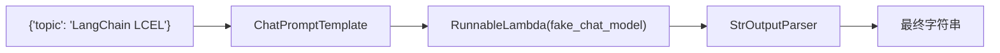
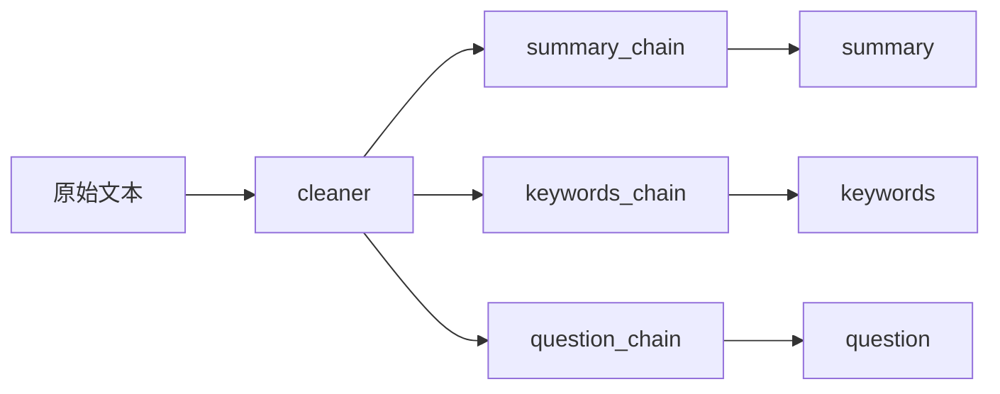
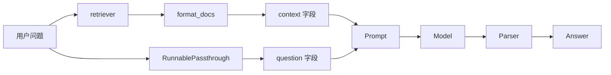

# LangChain 核心概念代码实现与逐行讲解

> 目标：用具体代码把 LangChain 六大核心模块和 LCEL 串起来。  
> 代码目录：`code/`  
> 推荐顺序：先运行离线版，再运行真实模型版。

## 1. 本次新增文件

```text
第2天LangChain 核心概念/
├── requirements.txt
├── .env.example
├── code/
│   ├── 01_lcel_basic.py
│   ├── 02_lcel_parallel_and_lambda.py
│   ├── 03_lcel_naive_rag_offline.py
│   └── 04_lcel_rag_deepseek_optional.py
└── 03-代码实现与逐行讲解.md
```

每个文件的作用：

| 文件 | 作用 | 是否需要 API Key |
|---|---|---|
| `01_lcel_basic.py` | 最小 LCEL：`prompt | model | parser` | 不需要 |
| `02_lcel_parallel_and_lambda.py` | RunnableLambda、RunnableParallel、batch、stream | 不需要 |
| `03_lcel_naive_rag_offline.py` | 离线版 Naive RAG，理解完整 RAG 数据流 | 不需要 |
| `04_lcel_rag_deepseek_optional.py` | 把模拟模型替换成真实 DeepSeek 模型 | 需要 |

## 2. 环境准备

进入当前目录：

```powershell
cd "D:\vscode项目\AI Agent 开发工程师学习路线图（工程落地版）\第 1 周：大模型应用开发基础 + 手撕 Naive RAG\第2天LangChain 核心概念"
```

创建虚拟环境：

```powershell
python -m venv .venv
```

激活虚拟环境：

```powershell
.\.venv\Scripts\Activate.ps1
```

安装依赖：

```powershell
pip install -r requirements.txt
```

如果只运行前三个离线示例，不需要配置 API Key。

如果要运行第 4 个真实模型示例，复制 `.env.example` 为 `.env`，并填写：

```text
DEEPSEEK_API_KEY=你的 DeepSeek API Key
DEEPSEEK_BASE_URL=https://api.deepseek.com
DEEPSEEK_MODEL=deepseek-chat
```

## 3. 示例一：最小 LCEL 链路

文件：

```text
code/01_lcel_basic.py
```

运行：

```powershell
python code/01_lcel_basic.py
```

这个文件只讲一件事：

```python
chain = prompt | model | parser
```

也就是 LangChain LCEL 最核心的链式组合。

### 3.1 代码结构

```python
from langchain_core.messages import AIMessage
from langchain_core.output_parsers import StrOutputParser
from langchain_core.prompts import ChatPromptTemplate
from langchain_core.runnables import RunnableLambda
```

这四个导入分别对应：

| 对象 | 所属概念 | 作用 |
|---|---|---|
| `AIMessage` | Model I/O | 模拟聊天模型的返回消息 |
| `StrOutputParser` | Model I/O | 把模型输出解析成字符串 |
| `ChatPromptTemplate` | Model I/O | 构造聊天模型 prompt |
| `RunnableLambda` | LCEL | 把普通函数包装成 Runnable |

### 3.2 fake_chat_model 的作用

```python
def fake_chat_model(prompt_value):
    messages = prompt_value.to_messages()
    human_message = messages[-1].content

    return AIMessage(
        content=(
            "这是一个模拟模型输出。\n"
            f"我收到的人类消息是：{human_message}\n"
    "在真实项目中，这一步会由 DeepSeek、通义千问、OpenAI 或本地模型完成。"
        )
    )
```

这里没有调用真实大模型，而是写了一个假模型。

为什么要这样做？

因为你今天的重点是理解 LangChain 的链路，不是先卡在 API Key、网络、额度和模型响应上。

这个函数接收的是 `prompt_value`。

`prompt_value` 是 `ChatPromptTemplate` 渲染后的结果，它不是普通字符串，而是一个可以转成消息列表的对象。

这一行：

```python
messages = prompt_value.to_messages()
```

会把 prompt 转成类似这样的消息：

```text
SystemMessage: 你是一名耐心的 AI 应用开发导师。
HumanMessage: 请用初学者能理解的方式解释：LangChain LCEL
```

这一行：

```python
human_message = messages[-1].content
```

取出最后一条 human 消息。

最后它返回一段字符串，用来模拟模型输出。

真实 ChatModel 通常会返回 `AIMessage`，但离线示例为了在不同 `langchain_core` 版本中都更稳定地显示普通文本，直接让模拟模型返回字符串。

### 3.3 prompt 的作用

```python
prompt = ChatPromptTemplate.from_messages(
    [
        ("system", "你是一名耐心的 AI 应用开发导师。"),
        ("human", "请用初学者能理解的方式解释：{topic}"),
    ]
)
```

这里的 prompt 有两个角色：

1. `system`：定义模型身份和回答风格。
2. `human`：用户输入，其中 `{topic}` 是变量。

当你调用：

```python
prompt.invoke({"topic": "LangChain LCEL"})
```

LangChain 会把 `{topic}` 替换成 `LangChain LCEL`。

### 3.4 model 的作用

```python
model = RunnableLambda(fake_chat_model)
```

`fake_chat_model` 本来只是一个普通 Python 函数。

普通函数不能直接参与 LCEL 的 `|` 管道组合。

所以这里用：

```python
RunnableLambda(fake_chat_model)
```

把它包装成 Runnable。

包装后，它就可以像模型一样参与链路：

```python
prompt | model
```

### 3.5 parser 的作用

```python
parser = StrOutputParser()
```

`fake_chat_model` 返回的是字符串。

真实模型返回的通常是消息对象，应用最终一般不想直接拿消息对象，而是想拿普通字符串。

所以需要：

```python
parser = StrOutputParser()
```

在真实模型链路中，它会把：

```python
AIMessage(content="xxx")
```

解析成：

```python
"xxx"
```

### 3.6 完整链路

```python
chain = prompt | model | parser
```

这行代码可以拆成三步：

```python
prompt_result = prompt.invoke(user_input)
model_result = model.invoke(prompt_result)
parser_result = parser.invoke(model_result)
```

LCEL 的 `|` 就是在表达：

```text
上一步输出 -> 下一步输入
```

图示：



### 3.7 你应该观察什么

运行后你会看到四段输出：

1. 单独运行 prompt。
2. 单独运行 model。
3. 单独运行 parser。
4. 运行完整 chain。

这四段输出的学习价值非常高。

你要重点看：

1. prompt 的输出不是字符串，而是 ChatPromptValue。
2. model 的输出是 AIMessage。
3. parser 的输出是字符串。
4. chain 的最终输出也是字符串。

这就是 Model I/O 的完整闭环。

## 4. 示例二：RunnableLambda、RunnableParallel、batch、stream

文件：

```text
code/02_lcel_parallel_and_lambda.py
```

运行：

```powershell
python code/02_lcel_parallel_and_lambda.py
```

这个示例重点讲四个能力：

1. `RunnableLambda`
2. `RunnableParallel`
3. `batch`
4. `stream`

### 4.1 clean_text：普通函数

```python
def clean_text(text: str) -> str:
    return " ".join(text.strip().split())
```

这个函数做文本清洗：

1. 去掉首尾空白。
2. 把多个空白字符压缩成一个空格。

它本来只是普通函数。

### 4.2 把普通函数变成 Runnable

```python
cleaner = RunnableLambda(clean_text)
```

这样 `cleaner` 就可以放进 LCEL：

```python
analysis_chain = cleaner | RunnableParallel(...)
```

含义是：

```text
先清洗文本，再进入并行分析链路
```

### 4.3 三条子链

代码中定义了三条子链：

```python
summary_chain = summary_prompt | RunnableLambda(fake_summary_model) | parser
keywords_chain = keywords_prompt | RunnableLambda(fake_keywords_model) | parser
question_chain = question_prompt | RunnableLambda(fake_question_model) | parser
```

它们结构完全一样：

```text
Prompt -> 模拟模型 -> Parser
```

区别只是 prompt 和模拟模型的任务不同。

### 4.4 RunnableParallel

```python
analysis_chain = cleaner | RunnableParallel(
    {
        "summary": summary_chain,
        "keywords": keywords_chain,
        "question": question_chain,
    }
)
```

这表示：

1. 先执行 `cleaner`。
2. 把清洗后的文本同时交给三条子链。
3. 三条子链分别生成 summary、keywords、question。
4. 最终输出一个字典。

输出大概像：

```python
{
    "summary": "...",
    "keywords": "...",
    "question": "..."
}
```

图示：



### 4.5 invoke

```python
result = analysis_chain.invoke(text)
```

`invoke` 是单次调用。

输入是一条文本。

输出是一份分析结果。

### 4.6 batch

```python
batch_results = analysis_chain.batch(
    [
        "PromptTemplate 负责把变量渲染成模型输入。",
        "Retriever 负责根据问题取回相关文档。",
        "Callback 可以记录链路执行过程。",
    ]
)
```

`batch` 是批量调用。

输入是列表。

输出也是列表。

每个输入都会走同一条 chain。

### 4.7 stream

```python
for chunk in analysis_chain.stream(text):
    print(chunk)
```

`stream` 是流式输出。

在真实 ChatModel 中，stream 通常会逐 token 输出。

在这个离线示例中，最终输出是字典，所以你会看到逐步产出的字典片段。

### 4.8 这个示例对应哪些核心模块

| 代码能力 | 对应模块 |
|---|---|
| PromptTemplate | Model I/O |
| RunnableLambda | LCEL / Chains |
| RunnableParallel | LCEL / Chains |
| StrOutputParser | Model I/O |
| batch | LCEL 运行能力 |
| stream | LCEL 运行能力 / Callbacks 思想基础 |

## 5. 示例三：离线版 Naive RAG

文件：

```text
code/03_lcel_naive_rag_offline.py
```

运行：

```powershell
python code/03_lcel_naive_rag_offline.py
```

这个示例是今天最重要的代码。

它实现了一个不依赖 API Key、不依赖向量库的 Naive RAG。

虽然检索方法很简单，但链路结构和真实 RAG 是一致的：

```text
question -> retriever -> context -> prompt -> model -> parser -> answer
```

### 5.1 KNOWLEDGE_BASE：知识库

```python
KNOWLEDGE_BASE = [
    Document(...),
    Document(...),
]
```

这里用 `Document` 表示文档。

一个 Document 主要包含：

1. `page_content`：文档正文。
2. `metadata`：文档元数据，比如来源、标题、页码。

示例：

```python
Document(
    page_content="LCEL 是 LangChain Expression Language...",
    metadata={"source": "note-lcel", "title": "LCEL 说明"},
)
```

在真实 RAG 中，这些 Document 通常来自：

1. PDF。
2. Markdown。
3. Word。
4. 网页。
5. 数据库。
6. 企业知识库。

### 5.2 keyword_retriever：极简检索器

```python
def keyword_retriever(question: str):
    ...
    return [doc for _, doc in scored_docs[:3]]
```

这个函数输入用户问题，输出相关 Document。

它做了几件事：

1. 准备一组关键词。
2. 遍历知识库里的每个文档。
3. 如果问题和文档都命中某个关键词，就给更高分。
4. 按分数排序。
5. 返回 Top 3 文档。

这不是生产级检索，但足够帮助你理解 Retriever 的职责：

```text
question -> relevant documents
```

真实项目中，这一步通常会换成：

```python
retriever = vectorstore.as_retriever(search_kwargs={"k": 3})
```

也就是：

```text
question -> embedding -> vector search -> top-k documents
```

### 5.3 format_docs：把 Document 列表变成字符串

```python
def format_docs(docs):
    if not docs:
        return "没有检索到相关上下文。"

    formatted = []
    for index, doc in enumerate(docs, start=1):
        source = doc.metadata.get("source", "unknown")
        title = doc.metadata.get("title", "unknown")
        formatted.append(
            f"[文档 {index}]\n"
            f"标题：{title}\n"
            f"来源：{source}\n"
            f"内容：{doc.page_content}"
        )

    return "\n\n".join(formatted)
```

Retriever 返回的是 Document 列表。

但 prompt 里通常需要的是一段上下文文本。

所以要把：

```python
[Document(...), Document(...)]
```

转换成：

```text
[文档 1]
标题：...
来源：...
内容：...

[文档 2]
标题：...
来源：...
内容：...
```

这一步非常重要。

因为上下文格式会直接影响模型回答质量。

### 5.4 fake_rag_model：模拟模型

```python
def fake_rag_model(prompt_value) -> str:
    messages = prompt_value.to_messages()
    full_prompt = "\n".join(message.content for message in messages)
    ...
    return answer
```

这个函数模拟真实模型。

它做了三件事：

1. 把 prompt 转成消息列表。
2. 把消息内容拼起来。
3. 根据 prompt 中出现的关键词返回模拟答案。

真实项目中，你会把它替换成 DeepSeek：

```python
import os
from langchain_openai import ChatOpenAI

model = ChatOpenAI(
    model=os.getenv("DEEPSEEK_MODEL", "deepseek-chat"),
    api_key=os.getenv("DEEPSEEK_API_KEY"),
    base_url=os.getenv("DEEPSEEK_BASE_URL", "https://api.deepseek.com"),
    temperature=0,
)
```

但链路主体不需要大改。

### 5.5 build_rag_chain：构造完整 RAG 链

这是最关键的函数：

```python
def build_rag_chain():
    retriever = RunnableLambda(keyword_retriever)

    prompt = ChatPromptTemplate.from_messages(...)
    model = RunnableLambda(fake_rag_model)
    parser = StrOutputParser()

    rag_chain = (
        {
            "context": retriever | RunnableLambda(format_docs),
            "question": RunnablePassthrough(),
        }
        | prompt
        | model
        | parser
    )

    return rag_chain
```

我们逐段拆。

### 5.6 retriever

```python
retriever = RunnableLambda(keyword_retriever)
```

`keyword_retriever` 是普通函数。

包装成 Runnable 后，就可以放进 LCEL。

它的输入输出是：

```text
str question -> list[Document]
```

### 5.7 prompt

```python
prompt = ChatPromptTemplate.from_messages(
    [
        (
            "system",
            "你是一名严谨的 AI 应用开发导师。请只根据上下文回答问题。",
        ),
        (
            "human",
            "上下文：\n{context}\n\n问题：{question}\n\n请给出清晰、分点的回答。",
        ),
    ]
)
```

这个 prompt 需要两个变量：

1. `context`
2. `question`

所以前面的 LCEL 必须构造出一个这样的字典：

```python
{
    "context": "...检索到的上下文...",
    "question": "...用户原始问题...",
}
```

### 5.8 LCEL 字典映射

```python
{
    "context": retriever | RunnableLambda(format_docs),
    "question": RunnablePassthrough(),
}
```

这是 RAG 里最重要、也最容易绕的地方。

假设用户输入是：

```text
LCEL 在 LangChain 里有什么作用？
```

这份输入会同时进入两个分支：

第一个分支：

```python
"context": retriever | RunnableLambda(format_docs)
```

执行过程：

```text
问题 -> keyword_retriever -> Document 列表 -> format_docs -> context 字符串
```

第二个分支：

```python
"question": RunnablePassthrough()
```

执行过程：

```text
问题 -> 原样保留
```

最后合并成：

```python
{
    "context": "检索到的上下文字符串",
    "question": "LCEL 在 LangChain 里有什么作用？"
}
```

这个字典再传给 prompt。

图示：



### 5.9 为什么 RAG 必须保留 question

如果只传 context，模型知道相关文档，但不知道用户问什么。

如果只传 question，模型知道用户问什么，但没有外部知识。

RAG 需要二者同时存在：

```text
context + question -> answer
```

这就是 `RunnablePassthrough` 经常出现在 RAG 代码里的原因。

### 5.10 debug_steps：手动拆链路

```python
def debug_steps(question: str):
    ...
```

这个函数故意不用完整 chain，而是手动执行每一步。

它会打印：

1. 用户问题。
2. 检索器返回的 Document 列表。
3. 格式化后的 context。
4. prompt 渲染结果。

学习 LangChain 时，一定要养成这个习惯：

> 链路跑不通时，不要盲猜，拆开每个 Runnable 单独 invoke。

### 5.11 完整调用

```python
rag_chain = build_rag_chain()
answer = rag_chain.invoke(question)
print(answer)
```

输入：

```text
LCEL 在 LangChain 里有什么作用？
```

输出：

```text
LCEL 是 LangChain 的表达式语言，用于把 Runnable 组件组合成链路...
```

### 5.12 batch 批量问答

```python
questions = [
    "什么是 RAG？",
    "Agent 和 Chain 有什么区别？",
    "Memory 解决什么问题？",
]
answers = rag_chain.batch(questions)
```

同一条 RAG chain 可以批量处理多个问题。

这就是 LCEL 的好处：

1. 链路定义一次。
2. 单次调用用 `invoke`。
3. 批量调用用 `batch`。
4. 流式输出用 `stream`。

## 6. 示例四：接入真实 DeepSeek 模型

文件：

```text
code/04_lcel_rag_deepseek_optional.py
```

运行：

```powershell
python code/04_lcel_rag_deepseek_optional.py
```

这个文件和第三个文件的核心区别是：它使用 DeepSeek 的 OpenAI-compatible 接口，把模拟模型替换成真实模型。

```python
import os
from langchain_openai import ChatOpenAI
```

以及：

```python
model = ChatOpenAI(
    model=os.getenv("DEEPSEEK_MODEL", "deepseek-chat"),
    api_key=os.getenv("DEEPSEEK_API_KEY"),
    base_url=os.getenv("DEEPSEEK_BASE_URL", "https://api.deepseek.com"),
    temperature=0,
)
```

也就是说，我们把：

```python
model = RunnableLambda(fake_rag_model)
```

换成了真实 DeepSeek 模型：

```python
model = ChatOpenAI(
    model=os.getenv("DEEPSEEK_MODEL", "deepseek-chat"),
    api_key=os.getenv("DEEPSEEK_API_KEY"),
    base_url=os.getenv("DEEPSEEK_BASE_URL", "https://api.deepseek.com"),
    temperature=0,
)
```

其他链路几乎不变。

这正是 LangChain 组件化的价值：

> 只要输入输出协议一致，组件可以替换。

### 6.1 为什么 retriever 还是关键词检索

今天的主题是 LangChain 核心概念和 LCEL。

所以第 4 个示例暂时仍然保留关键词检索器。

这样你能把注意力放在：

```text
检索器 -> prompt -> 真实模型 -> parser
```

等你明天学习 Naive RAG 时，再把关键词检索器换成：

1. 文本切分。
2. Embeddings。
3. 向量库。
4. Top-k 相似度检索。

### 6.2 stream 的真实效果

```python
for chunk in rag_chain.stream(question):
    print(chunk, end="", flush=True)
```

如果使用真实 DeepSeek 模型，你会看到模型逐步输出文本。

这就是聊天产品里常见的“打字机效果”。

## 7. 四个示例和六大核心模块的对应关系

| 核心模块 | 代码中在哪里体现 |
|---|---|
| Model I/O | `ChatPromptTemplate`、`ChatOpenAI` DeepSeek 接入、`StrOutputParser`、`AIMessage` |
| Retrieval | `keyword_retriever`、`Document`、`format_docs` |
| Chains | `prompt | model | parser`、`rag_chain` |
| Agents | 本次不实现完整 Agent，只在知识库和讲解中说明 Agent 与 Chain 的区别 |
| Memory | 本次不实现完整 Memory，但通过知识库和说明理解其职责 |
| Callbacks | 本次不写自定义 Callback，但 `stream` 是理解回调和流式输出的入口 |
| LCEL | `RunnableLambda`、`RunnableParallel`、`RunnablePassthrough`、`invoke`、`batch`、`stream` |

## 8. 你必须真正理解的 5 行代码

### 8.1 最小链

```python
chain = prompt | model | parser
```

含义：

```text
输入 -> prompt 渲染 -> model 生成 -> parser 解析 -> 输出
```

### 8.2 RAG 输入构造

```python
{
    "context": retriever | RunnableLambda(format_docs),
    "question": RunnablePassthrough(),
}
```

含义：

```text
同一个用户问题分成两路：
一路去检索上下文；
一路保留原始问题。
```

### 8.3 完整 RAG

```python
rag_chain = (
    {
        "context": retriever | RunnableLambda(format_docs),
        "question": RunnablePassthrough(),
    }
    | prompt
    | model
    | parser
)
```

含义：

```text
问题 -> 检索上下文 + 保留问题 -> 构造 Prompt -> 模型回答 -> 字符串输出
```

### 8.4 批处理

```python
answers = rag_chain.batch(questions)
```

含义：

```text
把多个问题依次交给同一条 chain，得到多个答案。
```

### 8.5 流式输出

```python
for chunk in rag_chain.stream(question):
    print(chunk, end="", flush=True)
```

含义：

```text
模型生成一点，应用输出一点。
```

## 9. 建议你做的改造练习

### 练习 1：修改 Prompt

在 `03_lcel_naive_rag_offline.py` 中，把 prompt 改成：

```text
请用以下格式回答：
1. 结论
2. 原因
3. 对应上下文来源
```

观察输出变化。

### 练习 2：修改知识库

在 `KNOWLEDGE_BASE` 中新增一条：

```python
Document(
    page_content="Callbacks 可以记录 LangChain 链路执行过程，包括开始、结束、错误和 token 流。",
    metadata={"source": "note-callbacks", "title": "Callbacks 说明"},
)
```

然后提问：

```text
Callbacks 有什么用？
```

### 练习 3：修改 Top-k

在 `keyword_retriever` 中把：

```python
return [doc for _, doc in scored_docs[:3]]
```

改成：

```python
return [doc for _, doc in scored_docs[:1]]
```

观察上下文减少后答案有什么变化。

### 练习 4：替换模型

在第 3 个文件中，把：

```python
model = RunnableLambda(fake_rag_model)
```

改成真实模型：

```python
import os
from langchain_openai import ChatOpenAI

model = ChatOpenAI(
    model=os.getenv("DEEPSEEK_MODEL", "deepseek-chat"),
    api_key=os.getenv("DEEPSEEK_API_KEY"),
    base_url=os.getenv("DEEPSEEK_BASE_URL", "https://api.deepseek.com"),
    temperature=0,
)
```

这就是第 4 个文件做的事情。

### 练习 5：加入输出来源

修改 `format_docs`，让每条文档都有更明显的来源标记。

然后要求模型：

```text
回答时必须引用来源编号。
```

## 10. 常见报错

### 10.1 没安装 langchain_core

报错类似：

```text
ModuleNotFoundError: No module named 'langchain_core'
```

解决：

```powershell
pip install -r requirements.txt
```

### 10.2 没有 API Key

如果运行第 4 个文件，可能报错：

```text
OpenAIError: The api_key client option must be set
```

解决：

1. 复制 `.env.example` 为 `.env`。
2. 填写 `DEEPSEEK_API_KEY`。
3. 重新运行。

说明：虽然你接入的是 DeepSeek，但底层使用的是 OpenAI-compatible SDK，所以报错类名里仍可能出现 `OpenAIError`。

### 10.3 PowerShell 无法激活虚拟环境

报错可能和执行策略有关。

可以临时执行：

```powershell
Set-ExecutionPolicy -Scope Process -ExecutionPolicy Bypass
```

再激活：

```powershell
.\.venv\Scripts\Activate.ps1
```

## 11. 学完代码后你应该能回答

1. `prompt | model | parser` 的每一步输入输出是什么？
2. 为什么 `RunnableLambda` 可以把普通函数放进 LCEL？
3. `RunnableParallel` 的输出为什么是字典？
4. RAG 中为什么要同时构造 `context` 和 `question`？
5. `RunnablePassthrough` 为什么在 RAG 里常见？
6. `retriever | RunnableLambda(format_docs)` 解决了什么问题？
7. 为什么先写离线版 RAG 更适合初学？
8. 如何把模拟模型替换成真实模型？
9. `invoke`、`batch`、`stream` 各自适合什么场景？
10. 如果 RAG 答案不好，应该优先检查哪些环节？

## 12. 下一步：从关键词检索到真正 Naive RAG

今天的代码已经把 RAG 的主链路搭起来了：

```text
question -> retriever -> context -> prompt -> model -> parser
```

明天要升级的是 retriever 内部：

```text
原始文档 -> 文本切分 -> embedding -> 向量库 -> 相似度搜索 -> top-k docs
```

也就是说，LCEL 主链路可以保持稳定，重点替换 Retrieval 模块。

这就是今天代码的真正价值：你已经把应用骨架搭好了，明天只需要把检索器从玩具版升级成真实版。
