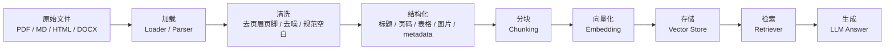
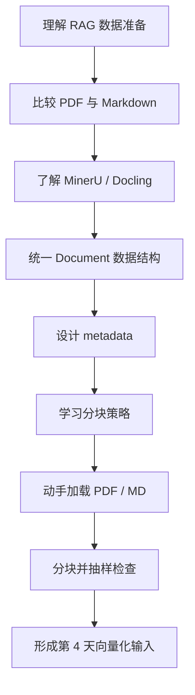

# 第3天：RAG Part 1 加载与分割学习计划

> 今日主题：RAG Part 1: 加载与分割  
> 参考资料：MinerU、Docling  
> 今日目标：掌握 PDF、Markdown 等不同格式文档的加载方式，理解文本分块策略对 RAG 检索质量的影响，并能独立设计一个可扩展的文档预处理流水线。

## 1. 今日总目标

今天的重点不是“会调用某一个 loader API”，而是建立 RAG 数据准备阶段的工程判断力。

完成今天学习后，你应该能够做到：

1. 说清楚 RAG 数据准备阶段为什么重要。
2. 解释“文档加载”和“文本分块”分别解决什么问题。
3. 理解 PDF 与 Markdown 在加载难度上的差异。
4. 知道为什么复杂 PDF 通常不能只用普通文本抽取。
5. 了解 MinerU、Docling 这类文档解析工具在 RAG 流水线中的位置。
6. 能把 PDF、MD 统一转换成内部 `Document` 数据结构。
7. 能设计一套基础 metadata 字段，用于后续检索、引用和调试。
8. 能解释 chunk size、chunk overlap、separator、token-aware splitting 的含义。
9. 能比较固定长度分块、递归字符分块、标题层级分块、父子分块的优缺点。
10. 能根据文档类型选择合适的分块策略。
11. 能写出一个“加载 -> 清洗 -> 分块 -> 检查”的最小数据预处理脚本。
12. 能为第 4 天“向量化与存储”准备结构良好的 chunks。

## 2. 今天你要建立的核心认知

RAG 的效果很大程度不是从 embedding 开始决定的，而是从文档进入系统的那一刻就开始决定了。

一个常见误区是：

> 只要把 PDF 读成字符串，再切成几段，丢进向量数据库，RAG 就完成了。

更接近真实工程的理解应该是：

> RAG 的输入不是“文件”，而是经过解析、清洗、结构还原、元数据标注和合理分块后的知识单元。

如果加载阶段做得粗糙，后面的 embedding、vector store、retriever、reranker、prompt 都会被迫补救前面的错误。很多 RAG 问答失败，不是模型不会回答，而是相关上下文在预处理阶段已经被切坏、丢失、污染或无法被检索到了。

## 3. 今日产出物

建议今天至少完成以下产出：

1. 阅读本目录下的 [02-RAG加载与文本分块详解.md](02-RAG加载与文本分块详解.md)。
2. 自己整理一张“文档加载器选择表”。
3. 准备两个测试文件：
   - 一个 PDF 文件，可以是论文、产品文档、课程讲义或说明书。
   - 一个 Markdown 文件，可以是项目 README、技术笔记或课程文档。
4. 写一个 `load_documents.py`：
   - 能读取 Markdown。
   - 能读取 PDF 解析结果。
   - 能统一输出 `Document(page_content, metadata)`。
5. 写一个 `split_documents.py`：
   - 至少实现递归字符分块。
   - 至少实现 Markdown 标题分块。
   - 打印每个 chunk 的长度、来源、标题路径。
6. 写一个 `inspect_chunks.py`：
   - 抽样展示 chunk。
   - 检查空 chunk、过短 chunk、过长 chunk。
   - 检查 metadata 是否完整。
7. 记录一份实验结论：
   - 不同 chunk size 的效果差异。
   - overlap 是否有帮助。
   - Markdown 标题是否被保留下来。
   - PDF 页码和章节信息是否可追踪。

## 4. 推荐时间安排

如果你今天有 3 到 4 小时，可以按下面节奏推进。

### 阶段一：建立 RAG 数据准备地图，30 分钟

目标：知道今天学的内容处在完整 RAG 系统的哪个位置。

你要理解下面这条链路：



完成标准：

1. 能说清楚 Loader 和 Text Splitter 的职责边界。
2. 能说明为什么第 3 天的输出会成为第 4 天向量化的输入。
3. 能解释“文档解析质量”和“检索质量”之间的关系。

### 阶段二：理解 PDF 与 Markdown 的加载差异，45 分钟

目标：认识到 PDF 和 Markdown 不是同一种难度的输入。

Markdown 的特点：

1. 天然有标题层级。
2. 文本顺序通常就是阅读顺序。
3. 代码块、列表、表格相对容易识别。
4. 很适合作为 RAG 中间格式。
5. 缺点是不同项目的 Markdown 风格不完全一致。

PDF 的特点：

1. PDF 本质更接近“版面呈现格式”，不是天然语义格式。
2. 文本抽取顺序可能不等于阅读顺序。
3. 双栏、多栏、脚注、页眉页脚、表格、公式、图片都可能破坏纯文本抽取。
4. 扫描版 PDF 需要 OCR。
5. 表格和公式通常需要专门模型或规则处理。
6. 页码、标题层级、图片说明、表格标题等信息非常适合作为 metadata。

完成标准：

1. 能解释为什么复杂 PDF 需要 MinerU 或 Docling 这类工具。
2. 能说明 Markdown 为什么常被当作 RAG-ready 中间格式。
3. 能列出至少 5 个 PDF 解析失败的常见现象。

### 阶段三：了解 MinerU 与 Docling 的定位，40 分钟

目标：知道什么时候该使用文档智能解析工具，而不是简单 PDF loader。

MinerU 适合关注：

1. 复杂 PDF 的内容抽取。
2. OCR、版面分析、表格、公式、图片等多模态元素识别。
3. 把非结构化文档转换成 Markdown、JSON 等更适合下游处理的格式。
4. 对科研文档、报告、教材、扫描件进行高质量解析。

Docling 适合关注：

1. 文档转换与统一结构表示。
2. PDF 等文档转换为 Markdown、JSON 等格式。
3. 基于布局分析和表格结构识别的文档解析。
4. Python API 与 CLI 工作流。
5. 与 LangChain、LlamaIndex 等 RAG 生态集成。

完成标准：

1. 能说清楚 MinerU 和 Docling 都不是向量数据库，也不是 RAG 框架，而是文档解析层工具。
2. 能描述它们的输出如何进入后续 chunking 流程。
3. 能根据文档复杂度决定使用“轻量 loader”还是“文档解析引擎”。

### 阶段四：设计统一 Document 数据结构，35 分钟

目标：把不同来源文档统一成后续代码可以处理的格式。

建议用这样的结构理解：

```python
from dataclasses import dataclass, field

@dataclass
class Document:
    page_content: str
    metadata: dict = field(default_factory=dict)
```

`page_content` 放真正要被 embedding 和检索的文本。

`metadata` 放“这段文本从哪里来、处在文档哪里、有什么结构信息”。

建议 metadata 字段：

| 字段 | 说明 | 示例 |
|---|---|---|
| source | 原始文件路径或 URL | docs/rag.pdf |
| file_name | 文件名 | rag.pdf |
| file_type | 文件类型 | pdf / md |
| parser | 解析工具 | mineru / docling / markdown |
| page | PDF 页码 | 12 |
| section | 当前章节标题 | 3.2 Chunking |
| heading_path | Markdown 标题路径 | RAG > Loading > PDF |
| chunk_id | chunk 唯一 ID | rag_pdf_00012 |
| chunk_index | 当前 chunk 序号 | 12 |
| created_at | 处理时间 | 2026-06-15 |

完成标准：

1. 能把 Markdown 和 PDF 解析结果都转换成 `Document`。
2. 能解释哪些字段应该放到正文，哪些字段应该放到 metadata。
3. 能说明 metadata 对引用来源、过滤检索和问题排查的价值。

### 阶段五：掌握基础分块策略，60 分钟

目标：理解 chunking 不是机械切字符串，而是为检索服务的知识单元设计。

今天至少掌握四类分块方式：

1. 固定长度分块。
2. 递归字符分块。
3. Markdown 标题层级分块。
4. 父子分块。

你要重点比较：

| 策略 | 优点 | 缺点 | 适合场景 |
|---|---|---|---|
| 固定长度分块 | 简单、稳定、易实现 | 容易切断语义 | 快速实验、低风险文本 |
| 递归字符分块 | 尽量按段落、句子边界切 | 不理解文档结构 | 普通文本、解析后的 Markdown |
| Markdown 标题分块 | 保留章节结构 | 依赖标题质量 | README、技术文档、课程笔记 |
| 父子分块 | 小块检索，大块回答 | 实现复杂一点 | 长文档、高质量问答 |

完成标准：

1. 能解释 chunk size 太大和太小分别有什么问题。
2. 能解释 overlap 为什么能缓解语义断裂。
3. 能说明为什么 Markdown 文档优先按标题切。
4. 能说明为什么 PDF 转 Markdown 后再分块通常更可控。

### 阶段六：动手实验，60 到 90 分钟

目标：用真实文件跑一遍加载与分块流程。

推荐实验顺序：

1. 选择一个 Markdown 文件。
2. 按标题加载，观察标题路径。
3. 用递归字符分块切分，设置 `chunk_size=500`、`chunk_overlap=80`。
4. 输出每个 chunk 的前 100 字和 metadata。
5. 选择一个 PDF 文件。
6. 使用 MinerU 或 Docling 先转换成 Markdown 或 JSON。
7. 对转换结果执行同样分块流程。
8. 对比 Markdown 原生文档和 PDF 转换文档的 chunk 质量。

完成标准：

1. 能生成一组 chunks。
2. 每个 chunk 都有来源 metadata。
3. 能抽样检查 chunk 是否语义完整。
4. 能发现至少 3 个需要清洗或优化的问题。

### 阶段七：复盘与自测，20 分钟

目标：把今天的知识从“看过”变成“能判断、能解释、能落地”。

请回答：

1. 为什么 PDF 比 Markdown 更难加载？
2. 为什么说 Markdown 是很好的 RAG 中间格式？
3. 什么情况下需要 OCR？
4. MinerU 和 Docling 分别位于 RAG 流水线的哪一层？
5. `Document.page_content` 和 `Document.metadata` 应该分别放什么？
6. chunk size 太大会导致什么问题？
7. chunk size 太小会导致什么问题？
8. chunk overlap 的作用是什么？
9. 为什么标题层级对 RAG 很重要？
10. 如果用户问“第三章里某个概念的定义”，metadata 如何帮忙？
11. 为什么不建议把整本书直接作为一个 chunk？
12. 为什么不建议按每 100 个字无脑切？
13. PDF 页眉页脚对检索有什么坏处？
14. 表格应该如何处理才更适合 RAG？
15. 如何判断一个 chunk 是否合格？

## 5. 今日学习路线图



## 6. 今天的关键判断标准

当你处理一个新文档时，可以按下面顺序判断。

第一问：这个文件能不能直接读出可靠文本？

1. Markdown：通常可以。
2. 纯文本 PDF：可能可以，但要检查顺序和结构。
3. 扫描 PDF：不能直接读，需要 OCR。
4. 复杂排版 PDF：需要布局分析。
5. 大量表格或公式：需要专门解析。

第二问：这个文档是否有结构？

1. 有明确标题：优先按标题层级分块。
2. 没有标题但段落清晰：用递归字符分块。
3. 表格很多：先把表格转换为结构化 Markdown 或 JSON。
4. 页面之间强相关：保留页码和章节信息。

第三问：chunk 应该多大？

建议从这个范围开始：

1. 中文短文档：300 到 800 字。
2. 英文技术文档：500 到 1200 tokens。
3. API 文档：按小节或函数粒度切。
4. 论文：按章节、段落、图表说明组合切。
5. 法律、合同、制度：按条款切，并保留条款编号。

第四问：要不要 overlap？

建议：

1. 普通段落文本：使用 10% 到 20% overlap。
2. Markdown 标题块：可以少量 overlap 或不 overlap。
3. 长段落被迫切断：需要 overlap。
4. 表格：不建议随意 overlap，优先保持完整。
5. 代码：不建议从任意字符切断，优先按函数、类、代码块切。

## 7. 推荐文件结构

如果你今天要补代码，可以在本目录下建立：

```text
第3天RAG Part 1 加载与分割/
├── README.md
├── 01-今日学习计划.md
├── 02-RAG加载与文本分块详解.md
├── examples/
│   ├── sample.md
│   └── sample.pdf
├── scripts/
│   ├── load_markdown.py
│   ├── load_pdf_with_docling.py
│   ├── split_documents.py
│   └── inspect_chunks.py
└── outputs/
    ├── parsed/
    └── chunks/
```

今天可以先不追求完整工程，只要你能把“不同格式输入 -> 统一 Document -> 合理 chunks”跑通，就已经踩到了 RAG 的关键地基。

## 8. 今日最终验收标准

完成今天学习时，你应该能拿任意一个 PDF 或 Markdown 文件，回答下面问题：

1. 我用什么工具加载它，为什么？
2. 我是否需要先转换成 Markdown？
3. 我是否需要 OCR？
4. 我需要清洗哪些噪声？
5. 我应该保留哪些 metadata？
6. 我应该按什么粒度分块？
7. 我如何判断 chunk 质量？
8. 这些 chunk 是否能直接进入第 4 天 embedding 流程？

如果你都能回答，今天的目标就达成了。

