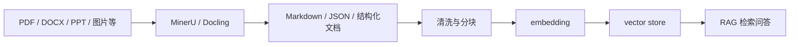
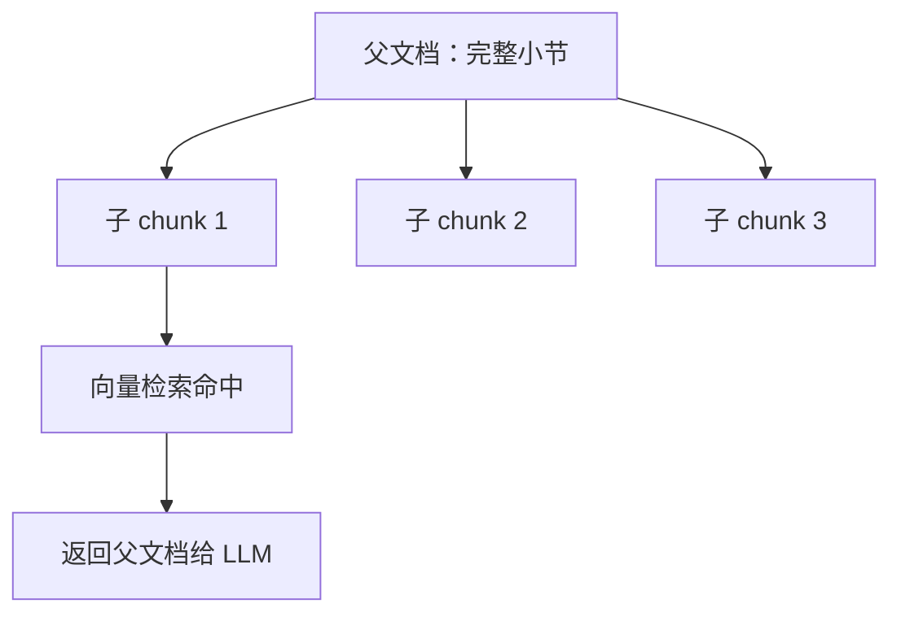
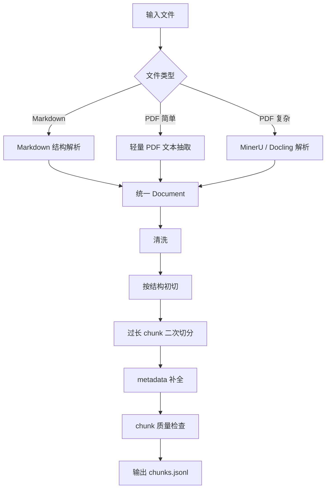
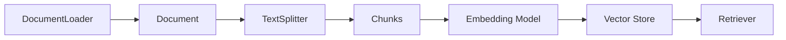

# RAG Part 1：加载与文本分块详解

> 学习主题：RAG 数据摄取、PDF/Markdown 加载、Document 结构、metadata 设计、文本分块策略  
> 参考资料：MinerU、Docling  
> 核心目标：让原始文件变成高质量、可检索、可追踪、可进入向量化流程的 chunks。

## 1. 先建立一个总认识

RAG 的全称是 Retrieval-Augmented Generation，检索增强生成。

很多人第一次学 RAG 时，会把注意力放在：

1. 用什么 embedding 模型。
2. 用什么向量数据库。
3. 用什么大模型。
4. prompt 怎么写。

这些当然都重要，但在真实工程中，RAG 的第一道分水岭往往在更早的位置：

> 文档是否被正确加载、清洗、结构化和分块。

如果原始文档进入系统时就已经乱了，后面的检索和生成很难恢复。比如：

1. PDF 双栏论文被抽成左右混杂的文本。
2. 页眉页脚反复出现在每个 chunk 中。
3. 表格被拆成无意义的散乱文字。
4. 标题和正文被分到不同 chunk。
5. chunk 没有来源页码，回答时无法引用。
6. Markdown 代码块被从中间切断。
7. 一个定义被切在两个 chunk 之间，检索只召回了后一半。
8. chunk 太大，相关信息被大量噪声稀释。
9. chunk 太小，语义不完整，模型看不懂上下文。

所以，今天学习的“加载与分割”，本质上是在做 RAG 的知识工程。

## 2. RAG 数据准备阶段的完整链路

一个基础 RAG 系统的数据准备阶段通常如下：


各阶段职责：

| 阶段 | 目标 | 输出 |
|---|---|---|
| 原始文件 | PDF、MD、HTML、DOCX 等 | 文件路径或字节流 |
| 文档解析 | 抽取文本、表格、标题、图片说明 | Markdown / JSON / 文本 |
| 文本清洗 | 去除噪声、规范空白、修复断行 | 干净文本 |
| 结构还原 | 保留标题、页码、表格、列表、代码块 | 结构化文档 |
| 统一 Document | 抹平不同格式差异 | `Document` 列表 |
| 文本分块 | 生成适合检索的知识单元 | chunks |
| chunk 质检 | 检查长度、语义完整度、metadata | 可入库 chunks |
| embedding | 将 chunk 转成向量 | vectors |
| vector store | 建立索引 | 可检索知识库 |

今天只做到 `chunk 质检` 之前。第 4 天再进入 embedding 和向量存储。

## 3. 什么是文档加载

文档加载不是简单的 `open(file).read()`。

在 RAG 中，文档加载至少要做三件事：

1. 读取内容：从文件中拿到文本或结构化内容。
2. 保留结构：标题、段落、表格、代码块、页码、章节等。
3. 添加来源信息：文件名、页码、解析器、标题路径、时间等。

最终我们希望得到一个统一对象：

```python
from dataclasses import dataclass, field

@dataclass
class Document:
    page_content: str
    metadata: dict = field(default_factory=dict)
```

这里有一个很重要的边界：

1. `page_content` 是会参与 embedding 和检索的正文。
2. `metadata` 主要用于过滤、引用、排序、调试和上下文增强。

不要把所有信息都塞进正文，也不要把对回答有用的信息藏在 metadata 里完全不让模型看到。工程上经常会把一部分 metadata 渲染回 chunk 开头，例如：

```text
标题路径：RAG > 文档加载 > PDF 解析
页码：12

正文内容……
```

这样做的好处是：embedding 能感知章节语义，LLM 也能看到来源线索。

## 4. PDF 与 Markdown 的本质差异

### 4.1 Markdown 是偏语义格式

Markdown 通常长这样：

```markdown
# RAG

## 文档加载

文档加载的目标是……

## 文本分块

文本分块的目标是……
```

它的优点是：

1. 标题层级明确。
2. 阅读顺序基本就是文本顺序。
3. 列表、代码块、引用块、表格有明显语法。
4. 很容易转换为纯文本或 HTML。
5. 很适合作为 RAG 的中间格式。

Markdown 的常见问题：

1. 标题层级可能不规范，比如从 `#` 直接跳到 `###`。
2. 表格可能很宽，不适合直接 embedding。
3. 代码块需要整体保留，不能随便切。
4. 图片通常只有路径，没有图片内容。
5. 链接文本和 URL 是否保留，需要按场景决定。

### 4.2 PDF 是偏版面格式

PDF 更像是“把内容放到页面上的结果”。它关注的是：

1. 文字在页面哪个坐标。
2. 字体是什么。
3. 图片在哪里。
4. 表格线怎么画。
5. 每一页如何显示。

但 RAG 关心的是：

1. 这段话属于哪个章节。
2. 阅读顺序是什么。
3. 表格的行列关系是什么。
4. 图片说明和图片是否关联。
5. 页眉页脚是否应该去掉。
6. 公式是否应该保留为 LaTeX。
7. 跨页段落是否应该合并。

所以 PDF 解析经常遇到困难。

### 4.3 PDF 解析失败的常见现象

常见问题包括：

1. 阅读顺序错乱：双栏论文左栏和右栏混在一起。
2. 页眉页脚污染：每页都出现论文标题、公司名、页码。
3. 断行严重：一句话被切成很多短行。
4. 连字符错误：英文单词跨行时出现 `informa- tion`。
5. 表格丢结构：行列关系变成散乱文本。
6. 公式丢失：数学公式被忽略或变成乱码。
7. 图片缺失：图像内容没有被描述。
8. 标题识别失败：章节标题被当作普通段落。
9. 脚注混入正文：脚注内容插入到正文中间。
10. 扫描版无文本层：普通文本抽取拿不到内容。
11. 多语言混排错误：中文、英文、公式、符号混在一起时识别质量下降。
12. 跨页段落断裂：上一页最后一段和下一页开头不能自动合并。

这就是为什么复杂 PDF 需要 MinerU、Docling 这类文档解析工具。

## 5. MinerU 与 Docling 在 RAG 中的位置

### 5.1 它们解决的不是同一个层级的问题

MinerU 和 Docling 都不是向量数据库，也不是大模型应用框架。它们更靠近 RAG 的数据源头，负责把复杂文档转换成更适合下游处理的结构化结果。

可以把它们放在这个位置：



### 5.2 MinerU 的定位

根据 MinerU 项目和论文描述，它面向高精度文档内容抽取，关注 OCR、布局检测、公式识别、表格识别以及后处理规则等能力。它适合用来处理复杂 PDF、扫描文档、科研论文、报告、教材等非结构化或半结构化文档。

在 RAG 中，你可以把 MinerU 理解成：

> 把复杂 PDF 解析成 RAG 更容易消费的 Markdown、JSON 或其他结构化结果的文档智能解析层。

适合使用 MinerU 的情况：

1. PDF 排版复杂。
2. 文档有大量公式。
3. 文档有大量表格。
4. 文档有图片、图注、跨页内容。
5. 文档是扫描件，需要 OCR。
6. 你希望得到更接近阅读顺序的 Markdown。
7. 你希望后续做高质量 RAG，而不是只做粗糙全文检索。

### 5.3 Docling 的定位

根据 Docling 项目和论文描述，它是一个开源文档转换工具包，可以通过 Python API 或 CLI 使用，目标是把多种常见文档格式解析为统一且结构丰富的表示，并支持布局分析、表格结构识别等能力。Docling 也强调与 LangChain、LlamaIndex 等生态的集成。

在 RAG 中，你可以把 Docling 理解成：

> 一个把文档转换为统一结构表示，并方便接入 RAG 框架的文档转换层。

适合使用 Docling 的情况：

1. 你想用 Python API 直接处理文档。
2. 你想把 PDF 转成 Markdown 或 JSON。
3. 你需要比较规整的文档结构表示。
4. 你希望后续接 LangChain 或 LlamaIndex。
5. 你希望用统一方式处理多种文档格式。
6. 你关注表格结构和版面信息。

### 5.4 轻量 loader、MinerU、Docling 如何选择

可以用下面的决策表：

| 文档类型 | 推荐方式 | 原因 |
|---|---|---|
| 简单 Markdown | 直接 Markdown loader | 结构天然清晰 |
| 简单 TXT | 直接文本 loader | 无复杂结构 |
| 简单 PDF，文字顺序正确 | 轻量 PDF loader 可先试 | 成本低，适合快速验证 |
| 双栏论文 PDF | MinerU / Docling | 需要布局分析 |
| 扫描 PDF | MinerU / Docling + OCR | 无文本层 |
| 大量表格 PDF | MinerU / Docling | 需要表格结构识别 |
| 大量公式论文 | MinerU 更值得关注 | 公式识别是重点 |
| 需要接 LangChain 生态 | Docling 值得关注 | 生态集成方便 |
| 生产级知识库 | 文档解析引擎 + 自定义清洗 | 质量优先 |

## 6. RAG 中的 Document 设计

### 6.1 最小 Document

最小结构：

```python
{
    "page_content": "文档正文",
    "metadata": {
        "source": "docs/rag.md"
    }
}
```

但真实项目里，这通常不够。

### 6.2 推荐 metadata 字段

建议从这些字段开始：

| 字段 | 类型 | 是否推荐 | 说明 |
|---|---|---|---|
| source | string | 必须 | 原始文件路径或 URL |
| file_name | string | 必须 | 文件名 |
| file_type | string | 必须 | pdf / md / txt |
| parser | string | 推荐 | mineru / docling / markdown |
| parser_version | string | 可选 | 解析器版本 |
| page | int | PDF 推荐 | 页码 |
| total_pages | int | 可选 | 总页数 |
| section | string | 推荐 | 当前章节 |
| heading_path | list/string | 强烈推荐 | 标题路径 |
| title | string | 推荐 | 文档标题 |
| author | string | 可选 | 作者 |
| created_at | string | 可选 | 处理时间 |
| chunk_id | string | 必须 | chunk 唯一 ID |
| chunk_index | int | 必须 | chunk 顺序 |
| parent_id | string | 父子分块推荐 | 父文档 ID |
| start_char | int | 可选 | 在父文本中的起始位置 |
| end_char | int | 可选 | 在父文本中的结束位置 |
| language | string | 可选 | zh / en / mixed |

### 6.3 metadata 的价值

metadata 至少有 5 个价值：

1. 来源引用：回答时告诉用户来自哪个文件、哪一页。
2. 过滤检索：只检索某个文件、某个章节、某种文档类型。
3. 排序加权：标题、摘要、正文可以给不同权重。
4. 调试排查：检索错了时能追踪是哪个 chunk 的问题。
5. 上下文增强：把章节标题、页码渲染给模型，提高回答稳定性。

### 6.4 哪些信息应该放正文，哪些放 metadata

适合放正文：

1. 用户可能会问到的定义、观点、步骤、条款。
2. 标题路径中对语义有帮助的部分。
3. 表格转写后的语义内容。
4. 图片说明、图注、公式说明。
5. 代码块及其上下文。

适合放 metadata：

1. 文件路径。
2. 页码。
3. chunk 序号。
4. 解析器名称。
5. 文档类型。
6. 时间戳。
7. 权限标签。
8. 业务分类标签。

有些信息两边都可以放，比如章节标题。工程上常见做法是：

1. metadata 中保留结构化 `heading_path`。
2. chunk 正文开头也渲染一行标题路径，帮助 embedding。

## 7. Markdown 加载策略

### 7.1 最简单的 Markdown 加载

```python
from pathlib import Path

def load_markdown(path: str) -> dict:
    text = Path(path).read_text(encoding="utf-8")
    return {
        "page_content": text,
        "metadata": {
            "source": path,
            "file_name": Path(path).name,
            "file_type": "md",
            "parser": "markdown_raw",
        },
    }
```

这个方法简单，但有问题：整篇 Markdown 可能很长，还没有按标题结构拆开。

### 7.2 按标题解析 Markdown

Markdown 标题天然适合做结构化解析。

示例：

```markdown
# RAG

## 文档加载

加载是……

### PDF 加载

PDF 加载需要……

## 文本分块

分块是……
```

可以得到这样的标题路径：

```text
RAG
RAG > 文档加载
RAG > 文档加载 > PDF 加载
RAG > 文本分块
```

这对 RAG 非常有帮助，因为用户的问题经常隐含章节范围，例如：

1. “PDF 加载有什么坑？”
2. “文本分块里的 overlap 是什么？”
3. “这个项目的安装步骤是什么？”

如果 chunk 带着标题路径，检索和回答都会更稳定。

### 7.3 Markdown 特殊结构处理

Markdown 里有一些结构不能随便切。

#### 代码块

代码块应该整体保留：

````markdown
```python
def hello():
    print("hello")
```
````

不要切成：

```text
def hello():
```

和：

```text
print("hello")
```

否则模型拿到的上下文是不完整的。

#### 表格

Markdown 表格：

```markdown
| 参数 | 说明 |
|---|---|
| chunk_size | chunk 最大长度 |
| chunk_overlap | 相邻 chunk 重叠长度 |
```

小表格可以整体保留。大表格要考虑：

1. 按行切。
2. 每个 chunk 保留表头。
3. 转成自然语言描述。
4. 结合结构化检索，而不是只做向量检索。

#### 列表

列表最好按完整列表项保留，不要从中间切断。

#### 链接

链接可以有三种处理方式：

1. 只保留链接文本。
2. 保留链接文本和 URL。
3. 把 URL 放 metadata。

技术文档里，建议保留 URL，因为用户可能问“参考链接是什么”。

## 8. PDF 加载策略

### 8.1 PDF 加载的三个层次

PDF 加载可以分成三个层次：

1. 纯文本抽取。
2. 布局感知抽取。
3. 多模态结构化解析。

#### 纯文本抽取

适合：

1. 简单 PDF。
2. 单栏文本。
3. 没有复杂表格和公式。
4. 文本层质量好。

缺点：

1. 可能顺序错。
2. 页眉页脚会混入正文。
3. 表格结构丢失。
4. 图片和公式基本处理不好。

#### 布局感知抽取

适合：

1. 双栏论文。
2. 报告。
3. 复杂排版文档。
4. 有标题、表格、图注的文档。

需要关注：

1. 阅读顺序。
2. 标题识别。
3. 段落合并。
4. 表格结构。
5. 页码 metadata。

#### 多模态结构化解析

适合：

1. 扫描件。
2. 图片型 PDF。
3. 公式密集论文。
4. 表格密集报告。
5. 需要高质量 RAG 的生产级知识库。

这时就该考虑 MinerU、Docling 这类工具。

### 8.2 PDF 转 Markdown 的价值

很多 RAG 流水线会先把 PDF 转成 Markdown。

原因是：

1. Markdown 更容易检查。
2. Markdown 更容易按标题切分。
3. Markdown 能表达标题、列表、代码块、表格。
4. Markdown 比 PDF 坐标信息更接近语义文本。
5. Markdown 可以作为人工修订的中间产物。

但是注意：

> PDF 转 Markdown 不是终点，只是更好的中间层。

你仍然需要：

1. 清洗 Markdown。
2. 检查标题层级。
3. 处理重复页眉页脚。
4. 处理表格和图片。
5. 再执行分块。

### 8.3 PDF 加载后的质量检查

每个 PDF 解析后，都建议抽样检查：

1. 前 3 页。
2. 中间 3 页。
3. 最后 3 页。
4. 表格所在页。
5. 图片和公式所在页。
6. 目录页。
7. 参考文献页。

检查问题：

1. 阅读顺序是否正确？
2. 标题是否被识别？
3. 页眉页脚是否污染正文？
4. 表格是否可读？
5. 公式是否保留？
6. 图片说明是否保留？
7. 页码 metadata 是否正确？
8. 是否有大量乱码？
9. 是否有大量空行？
10. 是否有重复内容？

## 9. 文本清洗

### 9.1 为什么清洗很重要

脏文本会直接影响 embedding 和检索。

例如页眉页脚重复出现：

```text
公司内部资料 请勿外传
第 1 页
……
公司内部资料 请勿外传
第 2 页
……
公司内部资料 请勿外传
第 3 页
……
```

如果不清洗，很多 chunk 都会带着“公司内部资料 请勿外传”，embedding 会被无关内容污染。

### 9.2 常见清洗规则

常见清洗动作：

1. 去掉重复页眉。
2. 去掉重复页脚。
3. 合并错误断行。
4. 修复英文跨行连字符。
5. 规范连续空格。
6. 规范连续空行。
7. 删除空 chunk。
8. 删除过短噪声行。
9. 统一全角半角符号。
10. 处理乱码。
11. 过滤目录页或参考文献页，视业务而定。
12. 保留或删除水印，视业务而定。

### 9.3 清洗不要过度

清洗有风险。不要为了“看起来干净”删掉有用信息。

比如：

1. 合同中的编号不能删。
2. API 文档里的参数名不能改。
3. 代码块里的缩进不能乱动。
4. 表格里的空值可能有业务含义。
5. 法律条文里的标点可能影响含义。

建议原则：

> 清洗只删除确定无用的噪声，结构信息尽量保留。

## 10. 什么是文本分块

文本分块就是把长文档切成多个较小的知识单元。

为什么需要分块？

1. embedding 模型有 token 限制。
2. 向量检索需要可比较的语义单元。
3. LLM 上下文窗口有限。
4. 太长的文本会稀释相关信息。
5. 太短的文本会丢失语义上下文。

一个 chunk 应该像什么？

> 一个 chunk 应该是可以独立表达一个相对完整意思的最小上下文单元。

它不一定是一个自然段，也不一定是固定字数。它应该服务于检索和回答。

## 11. chunk size

### 11.1 chunk size 是什么

`chunk_size` 表示每个 chunk 的最大长度。

长度可以按：

1. 字符数。
2. token 数。
3. 句子数。
4. 段落数。
5. 语义单元数。

实际工程中，token-aware splitting 更准确，因为模型和 embedding 的限制通常按 token 计算。

### 11.2 chunk 太大的问题

chunk 太大时：

1. embedding 表达会变得模糊。
2. 一个 chunk 里混入多个主题。
3. 检索命中后带入大量无关内容。
4. LLM 上下文被浪费。
5. rerank 成本更高。
6. 引用定位不精确。

示例：

```text
一个 chunk 同时包含：安装步骤、API 参数、错误码、部署架构、FAQ。
```

用户问“错误码 401 是什么”，这个 chunk 可能能被召回，但里面噪声太多。

### 11.3 chunk 太小的问题

chunk 太小时：

1. 语义不完整。
2. 定义和解释被切开。
3. 标题和正文分离。
4. 检索召回碎片化。
5. LLM 需要更多 chunk 才能回答。
6. 向量数据库条目数量暴涨。

示例：

```text
chunk 1: RAG 的核心思想是
chunk 2: 从外部知识库检索相关内容
chunk 3: 再把内容放进 prompt
```

每个 chunk 单独看都不完整。

### 11.4 推荐起步参数

可以先从这里开始：

| 文档类型 | chunk size | overlap |
|---|---:|---:|
| 中文课程笔记 | 500 到 900 字 | 80 到 150 字 |
| 英文技术文档 | 700 到 1200 tokens | 100 到 200 tokens |
| API 文档 | 一个函数或小节 | 少量或无 |
| Markdown README | 一个二级或三级标题块 | 少量 |
| 论文 | 一个小节或 800 到 1200 tokens | 100 到 200 tokens |
| 合同制度 | 一个条款或子条款 | 少量 |

这些不是固定答案，只是起点。最终要通过检索评估来调。

## 12. chunk overlap

### 12.1 overlap 是什么

`chunk_overlap` 表示相邻 chunk 之间重叠的内容长度。

例如：

```text
原文：ABCDEFGHIJK
chunk_size=5
chunk_overlap=2

chunk 1: ABCDE
chunk 2: DEFGH
chunk 3: GHIJK
```

### 12.2 overlap 的作用

overlap 用来缓解语义被切断的问题。

适合：

1. 段落很长。
2. 概念解释跨越边界。
3. 没有明显标题结构。
4. 使用固定长度或递归字符分块。

不适合滥用：

1. overlap 太大，会导致重复内容太多。
2. 存储成本增加。
3. 检索结果容易重复。
4. LLM 看到多个相似 chunk，可能浪费上下文。

### 12.3 overlap 推荐值

经验值：

1. 10% 到 20% 是常见起点。
2. 结构化 Markdown 可以少一点。
3. 长段落文本可以多一点。
4. 表格和代码块不要机械 overlap。

## 13. 常见分块策略

### 13.1 固定长度分块

最简单：

```python
def fixed_split(text: str, size: int = 500, overlap: int = 50):
    chunks = []
    start = 0
    while start < len(text):
        end = start + size
        chunks.append(text[start:end])
        start = end - overlap
    return chunks
```

优点：

1. 简单。
2. 稳定。
3. 容易实现。

缺点：

1. 容易切断句子。
2. 不理解段落。
3. 不理解标题。
4. 不适合表格、代码、合同条款。

适合：

1. 快速实验。
2. 文本很均匀。
3. 对结构要求不高。

### 13.2 递归字符分块

递归字符分块会按分隔符优先级尝试切分。

常见分隔符优先级：

```python
separators = ["\n\n", "\n", "。", "，", " ", ""]
```

意思是：

1. 优先按段落切。
2. 段落太长，再按行切。
3. 行太长，再按句号切。
4. 仍然太长，再按逗号或空格切。
5. 最后才按字符切。

优点：

1. 比固定长度更尊重文本边界。
2. 实现成本低。
3. 适合大多数普通文本。

缺点：

1. 不真正理解语义。
2. 对标题、表格、代码块需要额外保护。
3. 分隔符设计会影响效果。

适合：

1. 纯文本。
2. PDF 转出来的普通 Markdown。
3. 没有强结构的长文档。

### 13.3 Markdown 标题层级分块

Markdown 文档优先考虑标题层级分块。

示例：

```markdown
# 第一章 RAG

## 1.1 加载

正文 A

## 1.2 分块

正文 B
```

可以切成：

```text
chunk 1:
heading_path = 第一章 RAG > 1.1 加载
content = 正文 A

chunk 2:
heading_path = 第一章 RAG > 1.2 分块
content = 正文 B
```

优点：

1. 保留文档结构。
2. 语义完整度高。
3. metadata 很清晰。
4. 引用和调试方便。

缺点：

1. 依赖标题质量。
2. 某些标题下内容可能过长，仍需二次切分。
3. 某些标题下内容太短，需要合并。

推荐做法：

1. 先按标题切成 section。
2. 如果 section 太长，再对 section 内部递归切分。
3. 每个子 chunk 都继承 heading_path。
4. chunk 正文开头可以加标题路径。

### 13.4 语义分块

语义分块尝试按语义边界切，而不是只按字符或标题。

常见思路：

1. 先按句子切。
2. 计算相邻句子的 embedding 相似度。
3. 在语义变化明显的位置切断。

优点：

1. 更贴近语义边界。
2. 对无标题长文档可能有效。

缺点：

1. 成本更高。
2. 实现复杂。
3. 对 embedding 模型质量敏感。
4. 结果不一定稳定。

初学阶段不必优先实现，但要知道它存在。

### 13.5 父子分块

父子分块是一种很实用的 RAG 策略。

核心思想：

1. 用小 chunk 做检索，因为小 chunk 更精准。
2. 检索命中后，返回它所属的较大父 chunk 给 LLM，因为父 chunk 上下文更完整。

示意：



适合：

1. 长文档问答。
2. 技术文档。
3. 论文。
4. 合同。
5. 用户问题需要完整上下文。

metadata 需要保留：

1. `parent_id`
2. `child_id`
3. `heading_path`
4. `source`
5. `page`

缺点：

1. 实现比普通分块复杂。
2. 需要同时存储父块和子块。
3. 检索后需要多一步映射。

## 14. 不同文档类型的分块建议

### 14.1 Markdown 技术文档

推荐：

1. 按标题层级切。
2. 代码块整体保留。
3. 表格整体保留或按行处理。
4. 每个 chunk 保留 `heading_path`。
5. 太长的小节再递归切。

metadata：

```python
{
    "source": "README.md",
    "file_type": "md",
    "heading_path": "项目名 > 安装 > Windows",
    "section": "Windows",
    "chunk_index": 3
}
```

### 14.2 PDF 论文

推荐：

1. 先用 MinerU 或 Docling 转 Markdown/JSON。
2. 保留标题、页码、公式、图表说明。
3. 按章节和小节切。
4. 摘要、引言、方法、实验、结论可以作为独立 section。
5. 表格和图注尽量和解释文本放近一些。

注意：

1. 参考文献是否入库要按场景决定。
2. 公式如果用户会问，需要保留 LaTeX 或文字解释。
3. 图表如果很重要，可以生成图片说明后入库。

### 14.3 产品手册

推荐：

1. 按功能模块切。
2. 安装、配置、错误码、FAQ 分开。
3. 步骤列表整体保留。
4. 参数表保留表头。
5. chunk 不要跨多个功能主题。

### 14.4 API 文档

推荐：

1. 一个接口一个父 chunk。
2. 方法名、路径、参数、返回值、示例要放在一起。
3. 子 chunk 可以按“参数说明”“请求示例”“响应示例”切。
4. metadata 保留 endpoint、method、version。

示例 metadata：

```python
{
    "doc_type": "api",
    "endpoint": "/v1/chat/completions",
    "method": "POST",
    "version": "v1"
}
```

### 14.5 法律合同制度

推荐：

1. 按条、款、项切。
2. 保留编号。
3. 不要把编号和正文分开。
4. overlap 要谨慎。
5. metadata 保留条款编号。

### 14.6 课程讲义

推荐：

1. 按章节、小节切。
2. 定义、例子、练习题尽量放在同一上下文。
3. 图片和图注尽量保留。
4. 对过长小节做二次递归切分。

## 15. 一个推荐的加载与分块流水线

### 15.1 总流程



### 15.2 伪代码

```python
from pathlib import Path

def load_file(path: str):
    suffix = Path(path).suffix.lower()

    if suffix == ".md":
        return load_markdown_as_sections(path)

    if suffix == ".pdf":
        if is_complex_pdf(path):
            parsed = parse_pdf_with_doc_engine(path)
            return convert_parsed_result_to_documents(parsed)
        return load_simple_pdf(path)

    raise ValueError(f"Unsupported file type: {suffix}")


def preprocess_documents(paths: list[str]):
    documents = []

    for path in paths:
        docs = load_file(path)
        docs = clean_documents(docs)
        chunks = split_documents(docs)
        chunks = enrich_metadata(chunks)
        validate_chunks(chunks)
        documents.extend(chunks)

    return documents
```

### 15.3 输出 JSONL 示例

每一行一个 chunk：

```json
{"page_content":"标题路径：RAG > 文档加载\n\n文档加载的目标是……","metadata":{"source":"rag.md","file_type":"md","heading_path":"RAG > 文档加载","chunk_id":"rag_0001","chunk_index":1}}
{"page_content":"标题路径：RAG > 文本分块\n\n文本分块的目标是……","metadata":{"source":"rag.md","file_type":"md","heading_path":"RAG > 文本分块","chunk_id":"rag_0002","chunk_index":2}}
```

JSONL 的好处：

1. 一行一个对象，适合流式处理。
2. 容易追加。
3. 容易抽样检查。
4. 后续 embedding 脚本可以逐行读取。

## 16. chunk 质量检查

### 16.1 自动检查

建议检查：

1. 是否为空。
2. 是否过短。
3. 是否过长。
4. 是否有重复 chunk。
5. 是否缺少 source。
6. 是否缺少 chunk_id。
7. PDF 是否缺少 page。
8. Markdown 是否缺少 heading_path。
9. 是否包含大量乱码。
10. 是否包含异常多的空白字符。

伪代码：

```python
def validate_chunk(chunk):
    text = chunk["page_content"]
    metadata = chunk["metadata"]

    if not text.strip():
        raise ValueError("empty chunk")

    if len(text) < 30:
        print("warning: chunk too short", metadata)

    if len(text) > 2000:
        print("warning: chunk too long", metadata)

    required = ["source", "file_type", "chunk_id", "chunk_index"]
    for key in required:
        if key not in metadata:
            raise ValueError(f"missing metadata: {key}")
```

### 16.2 人工抽样检查

自动检查只能发现格式问题，不能完全发现语义问题。

人工抽样时看：

1. 这个 chunk 单独看是否能理解？
2. 标题和正文是否匹配？
3. 是否从句子中间开始？
4. 是否从句子中间结束？
5. 是否混入页眉页脚？
6. 是否混入无关章节？
7. 表格是否完整？
8. 代码块是否完整？
9. metadata 是否能追踪来源？
10. 如果用户问这个 chunk 相关问题，它是否足够回答？

### 16.3 检索前的黄金问题

每个 chunk 都可以用这 5 个问题检验：

1. 它来自哪里？
2. 它讲了什么？
3. 它是否足够完整？
4. 它是否足够聚焦？
5. 它是否能被用户自然问题召回？

## 17. 一个最小可行实现思路

你可以按这个顺序写代码。

### 17.1 第一步：定义 Document

```python
from dataclasses import dataclass, field

@dataclass
class Document:
    page_content: str
    metadata: dict = field(default_factory=dict)
```

### 17.2 第二步：加载 Markdown

```python
from pathlib import Path

def load_markdown(path: str) -> list[Document]:
    text = Path(path).read_text(encoding="utf-8")
    return [
        Document(
            page_content=text,
            metadata={
                "source": path,
                "file_name": Path(path).name,
                "file_type": "md",
                "parser": "raw_markdown",
            },
        )
    ]
```

### 17.3 第三步：递归分块

```python
def recursive_split(text: str, chunk_size: int = 800, overlap: int = 100):
    separators = ["\n\n", "\n", "。", "，", " ", ""]

    def split_by_separator(part: str, seps: list[str]):
        if len(part) <= chunk_size:
            return [part]
        if not seps:
            return [part[i:i + chunk_size] for i in range(0, len(part), chunk_size - overlap)]

        sep = seps[0]
        if sep == "":
            return [part[i:i + chunk_size] for i in range(0, len(part), chunk_size - overlap)]

        pieces = part.split(sep)
        chunks = []
        current = ""

        for piece in pieces:
            candidate = current + (sep if current else "") + piece
            if len(candidate) <= chunk_size:
                current = candidate
            else:
                if current:
                    chunks.extend(split_by_separator(current, seps[1:]))
                current = piece

        if current:
            chunks.extend(split_by_separator(current, seps[1:]))

        return chunks

    raw_chunks = split_by_separator(text, separators)
    return [chunk.strip() for chunk in raw_chunks if chunk.strip()]
```

这段代码只是教学用。真实项目建议使用成熟 splitter，并补充 token 计算、代码块保护、表格保护等能力。

### 17.4 第四步：补全 chunk metadata

```python
def split_document(doc: Document) -> list[Document]:
    parts = recursive_split(doc.page_content)
    chunks = []

    for index, part in enumerate(parts):
        metadata = dict(doc.metadata)
        metadata["chunk_index"] = index
        metadata["chunk_id"] = f"{Path(metadata['source']).stem}_{index:04d}"

        chunks.append(Document(page_content=part, metadata=metadata))

    return chunks
```

### 17.5 第五步：检查输出

```python
def inspect_chunks(chunks: list[Document], limit: int = 5):
    for chunk in chunks[:limit]:
        print("=" * 80)
        print(chunk.metadata)
        print(chunk.page_content[:300])
```

## 18. LangChain 中的相关概念

如果你接 LangChain，常见对象包括：

1. `Document`
2. `DocumentLoader`
3. `TextSplitter`
4. `RecursiveCharacterTextSplitter`
5. `MarkdownHeaderTextSplitter`
6. `ParentDocumentRetriever`

概念关系：



注意：今天的重点不是背类名，而是理解每个类背后的工程问题。

## 19. 实验建议：三组对比

### 19.1 对比一：不同 chunk size

用同一份文档生成三组 chunks：

1. `chunk_size=300`
2. `chunk_size=700`
3. `chunk_size=1200`

观察：

1. chunk 数量变化。
2. 单个 chunk 是否完整。
3. 是否混入多个主题。
4. 后续检索时是否更精准。

### 19.2 对比二：有无 overlap

生成两组：

1. `chunk_overlap=0`
2. `chunk_overlap=100`

观察：

1. 边界处语义是否断裂。
2. 检索结果是否重复。
3. 总 chunk 数是否明显增加。

### 19.3 对比三：纯递归分块 vs 标题分块

对 Markdown 文档生成两组：

1. 直接递归字符分块。
2. 先按标题切，再递归字符分块。

观察：

1. 标题和正文是否分离。
2. chunk 是否更聚焦。
3. metadata 是否更有用。
4. 用户问章节相关问题时，哪种更容易召回。

## 20. 常见错误清单

初学 RAG 加载与分块时，最常见错误有：

1. 把整个 PDF 当成一个字符串。
2. 不检查 PDF 文本顺序。
3. 不去页眉页脚。
4. 不保留页码。
5. 不保留文件来源。
6. 不保留标题层级。
7. chunk size 随便设。
8. overlap 设得过大。
9. 表格被切碎。
10. 代码块被切碎。
11. 图片和图注分离。
12. metadata 只有 `source`。
13. 没有 chunk 质量检查。
14. 没有人工抽样。
15. 还没看 chunk，就直接 embedding 入库。

## 21. 推荐实践原则

### 21.1 先结构，后长度

优先按文档结构切，比如标题、章节、条款、接口、函数。

结构切完后，如果还太长，再按长度做二次切分。

不要一开始就按固定字数切所有东西。

### 21.2 先可读，后可嵌入

一个 chunk 首先应该人能看懂。

如果人类看这个 chunk 都不知道它在讲什么，embedding 模型也很难把它表达好。

### 21.3 metadata 宁可多一点

早期可以多保留 metadata。后面觉得无用再删。

一旦入库时没有保留页码、标题、来源，后面想补会很麻烦。

### 21.4 解析结果必须抽样看

文档解析不是黑盒。尤其是 PDF，一定要抽样看。

不要相信“程序成功运行”就等于“解析质量合格”。

### 21.5 分块参数要靠评估调整

没有全局最优的 chunk size。

你需要结合：

1. 文档类型。
2. 用户问题类型。
3. embedding 模型。
4. retriever 策略。
5. LLM 上下文长度。
6. 成本要求。

来调参。

## 22. 从今天到明天的衔接

今天结束时，你应该有：

1. 一批清洗后的 chunks。
2. 每个 chunk 有 `page_content`。
3. 每个 chunk 有完整 metadata。
4. chunks 可以保存为 JSONL。
5. 你能解释这些 chunk 为什么这样切。

第 4 天会在此基础上做：

1. 选择 embedding 模型。
2. 把 chunk 转成向量。
3. 存入向量数据库。
4. 实现相似度检索。
5. 比较不同检索参数。

如果今天的 chunk 质量不行，明天的向量检索会很痛苦。

## 23. 今日自测题

请尽量不用看答案，自己回答。

1. 文档加载和文本分块分别解决什么问题？
2. 为什么 PDF 不能简单理解为“带格式的 TXT”？
3. Markdown 为什么适合作为 RAG 中间格式？
4. 扫描版 PDF 为什么需要 OCR？
5. MinerU 和 Docling 在 RAG 中分别处在哪一层？
6. 什么情况下轻量 PDF loader 就够了？
7. 什么情况下应该使用 MinerU 或 Docling？
8. `page_content` 和 `metadata` 的边界是什么？
9. 为什么页码应该放 metadata？
10. 为什么标题路径可以同时放 metadata 和正文？
11. chunk size 太大会带来什么问题？
12. chunk size 太小会带来什么问题？
13. overlap 的作用是什么？
14. overlap 太大会有什么坏处？
15. 递归字符分块相比固定长度分块好在哪里？
16. Markdown 标题分块有什么优势？
17. 父子分块解决了什么矛盾？
18. 表格为什么不能随便按字符切？
19. 代码块为什么要整体保留？
20. 如何判断一个 chunk 是否适合进入向量数据库？

## 24. 参考资料

1. MinerU GitHub: https://github.com/opendatalab/MinerU
2. MinerU paper: https://arxiv.org/abs/2409.18839
3. Docling GitHub: https://github.com/docling-project/docling
4. Docling paper: https://arxiv.org/abs/2501.17887
5. Docling technical report: https://arxiv.org/abs/2408.09869

## 25. 最后总结

今天你真正要掌握的是这句话：

> RAG 的检索质量，首先取决于知识是否被正确地解析成可检索单元。

加载决定“内容有没有进来、结构有没有保住、来源能不能追踪”。

分块决定“知识单元是否完整、聚焦、适合 embedding、适合被问题召回”。

当你能根据文档类型选择解析工具，根据结构设计 metadata，根据问答场景调整分块策略时，你就已经从“会调 API”进入了“会做 RAG 工程”的阶段。

