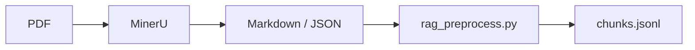
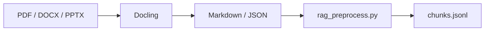

# RAG Part 1 代码实现详解：加载、清洗、分块、质检

> 对应代码：`scripts/rag_preprocess.py`  
> 示例输入：`examples/sample.md`  
> 输出文件：`outputs/chunks.jsonl`  
> 学习目标：用一套具体代码把“PDF/Markdown 文档 -> Document -> chunks -> JSONL”的 RAG 数据准备流程跑通。

## 1. 这套代码解决什么问题

今天的主题是 RAG Part 1：加载与分割。

概念上你已经知道：


这份代码就是把上面每一步落成一个能运行的 Python 脚本。

它支持：

1. 加载 Markdown。
2. 加载 TXT。
3. 加载 JSON 解析结果，例如 MinerU 或 Docling 导出的结构化结果。
4. 可选加载 PDF，依赖 `pypdf`。
5. 按 Markdown 标题结构生成 section。
6. 对文本执行递归字符分块。
7. 给每个 chunk 补全 metadata。
8. 输出 JSONL，供第 4 天 embedding 和向量数据库使用。
9. 打印 chunk 质量报告。
10. 打印前几个 chunk，方便人工抽样检查。

## 2. 文件结构

新增结构如下：

```text
第3天RAG Part 1 加载与分割/
├── README.md
├── 01-今日学习计划.md
├── 02-RAG加载与文本分块详解.md
├── 03-代码实现详解.md
├── requirements.txt
├── examples/
│   └── sample.md
└── scripts/
    └── rag_preprocess.py
```

运行后会生成：

```text
outputs/
└── chunks.jsonl
```

## 3. 如何运行

先进入目录：

```powershell
cd "D:\vscode项目\AI Agent 开发工程师学习路线图（工程落地版）\第 1 周：大模型应用开发基础 + 手撕 Naive RAG\第3天RAG Part 1 加载与分割"
```

运行示例 Markdown：

```powershell
python scripts/rag_preprocess.py --input examples/sample.md --output outputs/chunks.jsonl --include-metadata-header
```

如果你直接运行脚本、不传任何参数，脚本会自动使用内置示例：

```powershell
python scripts/rag_preprocess.py
```

这等价于处理：

```text
examples/sample.md -> outputs/chunks.jsonl
```

这样设计是为了方便你在 VS Code 里直接点运行按钮，也能先看到完整流程。

如果你想调整 chunk 大小：

```powershell
python scripts/rag_preprocess.py --input examples/sample.md --output outputs/chunks_500.jsonl --chunk-size 500 --chunk-overlap 80 --include-metadata-header
```

如果你想处理整个目录：

```powershell
python scripts/rag_preprocess.py --input examples --recursive --output outputs/chunks.jsonl --include-metadata-header
```

如果你要直接读取 PDF，需要先安装可选依赖：

```powershell
pip install -r requirements.txt
```

然后运行：

```powershell
python scripts/rag_preprocess.py --input your_file.pdf --output outputs/pdf_chunks.jsonl --include-metadata-header
```

注意：`pypdf` 适合简单 PDF。复杂 PDF 建议先用 MinerU 或 Docling 转成 Markdown/JSON，再用本脚本处理转换结果。

## 4. 输入与输出

### 4.1 输入

脚本支持这些文件：

| 后缀 | 处理方式 |
|---|---|
| `.md` | Markdown 标题解析或原文加载 |
| `.markdown` | Markdown 标题解析或原文加载 |
| `.txt` | 纯文本加载 |
| `.json` | 从常见文本字段中递归提取文本 |
| `.pdf` | 使用可选依赖 `pypdf` 逐页抽取 |

### 4.2 输出

输出是 JSONL，每一行一个 chunk。

示例：

```json
{"page_content":"标题路径：Naive RAG 学习笔记 > 2. 文档加载\n\n## 2. 文档加载\n\n文档加载的目标是把 PDF、Markdown、HTML、DOCX 等原始文件转换成统一的 Document 对象。","metadata":{"source":"examples\\sample.md","file_name":"sample.md","file_type":"md","parser":"markdown_heading","created_at":"2026-06-15T08:00:00+00:00","heading_path":"Naive RAG 学习笔记 > 2. 文档加载","section":"2. 文档加载","chunk_index":0,"chunk_id":"sample_0000_12345","chunk_length":138,"global_chunk_index":1}}
```

为什么用 JSONL？

1. 一行一个 chunk，适合流式处理。
2. 后续 embedding 脚本可以逐行读取，不必一次性加载全部。
3. 方便追加和抽样。
4. 方便排查某个 chunk 的来源。

## 5. 核心数据结构：Document

代码中定义了：

```python
@dataclass
class Document:
    """A unified document object before or after splitting."""

    page_content: str
    metadata: dict[str, Any] = field(default_factory=dict)
```

这就是 RAG 数据预处理阶段最重要的抽象。

`page_content` 表示真正参与 embedding 和检索的文本。

`metadata` 表示来源信息和结构信息，例如：

```python
{
    "source": "examples/sample.md",
    "file_name": "sample.md",
    "file_type": "md",
    "parser": "markdown_heading",
    "heading_path": "Naive RAG 学习笔记 > 2. 文档加载",
    "section": "2. 文档加载",
    "chunk_id": "sample_0000_12345",
    "chunk_index": 0
}
```

这个设计和 LangChain 里的 `Document` 思想是一致的。你后续接 LangChain 时，可以很容易转换。

## 6. 文本清洗：normalize_text

函数：

```python
def normalize_text(text: str) -> str:
    """Clean common whitespace noise without destroying useful structure."""

    text = text.replace("\ufeff", "")
    text = text.replace("\r\n", "\n").replace("\r", "\n")
    text = re.sub(r"[ \t]+", " ", text)
    text = re.sub(r"\n{4,}", "\n\n\n", text)
    return text.strip()
```

它做了几件事：

1. 删除 UTF-8 BOM。
2. 统一 Windows、Linux、Mac 的换行符。
3. 把连续空格和 tab 简化成一个空格。
4. 把过多空行压缩。
5. 去掉首尾空白。

注意这里没有做激进清洗。

原因是：教学阶段要优先保留结构，不要为了“干净”误删重要内容。比如合同编号、代码缩进、表格空值、API 参数名，都可能很重要。

## 7. 文件发现：iter_input_files

函数：

```python
def iter_input_files(input_path: Path, recursive: bool) -> list[Path]:
    if input_path.is_file():
        return [input_path]

    pattern = "**/*" if recursive else "*"
    files = [
        path
        for path in input_path.glob(pattern)
        if path.is_file() and path.suffix.lower() in SUPPORTED_SUFFIXES
    ]
    return sorted(files)
```

它解决的问题是：

1. 输入可以是单个文件。
2. 输入也可以是目录。
3. 如果加 `--recursive`，就递归读取目录中的支持文件。
4. 只保留 `.md`、`.txt`、`.json`、`.pdf` 等支持格式。

这一步是 RAG 批量数据摄取的基础。

## 8. Markdown 加载

### 8.1 原文加载

函数：

```python
def load_markdown_raw(path: Path) -> list[Document]:
    text = normalize_text(path.read_text(encoding="utf-8"))
    return [Document(text, base_metadata(path, "raw_markdown"))]
```

这种方式把整个 Markdown 当成一个 Document。

优点：

1. 简单。
2. 不丢结构符号。
3. 适合很短的 Markdown。

缺点：

1. 长文档还要继续分块。
2. 标题路径没有被结构化提取。
3. 后续 metadata 不够丰富。

运行时可以这样指定：

```powershell
python scripts/rag_preprocess.py --input examples/sample.md --markdown-mode raw
```

### 8.2 标题感知加载

函数：

```python
def parse_markdown_sections(path: Path) -> list[Document]:
```

这是本脚本处理 Markdown 的重点。

它会逐行读取 Markdown，并维护一个 `heading_stack`：

```python
heading_stack: list[str] = []
```

遇到标题时：

```python
match = re.match(r"^(#{1,6})\s+(.+?)\s*$", line)
```

代码会判断标题级别：

```python
level = len(match.group(1))
title = match.group(2).strip()
heading_stack = heading_stack[: level - 1]
heading_stack.append(title)
current_heading_path = heading_stack.copy()
```

举例：

```markdown
# Naive RAG 学习笔记
## 2. 文档加载
### 2.1 Markdown 加载
```

得到：

```text
Naive RAG 学习笔记
Naive RAG 学习笔记 > 2. 文档加载
Naive RAG 学习笔记 > 2. 文档加载 > 2.1 Markdown 加载
```

这就是 `heading_path`。

### 8.3 为什么要忽略代码块里的标题符号

Markdown 代码块中可能出现：

````markdown
```python
# 这不是 Markdown 标题，而是 Python 注释
print("hello")
```
````

如果脚本不处理代码块，就会把 `# 这不是 Markdown 标题` 错当成标题。

所以代码维护了：

```python
in_fence = False
```

遇到 ``` 或 ~~~ 时切换状态：

```python
if stripped.startswith("```") or stripped.startswith("~~~"):
    in_fence = not in_fence
    current_lines.append(line)
    continue
```

只有 `not in_fence` 时，标题才会被识别。

这就是一个很典型的 RAG 文档处理细节：结构解析要尊重文档语法。

## 9. JSON 加载：对接 MinerU 和 Docling

函数：

```python
def load_parser_json(path: Path) -> list[Document]:
```

它会读取 JSON，然后递归提取常见文本字段：

```python
text_keys = {
    "text",
    "content",
    "page_content",
    "markdown",
    "md",
    "md_content",
    "body",
    "caption",
    "html",
}
```

为什么要这么设计？

MinerU 和 Docling 都可以输出结构化结果，但不同版本、不同命令、不同导出配置下，JSON schema 可能不完全一样。

教学代码不追求覆盖所有 schema，而是给你一个通用思路：

1. 如果 JSON 中有 `markdown`、`md_content`，优先提取。
2. 如果有 `text`、`content`，也提取。
3. 如果是列表或嵌套字典，就递归向下找。

核心函数：

```python
def extract_text_from_json_value(value: Any, out: list[str]) -> None:
```

它处理三种情况：

1. 当前值是 dict：检查每个 key。
2. 当前值是 list：递归处理每个元素。
3. 当前值是普通值：忽略。

这让你可以把 Docling/MinerU 的 JSON 初步接进 RAG 分块流程。

生产级项目中，建议针对具体工具的输出 schema 写专用 adapter，而不是完全依赖通用递归提取。

## 10. PDF 加载

函数：

```python
def load_pdf_with_pypdf(path: Path) -> list[Document]:
```

它使用可选依赖：

```python
from pypdf import PdfReader
```

然后逐页抽取：

```python
for page_index, page in enumerate(reader.pages):
    text = normalize_text(page.extract_text() or "")
```

每一页生成一个 Document：

```python
metadata["page"] = page_index + 1
metadata["total_pages"] = len(reader.pages)
```

这一步非常重要，因为 PDF 问答通常需要引用页码。

但是要注意：

1. `pypdf` 适合简单 PDF。
2. 它不擅长 OCR。
3. 它不擅长复杂表格。
4. 它不擅长复杂版面。
5. 双栏论文可能阅读顺序错误。

所以复杂 PDF 的推荐流程是：


这份脚本不是要替代 MinerU 或 Docling，而是承接它们的输出。

## 11. 统一入口：load_documents

函数：

```python
def load_documents(path: Path, markdown_mode: str) -> list[Document]:
```

它按文件后缀分发：

```python
if suffix in {".md", ".markdown"}:
    ...

if suffix == ".txt":
    ...

if suffix == ".json":
    ...

if suffix == ".pdf":
    ...
```

这就是 loader dispatcher。

以后你扩展更多格式时，可以继续加：

1. `.html`
2. `.docx`
3. `.pptx`
4. `.xlsx`
5. `.csv`

每种格式最终都应该返回：

```python
list[Document]
```

这就是“不同输入格式，统一内部结构”的关键。

## 12. 递归字符分块

函数：

```python
def split_text_recursive(
    text: str,
    chunk_size: int,
    chunk_overlap: int,
    separators: list[str] | None = None,
) -> list[str]:
```

默认分隔符：

```python
["\n\n", "\n", "。", "！", "？", ".", "!", "?", "，", ",", " ", ""]
```

含义是：

1. 优先按段落切。
2. 段落太长，再按换行切。
3. 再不行，按中英文句号、感叹号、问号切。
4. 再不行，按逗号切。
5. 再不行，按空格切。
6. 最后才硬切字符。

为什么这样比固定长度切分好？

因为它尽量尊重自然语言边界。

例如：

```text
RAG 的核心思想是先检索，再生成。

文档分块会影响检索质量。
```

优先按空行切，比每 100 个字符硬切更合理。

## 13. chunk overlap 的实现

代码中最后做了一个简化版 overlap：

```python
for index, chunk in enumerate(chunks):
    if index == 0:
        with_overlap.append(chunk)
        continue
    prefix = chunks[index - 1][-chunk_overlap:].strip()
    combined = normalize_text(prefix + "\n" + chunk)
    with_overlap.append(combined[: chunk_size + chunk_overlap])
```

意思是：

1. 第一个 chunk 不需要 overlap。
2. 后续每个 chunk 前面补上前一个 chunk 的尾部。
3. 这样可以减少边界处语义断裂。

注意：这是教学实现。

生产项目中，你可能要：

1. 使用 token-aware overlap。
2. 避免破坏代码块。
3. 避免重复表格。
4. 避免 overlap 太大导致召回重复。

## 14. metadata header

函数：

```python
def render_chunk_text(doc: Document, include_metadata_header: bool) -> str:
```

如果你运行时加：

```powershell
--include-metadata-header
```

脚本会把部分 metadata 渲染到正文前面：

```text
标题路径：Naive RAG 学习笔记 > 2. 文档加载
页码：3

正文内容……
```

为什么要这样做？

因为 metadata 本身通常不会参与 embedding。

如果标题路径只存在 metadata 里，embedding 模型看不到“这段话属于文档加载章节”。把标题路径放进正文，可以提高 chunk 的语义可检索性。

但不要把所有 metadata 都放进正文。

适合放正文：

1. 标题路径。
2. 页码。
3. 条款编号。
4. API endpoint。

不适合放正文：

1. 绝对文件路径。
2. 解析器版本。
3. 处理时间。
4. 内部权限标签。

## 15. chunk_id 的生成

函数：

```python
def stable_file_id(path: Path) -> str:
```

它把文件名转换成适合作为 ID 的形式：

```python
stem = re.sub(r"[^0-9A-Za-z_\-\u4e00-\u9fff]+", "_", path.stem)
```

然后在分块时生成：

```python
metadata["chunk_id"] = f"{file_id}_{index:04d}_{abs(hash(piece)) % 100000:05d}"
```

示例：

```text
sample_0000_12345
sample_0001_67890
```

`chunk_id` 很重要，因为后续你可能需要：

1. 去重。
2. 更新某个 chunk。
3. 从向量数据库查回原文。
4. 建立父子 chunk 关系。
5. 做检索评估。

脚本使用 SHA256 的前 10 位作为文本指纹：

```python
def stable_text_hash(text: str, length: int = 10) -> str:
    return hashlib.sha256(text.encode("utf-8")).hexdigest()[:length]
```

这样同一段文本在不同运行进程里会得到相同 ID，比 Python 内置 `hash()` 更适合数据处理流水线。

## 16. 分块入口：split_documents

函数：

```python
def split_documents(
    docs: list[Document],
    chunk_size: int,
    chunk_overlap: int,
    include_metadata_header: bool,
) -> list[Document]:
```

它做两层循环：

1. 遍历加载出来的每个 Document。
2. 把每个 Document 切成多个 chunks。

并补充全局序号：

```python
chunk.metadata["global_chunk_index"] = global_index
```

为什么既要 `chunk_index` 又要 `global_chunk_index`？

1. `chunk_index` 表示在当前原始 Document 内的序号。
2. `global_chunk_index` 表示在整个本次处理结果中的序号。

这对调试很方便。

## 17. 质量报告：quality_report

函数：

```python
def quality_report(chunks: list[Document], min_chars: int, max_chars: int) -> ChunkReport:
```

它会统计：

| 字段 | 含义 |
|---|---|
| total_chunks | chunk 总数 |
| empty_chunks | 空 chunk 数 |
| too_short_chunks | 低于最小长度的 chunk 数 |
| too_long_chunks | 高于最大长度的 chunk 数 |
| missing_source | 缺少来源的 chunk 数 |
| missing_chunk_id | 缺少 chunk_id 的 chunk 数 |
| min_length | 最短 chunk 长度 |
| max_length | 最长 chunk 长度 |
| avg_length | 平均 chunk 长度 |

运行后你会看到类似：

```json
{
  "total_chunks": 6,
  "empty_chunks": 0,
  "too_short_chunks": 0,
  "too_long_chunks": 0,
  "missing_source": 0,
  "missing_chunk_id": 0,
  "min_length": 145,
  "max_length": 780,
  "avg_length": 396.5
}
```

这个报告不能代替人工检查，但可以快速发现明显问题。

## 18. 输出 JSONL：write_jsonl

函数：

```python
def write_jsonl(chunks: Iterable[Document], output_path: Path) -> None:
```

核心代码：

```python
file.write(json.dumps(asdict(chunk), ensure_ascii=False) + "\n")
```

`ensure_ascii=False` 很重要。

如果不加它，中文会变成：

```json
"\u6587\u6863\u52a0\u8f7d"
```

加上后会保留中文：

```json
"文档加载"
```

这对人工检查很友好。

## 19. CLI 参数详解

脚本使用 `argparse` 定义命令行参数。

| 参数 | 默认值 | 说明 |
|---|---|---|
| `--input` | 必填 | 输入文件或目录 |
| `--output` | `outputs/chunks.jsonl` | 输出 JSONL 文件 |
| `--recursive` | false | 输入是目录时是否递归读取 |
| `--chunk-size` | 800 | chunk 目标最大字符数 |
| `--chunk-overlap` | 120 | 相邻 chunk 重叠字符数 |
| `--markdown-mode` | heading | Markdown 使用标题解析还是原文加载 |
| `--include-metadata-header` | false | 是否把标题路径、页码写入正文 |
| `--preview` | 3 | 打印前几个 chunk |
| `--min-chars` | 50 | 过短 chunk 警告阈值 |
| `--max-chars` | 1400 | 过长 chunk 警告阈值 |

## 20. 推荐实验

### 实验一：默认分块

```powershell
python scripts/rag_preprocess.py --input examples/sample.md --output outputs/chunks_default.jsonl --include-metadata-header
```

观察：

1. 生成多少 chunk？
2. 每个 chunk 是否有 `heading_path`？
3. chunk 是否能单独读懂？

### 实验二：小 chunk

```powershell
python scripts/rag_preprocess.py --input examples/sample.md --output outputs/chunks_small.jsonl --chunk-size 300 --chunk-overlap 50 --include-metadata-header
```

观察：

1. chunk 数量是否增加？
2. 是否出现语义被切碎？
3. overlap 是否让边界更自然？

### 实验三：大 chunk

```powershell
python scripts/rag_preprocess.py --input examples/sample.md --output outputs/chunks_large.jsonl --chunk-size 1200 --chunk-overlap 100 --include-metadata-header
```

观察：

1. chunk 是否混入多个主题？
2. 检索时是否会带入过多无关内容？

### 实验四：Markdown heading vs raw

标题模式：

```powershell
python scripts/rag_preprocess.py --input examples/sample.md --output outputs/chunks_heading.jsonl --markdown-mode heading --include-metadata-header
```

原文模式：

```powershell
python scripts/rag_preprocess.py --input examples/sample.md --output outputs/chunks_raw.jsonl --markdown-mode raw --include-metadata-header
```

对比：

1. 哪种 metadata 更丰富？
2. 哪种 chunk 更聚焦？
3. 哪种更适合后续 RAG？

## 21. 如何接 MinerU

推荐流程：



如果 MinerU 输出 Markdown：

```powershell
python scripts/rag_preprocess.py --input mineru_output.md --output outputs/mineru_chunks.jsonl --include-metadata-header
```

如果 MinerU 输出 JSON：

```powershell
python scripts/rag_preprocess.py --input mineru_output.json --output outputs/mineru_chunks.jsonl --include-metadata-header
```

建议你额外检查：

1. 公式是否保留。
2. 表格是否可读。
3. 图片说明是否保留。
4. 章节标题是否清晰。
5. 页码是否需要从 MinerU JSON 中专门提取。

本脚本的通用 JSON 提取只负责“把文本先拿出来”，生产项目最好写 MinerU 专用 adapter。

## 22. 如何接 Docling

推荐流程：



如果 Docling 输出 Markdown：

```powershell
python scripts/rag_preprocess.py --input docling_output.md --output outputs/docling_chunks.jsonl --include-metadata-header
```

如果 Docling 输出 JSON：

```powershell
python scripts/rag_preprocess.py --input docling_output.json --output outputs/docling_chunks.jsonl --include-metadata-header
```

建议你额外检查：

1. 表格结构是否完整。
2. 标题层级是否正确。
3. 列表是否被保留。
4. PDF 页码是否能追踪。
5. 是否需要把 Docling 的结构字段映射为 metadata。

## 23. 这份教学代码的边界

这份代码适合学习和小规模实验，不是完整生产级 RAG 预处理框架。

它没有完整解决：

1. token-aware splitting。
2. 代码块绝对不切断。
3. 表格智能切分。
4. 图片 OCR 和图像描述。
5. PDF 复杂版面分析。
6. 专用 MinerU schema adapter。
7. 专用 Docling schema adapter。
8. 增量更新。
9. 去重策略。
10. 父子分块存储。
11. chunk 级评估集。

但它已经覆盖了 RAG Part 1 的主线：

```text
不同格式输入 -> 统一 Document -> 清洗 -> 分块 -> metadata -> JSONL -> 质检
```

这个主线一旦理解，后面换 LangChain、LlamaIndex、MinerU、Docling、Unstructured、向量数据库，本质都不会乱。

## 24. 下一步怎么扩展

建议按这个顺序扩展：

1. 把 `chunk_id` 改成 SHA256 稳定 ID。
2. 增加 `token_count` 字段。
3. 接入真正的 tokenizer。
4. 针对 MinerU JSON 写 `load_mineru_json()`。
5. 针对 Docling JSON 写 `load_docling_json()`.
6. 增加表格保护逻辑。
7. 增加代码块保护逻辑。
8. 实现父子分块。
9. 输出 `parents.jsonl` 和 `children.jsonl`。
10. 第 4 天读取 `chunks.jsonl` 做 embedding。

## 25. 今日代码验收标准

你今天可以用下面标准判断自己是否掌握：

1. 能运行脚本生成 `outputs/chunks.jsonl`。
2. 能解释 `Document.page_content` 和 `Document.metadata`。
3. 能解释 `heading_path` 是怎么来的。
4. 能解释 `chunk_size` 和 `chunk_overlap` 的作用。
5. 能通过 `--chunk-size` 调整分块粒度。
6. 能通过 `--markdown-mode heading/raw` 对比不同加载策略。
7. 能看懂 quality report。
8. 能打开 JSONL 检查 chunk 内容。
9. 能说明简单 PDF 和复杂 PDF 的处理差异。
10. 能说出这份代码如何承接 MinerU 和 Docling 输出。
