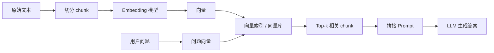
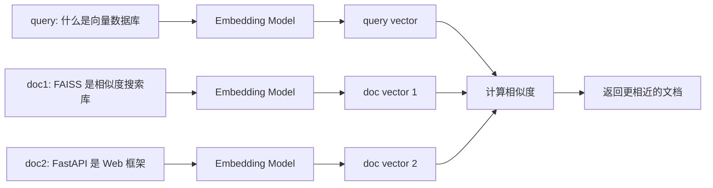
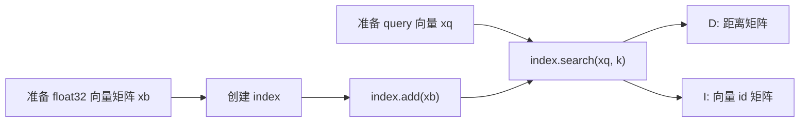
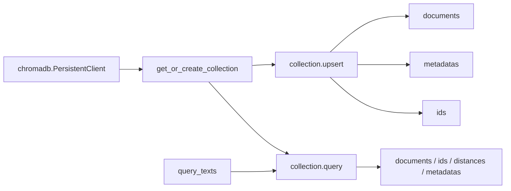

# 第4天：RAG Part 2 向量化与存储学习计划

> 今日主题：RAG Part 2: 向量化与存储  
> 今日目标：理解 Embedding 原理，使用 FAISS/Chroma 构建本地向量索引。  
> 推荐主线：先理解“为什么要向量化”，再手写相似度计算，再分别用 FAISS 和 Chroma 落地，最后回到 RAG 检索链路。

## 1. 今日学习总目标

今天不是为了“会调一个向量库 API”，而是为了把 RAG 的检索层真正吃透。

你要建立下面这条心智链路：



学完今天，你应该能做到：

1. 用自己的话解释什么是 Embedding。
2. 说清楚 token、句子、段落、文档向量之间的关系。
3. 说清楚为什么 RAG 不直接做关键词搜索，而要做语义向量检索。
4. 能计算余弦相似度、L2 距离、内积，并知道它们分别适合什么情况。
5. 能用 SentenceTransformers 把文本转成向量。
6. 能用 FAISS 构建本地内存索引并执行 Top-k 检索。
7. 能保存和加载 FAISS 索引。
8. 能用 Chroma 创建 collection、写入文档、查询文档、持久化本地数据。
9. 能比较 FAISS 和 Chroma 的定位差异。
10. 能把向量索引接回 Naive RAG 的 retriever。

## 2. 今日产出物

建议你今天至少完成这些东西：

1. 一份知识笔记：读完 `02-Embedding原理与FAISS-Chroma向量存储详解.md`。
2. 一个相似度小实验：手写 cosine、L2、inner product。
3. 一个 SentenceTransformers 脚本：把 5 到 10 段中文文本转成 embedding。
4. 一个 FAISS demo：构建 `IndexFlatL2` 或 `IndexFlatIP`，执行 Top-k 检索。
5. 一个 Chroma demo：创建本地持久化 collection，写入文档并查询。
6. 一份对比总结：FAISS 和 Chroma 分别适合什么场景。
7. 一个小型本地知识库：用你自己的学习笔记做检索。

## 3. 推荐时间安排

如果你今天有 4 到 5 小时，可以这样安排。

### 阶段一：建立 Embedding 心智模型，45 分钟

目标：知道向量化到底在解决什么问题。

学习内容：

1. 为什么传统关键词搜索不够。
2. Embedding 是什么。
3. 语义相似度为什么可以通过向量距离表示。
4. Bi-Encoder 和 Cross-Encoder 的区别。
5. 为什么 RAG 第一阶段通常使用 Bi-Encoder。
6. Query embedding 和 Document embedding 为什么要放在同一个向量空间。

完成标准：

1. 你能解释：
   “Embedding 是把文本映射到固定维度向量空间的一种表示方式，语义相近的文本在向量空间中距离更近。”
2. 你能解释为什么：
   “我想学 Python 网课” 能检索到 “如何在线学习 Python”。
3. 你能画出：



### 阶段二：手写相似度计算，45 分钟

目标：不把向量库当黑盒。

必练内容：

1. 用 Python list 或 numpy 表示向量。
2. 手写 dot product。
3. 手写 L2 distance。
4. 手写 cosine similarity。
5. 对 3 到 5 个文本向量做排序。

完成标准：

1. 知道 cosine 越大通常越相似。
2. 知道 L2 distance 越小通常越相似。
3. 知道归一化之后，cosine similarity 和 inner product 的关系会更接近。
4. 知道向量维度必须一致，否则不能直接比较。

### 阶段三：SentenceTransformers 实战，60 分钟

目标：用真实 embedding 模型处理文本。

建议使用：

```powershell
pip install sentence-transformers numpy
```

推荐先用轻量模型：

```python
from sentence_transformers import SentenceTransformer

model = SentenceTransformer("sentence-transformers/all-MiniLM-L6-v2")
embeddings = model.encode([
    "FAISS 可以用于高效相似度搜索。",
    "Chroma 是一个向量数据库。",
    "FastAPI 用于构建 Web API。",
])
print(embeddings.shape)
```

注意：如果模型第一次下载较慢，这是正常的；它需要从 Hugging Face 拉取模型文件。

完成标准：

1. 能打印 embedding shape。
2. 能理解 shape 中的两个数字分别代表“文本条数”和“向量维度”。
3. 能用同一个模型分别编码 query 和 documents。
4. 能用相似度排序找到最相关文本。

### 阶段四：FAISS 本地索引，70 分钟

目标：理解本地向量索引最小闭环。

你要掌握的 FAISS 最小流程：



完成标准：

1. 知道 FAISS 处理的是固定维度向量集合。
2. 知道 Python 中通常用 numpy array 表示向量矩阵。
3. 知道 FAISS 常要求 `float32`。
4. 能创建 `faiss.IndexFlatL2(d)`。
5. 能调用 `index.add(vectors)`。
6. 能调用 `D, I = index.search(query_vectors, k)`。
7. 能用 `I` 找回原始文本。

### 阶段五：Chroma 本地向量库，60 分钟

目标：理解更接近应用层的向量数据库。

你要掌握的 Chroma 最小流程：



完成标准：

1. 能解释 collection 是什么。
2. 能写入 `documents`、`ids`、`metadatas`。
3. 能使用 `query_texts` 查询。
4. 能看懂查询结果中的 `documents`、`ids`、`distances`、`metadatas`。
5. 能使用 `PersistentClient(path=...)` 把数据保存到本地。
6. 能说清楚 Chroma 和 FAISS 相比多了哪些应用层能力。

### 阶段六：回到 RAG 检索层，40 分钟

目标：把向量索引理解为 RAG 的中间部件，而不是孤立工具。

完成标准：

1. 能把文档 chunk、embedding、vector store、retriever 串起来。
2. 能解释为什么 chunk 太大或太小都会影响召回。
3. 能解释 `top_k` 的含义。
4. 能解释 metadata 为什么重要。
5. 能说明今天的索引如何服务明后天的 Naive RAG。

## 4. 今日详细任务清单

### 任务 1：环境准备

建议在第 4 天目录里新建虚拟环境：

```powershell
python -m venv .venv
.\.venv\Scripts\Activate.ps1
python -m pip install --upgrade pip
```

安装依赖：

```powershell
pip install numpy sentence-transformers faiss-cpu chromadb
```

如果 `faiss-cpu` 在 Windows 上安装失败，可以先完成 Chroma 和纯 numpy 部分；FAISS 可以使用 conda 或在 Linux/WSL 环境安装：

```powershell
conda install -c pytorch faiss-cpu
```

### 任务 2：手写相似度

文件建议：`demo_similarity.py`

你要写出三个函数：

1. `dot(a, b)`
2. `l2_distance(a, b)`
3. `cosine_similarity(a, b)`

并对下面的向量做排序：

```python
query = [1.0, 0.0]
docs = {
    "doc_python": [0.9, 0.1],
    "doc_fastapi": [0.7, 0.3],
    "doc_music": [0.0, 1.0],
}
```

你要观察：

1. 谁和 query 最接近。
2. cosine 排序和 L2 排序是否一致。
3. 如果向量没有归一化，inner product 排序会不会被向量长度影响。

### 任务 3：SentenceTransformers 编码文本

文件建议：`demo_sbert_encode.py`

准备 6 段文本：

1. FAISS 是一个用于高效相似度搜索和密集向量聚类的库。
2. Chroma 是一个面向 AI 应用的开源向量数据库。
3. SentenceTransformers 可以把句子或段落编码为向量。
4. FastAPI 是一个用于构建 Python Web API 的框架。
5. RAG 会先检索相关上下文，再让大模型生成答案。
6. 文本切分会影响向量检索的召回质量。

查询：

```text
如何把文本转成向量并检索相似内容？
```

你要输出：

1. 每段文本的相似度。
2. 排名前 3 的文本。
3. embedding 的 shape。

### 任务 4：FAISS 最小索引

文件建议：`demo_faiss_basic.py`

最小流程：

1. 用 SentenceTransformers 编码 docs。
2. 转成 `np.float32`。
3. 创建 FAISS index。
4. 添加 doc vectors。
5. 编码 query。
6. 搜索 top 3。
7. 用返回的 id 找回原文。

你要重点观察：

1. `D` 是距离或分数。
2. `I` 是向量在索引中的位置。
3. `I` 不是文档本身，所以你需要自己维护 `id -> document` 映射。

### 任务 5：FAISS 保存和加载

文件建议：`demo_faiss_save_load.py`

你要练习：

```python
faiss.write_index(index, "faiss_index.bin")
index = faiss.read_index("faiss_index.bin")
```

同时把原始文本和 metadata 保存到 JSON：

```text
faiss_index.bin      # 向量索引
faiss_docs.json      # 文档内容、metadata、id 映射
```

完成标准：

1. 关闭程序后重新运行也能查询。
2. 索引和原文映射不会错位。
3. 新增文档后知道需要同步更新索引和 JSON。

### 任务 6：Chroma 本地持久化

文件建议：`demo_chroma_basic.py`

你要练习：

1. 创建 `chromadb.PersistentClient(path="./chroma_db")`。
2. 创建或获取 collection。
3. 使用 `upsert` 写入文档。
4. 使用 `query` 查询相似文档。
5. 打印 documents、metadatas、distances。

完成标准：

1. 第二次运行不会因为重复 id 报错。
2. 数据会保存在 `./chroma_db`。
3. 能根据 metadata 知道结果来自哪个文档。

### 任务 7：FAISS vs Chroma 对比表

你要自己写一张表，至少包含这些维度：

| 维度 | FAISS | Chroma |
|---|---|---|
| 定位 | 向量相似度搜索库 | 向量数据库 / AI 数据基础设施 |
| 存储文档 | 需要自己维护 | 原生支持 documents、metadata、ids |
| 持久化 | 需要手动保存 index 和映射 | PersistentClient 自动本地持久化 |
| 检索接口 | `index.search` | `collection.query` |
| 适合学习什么 | 向量索引底层 | 应用层向量库 |
| 适合场景 | 需要高性能、可控索引 | 快速构建本地知识库、原型系统 |

## 5. 今日完成标准

你今天算真正完成，不是看完文档就结束，而是能做到下面这些：

1. 能解释 Embedding 和向量检索的关系。
2. 能解释 RAG 为什么依赖 embedding。
3. 能用 numpy 计算相似度。
4. 能用 SentenceTransformers 得到真实文本向量。
5. 能用 FAISS 搜索 top-k 文档。
6. 能用 Chroma 保存和查询本地文档。
7. 能从检索结果中拿到原文和 metadata。
8. 能说明检索结果质量受哪些因素影响：
   - embedding 模型
   - chunk 策略
   - 相似度度量
   - top_k
   - 文档质量
   - query 写法
   - metadata 过滤
9. 能为第 5-6 天手撕 Naive RAG 准备好本地向量检索模块。

## 6. 如果时间有限，优先级排序

1. 必须掌握：Embedding 是什么。
2. 必须掌握：cosine、L2、inner product 的区别。
3. 必须掌握：SentenceTransformers `model.encode`。
4. 必须掌握：FAISS `IndexFlatL2`、`add`、`search`。
5. 必须掌握：Chroma `Client` / `PersistentClient`、collection、add/upsert、query。
6. 重点理解：FAISS 返回的是向量 id，不是文档。
7. 重点理解：Chroma 帮你管理 documents、metadata、ids。
8. 了解即可：IVF、HNSW、PQ、量化、GPU FAISS。

## 7. 今日自测题

请尝试不看答案回答：

1. 什么是 Embedding？
2. 为什么 Embedding 可以用于语义搜索？
3. Bi-Encoder 和 Cross-Encoder 有什么区别？
4. 为什么 RAG 通常先用 Bi-Encoder 做召回？
5. cosine similarity、L2 distance、inner product 有什么区别？
6. 为什么很多向量检索会对向量做 normalize？
7. FAISS 中 `IndexFlatL2(d)` 的 `d` 是什么？
8. FAISS 的 `index.search(xq, k)` 返回的 `D` 和 `I` 分别是什么？
9. 为什么 FAISS 需要你自己维护原文映射？
10. Chroma 的 collection 是什么？
11. Chroma 中 ids 为什么必须稳定且唯一？
12. `add` 和 `upsert` 有什么区别？
13. 本地持久化为什么重要？
14. metadata 在 RAG 中有什么价值？
15. top_k 太小或太大会发生什么？

## 8. 官方资料入口

1. FAISS Getting started：<https://github.com/facebookresearch/faiss/wiki/Getting-started>
2. FAISS raw wiki：<https://raw.githubusercontent.com/wiki/facebookresearch/faiss/Getting-started.md>
3. SentenceTransformers Quickstart：<https://www.sbert.net/docs/quickstart.html>
4. SentenceTransformers Semantic Search：<https://www.sbert.net/examples/sentence_transformer/applications/semantic-search/README.html>
5. Chroma Getting Started：<https://docs.trychroma.com/docs/overview/getting-started>
6. Chroma Clients：<https://docs.trychroma.com/docs/run-chroma/clients>

