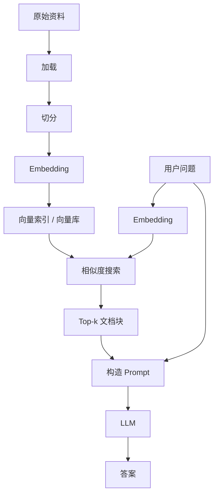
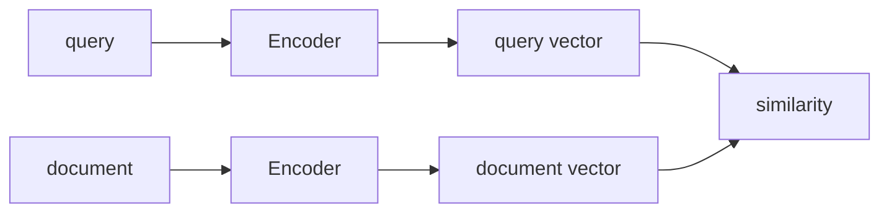
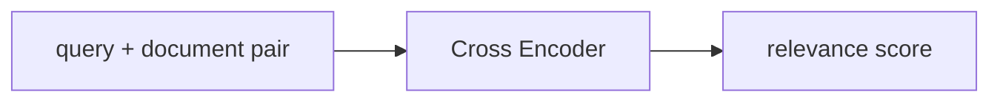
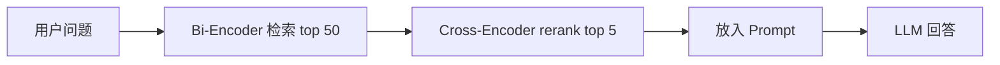
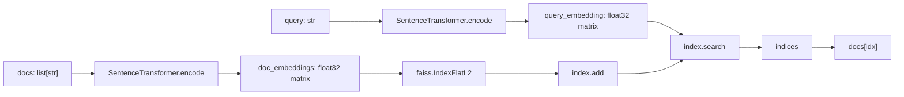

# Embedding 原理与 FAISS / Chroma 向量存储详解

> 学习主题：RAG Part 2: 向量化与存储  
> 重点目标：从原理到代码理解 Embedding，并掌握 FAISS 与 Chroma 两种本地向量索引方案。  
> 推荐读法：先读概念，再读代码。今天最重要的不是背 API，而是知道每一行代码在 RAG 检索层里承担什么角色。

## 1. 先从 RAG 的问题开始

RAG 是 Retrieval-Augmented Generation，检索增强生成。

一个 Naive RAG 的核心流程是：



第 3 天你已经学了加载与切分。今天进入中间最关键的一层：

```text
文本 chunk -> embedding vector -> vector index -> top-k retrieval
```

如果没有向量化，RAG 只能做很粗糙的关键词匹配。关键词匹配的问题是：

1. 用户提问和文档表达不一样时，容易搜不到。
2. 同义词、简称、翻译、换一种说法，都会降低召回。
3. 关键词匹配更关注字面重合，不真正理解语义。
4. 对长文档或复杂概念，关键词无法稳定表达相关性。

比如：

```text
用户问：如何提升检索召回？
文档写：可以通过优化 chunk 策略、选择更合适的 embedding 模型、增加 rerank 改善 recall。
```

关键词上不完全重合，但语义上非常相关。Embedding 检索就是为了解决这种“字面不同但语义接近”的问题。

## 2. 什么是 Embedding

Embedding 可以理解为：

> 把文本、图片、音频等对象映射成固定长度数字向量的表示方法。

在文本 RAG 中，我们关心的是文本 embedding。

例如：

```text
"FAISS 是一个向量相似度搜索库"
```

经过 embedding 模型后，可能变成：

```text
[0.021, -0.184, 0.337, ..., 0.092]
```

真实向量可能有 384、768、1024、1536 或更高维。你不需要理解每个维度单独代表什么，因为 embedding 通常不是人工设计的特征，而是模型训练出来的分布式语义表示。

更重要的是整体关系：

```text
语义相近的文本 -> 向量空间里更近
语义无关的文本 -> 向量空间里更远
```

## 3. Embedding 在 RAG 中到底保存了什么

很多初学者会误以为：

> embedding 向量里直接存了原文。

这不准确。

Embedding 不是压缩包，不是加密文本，也不能稳定反推出原文。它更像是一组语义坐标。

你可以把一个文本 chunk 想成地图上的一个点：

```text
chunk: "FAISS 支持高效向量相似度搜索"
vector: [0.12, -0.31, ...]
```

这个点附近可能有：

```text
"如何快速查找相似向量"
"向量数据库如何做 nearest neighbor search"
"RAG 中如何检索相关文档"
```

离它很远的可能是：

```text
"FastAPI 如何定义路由"
"CSS 如何设置字体"
"如何烤面包"
```

RAG 保存的是两部分：

1. 原始 chunk：真正要放进 prompt 的文本。
2. chunk embedding：用来做相似度搜索的向量。

向量库或索引的职责是把这两者关联起来：

```text
id -> vector
id -> document chunk
id -> metadata
```

## 4. Token 向量、句子向量、文档向量

Transformer 模型内部会产生 token 级别的表示。

一句话会被 tokenizer 切成 token：

```text
"什么是向量数据库？" -> ["什么", "是", "向量", "数据库", "？"]
```

模型内部可能给每个 token 产生一个 hidden state：

```text
token_1 -> vector
token_2 -> vector
token_3 -> vector
...
```

但是 RAG 通常需要的是整个句子或段落的向量，所以需要 pooling。

常见 pooling 思路：

1. CLS pooling：取特殊 `[CLS]` token 的向量。
2. Mean pooling：对所有 token 向量取平均。
3. Max pooling：按维度取最大值。
4. 模型自带 pooling head：由 SentenceTransformer 等封装处理。

你今天不需要自己实现 Transformer pooling，但要知道：

```text
文本 embedding = 模型对整段文本语义的固定维度表示
```

## 5. Bi-Encoder 与 Cross-Encoder

SentenceTransformers 文档把 Sentence Transformer 称为 bi-encoder。这个概念对 RAG 很重要。

### 5.1 Bi-Encoder

Bi-Encoder 的做法是：



特点：

1. query 和 document 分开编码。
2. document embedding 可以提前离线计算。
3. 查询时只需要编码 query，然后和已有文档向量比相似度。
4. 速度快，适合大规模召回。
5. 缺点是 query 和 document 之间没有深度交互，精排能力有限。

### 5.2 Cross-Encoder

Cross-Encoder 的做法是：



特点：

1. query 和 document 一起输入模型。
2. 模型可以充分建模二者关系。
3. 排序质量通常更好。
4. 但每个 query-document pair 都要跑一次模型，成本高。
5. 更适合 rerank，不适合第一阶段大规模召回。

### 5.3 RAG 中常见组合

生产级检索常常是两阶段：



今天先掌握第一阶段：Bi-Encoder + 向量索引。

## 6. 对称检索与非对称检索

语义搜索有一个很容易忽略的点：query 和 document 的形态是否相似。

### 6.1 对称检索

query 和 corpus 条目长度、信息量差不多。

例子：

```text
query: 如何在线学习 Python？
doc: 怎样在网上学习 Python？
```

适合场景：

1. 相似问题检索。
2. 句子相似度。
3. 去重。
4. 聚类。

### 6.2 非对称检索

query 通常较短，document 通常较长。

例子：

```text
query: 什么是 FAISS？
doc: FAISS 是 Facebook AI Research 开源的相似度搜索库，常用于密集向量检索...
```

RAG 问答通常是非对称检索。也就是说，你应该尽量选择适合 retrieval / question-answering 的 embedding 模型，而不是只看通用 STS 排名。

SentenceTransformers 中有些模型支持 `encode_query` 和 `encode_document`，它们可以针对 query 与 document 使用不同 prompt 或路由。初学阶段使用 `encode` 也可以跑通，但你要知道真实检索系统会关心这件事。

## 7. 向量相似度的三种常见度量

向量检索必须定义“近”是什么意思。

常见三种：

1. Cosine similarity
2. L2 distance
3. Inner product

### 7.1 Dot Product / Inner Product

两个向量：

```text
a = [a1, a2, a3]
b = [b1, b2, b3]
```

内积：

```text
a · b = a1*b1 + a2*b2 + a3*b3
```

特点：

1. 值越大，通常越相似。
2. 会受向量长度影响。
3. 如果向量已经归一化，inner product 与 cosine similarity 排序往往等价。

### 7.2 L2 Distance

欧氏距离：

```text
L2(a, b) = sqrt((a1-b1)^2 + (a2-b2)^2 + ...)
```

特点：

1. 值越小，通常越相似。
2. FAISS 的 `IndexFlatL2` 返回的是 squared L2 distance。
3. 适合很多基础向量检索实验。

### 7.3 Cosine Similarity

余弦相似度：

```text
cos(a, b) = (a · b) / (||a|| * ||b||)
```

特点：

1. 衡量方向相似度。
2. 取值通常在 -1 到 1。
3. 越接近 1，方向越相似。
4. 对向量长度不敏感。
5. 文本 embedding 检索中非常常见。

### 7.4 归一化为什么重要

归一化就是把向量长度缩放到 1：

```text
v_normalized = v / ||v||
```

归一化后：

```text
cosine_similarity(a, b) = inner_product(normalize(a), normalize(b))
```

这意味着你可以用内积索引来做 cosine 风格检索。

实践建议：

1. 如果用 L2：可以直接用 `IndexFlatL2`。
2. 如果用 cosine：通常先 normalize，再用 inner product。
3. 如果模型文档明确说明输出已归一化或推荐某种 metric，优先按模型说明来。

## 8. 手写相似度：不要跳过这一节

下面这段代码能帮你拆掉黑盒感。

```python
import math


def dot(a, b):
    return sum(x * y for x, y in zip(a, b))


def norm(a):
    return math.sqrt(sum(x * x for x in a))


def cosine_similarity(a, b):
    denominator = norm(a) * norm(b)
    if denominator == 0:
        return 0.0
    return dot(a, b) / denominator


def l2_distance(a, b):
    return math.sqrt(sum((x - y) ** 2 for x, y in zip(a, b)))


query = [1.0, 0.0]
docs = {
    "doc_python": [0.9, 0.1],
    "doc_fastapi": [0.7, 0.3],
    "doc_music": [0.0, 1.0],
}

print("Cosine ranking:")
for name, vector in sorted(
    docs.items(),
    key=lambda item: cosine_similarity(query, item[1]),
    reverse=True,
):
    print(name, cosine_similarity(query, vector))

print("L2 ranking:")
for name, vector in sorted(
    docs.items(),
    key=lambda item: l2_distance(query, item[1]),
):
    print(name, l2_distance(query, vector))
```

你要记住：

```text
向量库做的事情，本质上就是更快、更省内存、更工程化地完成这个排序过程。
```

## 9. SentenceTransformers 入门

SentenceTransformers 是一个常用的 sentence embedding 框架。它可以把句子、段落、图片等编码成固定大小向量，并提供相似度、语义搜索、聚类、重排序等能力。

安装：

```powershell
pip install sentence-transformers
```

最小代码：

```python
from sentence_transformers import SentenceTransformer

model = SentenceTransformer("sentence-transformers/all-MiniLM-L6-v2")

sentences = [
    "FAISS 可以用于高效相似度搜索。",
    "Chroma 是一个向量数据库。",
    "FastAPI 用于构建 Web API。",
]

embeddings = model.encode(sentences)
print(embeddings.shape)
```

如果使用 `sentence-transformers/all-MiniLM-L6-v2`，通常会得到：

```text
(3, 384)
```

含义：

1. 3：你输入了 3 条文本。
2. 384：每条文本被编码成 384 维向量。

### 9.1 用 SentenceTransformers 做简单语义搜索

```python
from sentence_transformers import SentenceTransformer
from sentence_transformers.util import cos_sim

model = SentenceTransformer("sentence-transformers/all-MiniLM-L6-v2")

docs = [
    "FAISS 是一个用于高效相似度搜索和密集向量聚类的库。",
    "Chroma 是一个面向 AI 应用的开源向量数据库。",
    "SentenceTransformers 可以把句子或段落编码为向量。",
    "FastAPI 是一个用于构建 Python Web API 的框架。",
    "RAG 会先检索相关上下文，再让大模型生成答案。",
    "文本切分会影响向量检索的召回质量。",
]

query = "如何把文本转成向量并检索相似内容？"

doc_embeddings = model.encode(docs)
query_embedding = model.encode(query)

scores = cos_sim(query_embedding, doc_embeddings)[0]

ranking = sorted(
    enumerate(scores),
    key=lambda item: float(item[1]),
    reverse=True,
)

for idx, score in ranking[:3]:
    print(float(score), docs[idx])
```

这已经是一个极简版向量检索。

但当文档从 6 条变成 6 万条、600 万条时，直接和所有向量逐个计算相似度就不够用了。这时就需要 FAISS 这类高性能向量索引，或者 Chroma 这类向量数据库。

## 10. 什么是向量索引 / 向量库

向量索引负责：

```text
给定 query vector，在一堆 document vectors 里快速找到最相似的 k 个。
```

向量库通常比向量索引多做一些应用层事情：

1. 保存文档原文。
2. 保存 metadata。
3. 管理 ids。
4. 支持持久化。
5. 支持过滤。
6. 支持 collection / namespace。
7. 支持增删改查。
8. 支持本地或服务化部署。

简单理解：

```text
FAISS 更像高性能向量搜索引擎内核。
Chroma 更像面向 AI 应用的向量数据库。
```

## 11. FAISS 核心概念

FAISS 是 Facebook AI Research 开源的相似度搜索库，常用于 dense vector search。

官方 Getting started 里强调了几个关键点：

1. FAISS 处理固定维度的向量集合。
2. Python 中通常用 numpy matrix 保存向量。
3. 数据类型要是 `float32`。
4. 索引对象是 `Index`。
5. 基础操作是 `add` 和 `search`。
6. `search` 返回距离矩阵 `D` 和索引矩阵 `I`。

### 11.1 FAISS 最小流程

```python
import numpy as np
import faiss

d = 64
nb = 1000
nq = 3

np.random.seed(42)
xb = np.random.random((nb, d)).astype("float32")
xq = np.random.random((nq, d)).astype("float32")

index = faiss.IndexFlatL2(d)
print(index.is_trained)

index.add(xb)
print(index.ntotal)

k = 4
D, I = index.search(xq, k)
print(D)
print(I)
```

解释：

1. `d`：向量维度。
2. `xb`：database vectors，也就是要被检索的文档向量。
3. `xq`：query vectors，也就是查询向量。
4. `IndexFlatL2`：暴力精确 L2 搜索索引。
5. `index.add(xb)`：把文档向量加入索引。
6. `index.search(xq, k)`：为每个 query 找 top k。
7. `D`：距离矩阵，shape 是 `(nq, k)`。
8. `I`：索引矩阵，shape 是 `(nq, k)`。

### 11.2 用 FAISS 检索文本

FAISS 不认识文本，它只认识向量。

所以完整流程是：



代码：

```python
import numpy as np
import faiss
from sentence_transformers import SentenceTransformer


docs = [
    "FAISS 是一个用于高效相似度搜索和密集向量聚类的库。",
    "Chroma 是一个面向 AI 应用的开源向量数据库。",
    "SentenceTransformers 可以把句子或段落编码为向量。",
    "FastAPI 是一个用于构建 Python Web API 的框架。",
    "RAG 会先检索相关上下文，再让大模型生成答案。",
    "文本切分会影响向量检索的召回质量。",
]

model = SentenceTransformer("sentence-transformers/all-MiniLM-L6-v2")

doc_embeddings = model.encode(docs)
doc_embeddings = np.asarray(doc_embeddings, dtype="float32")

d = doc_embeddings.shape[1]
index = faiss.IndexFlatL2(d)
index.add(doc_embeddings)

query = "如何构建本地向量索引？"
query_embedding = model.encode([query])
query_embedding = np.asarray(query_embedding, dtype="float32")

k = 3
D, I = index.search(query_embedding, k)

for rank, idx in enumerate(I[0], start=1):
    print(f"rank={rank}, distance={D[0][rank - 1]:.4f}, doc={docs[idx]}")
```

### 11.3 用 cosine 风格检索

很多文本 embedding 更常用 cosine similarity。

FAISS 中可以这样做：

1. 对 doc embeddings normalize。
2. 对 query embedding normalize。
3. 使用 `IndexFlatIP` 做 inner product。

```python
import numpy as np
import faiss
from sentence_transformers import SentenceTransformer


docs = [
    "FAISS 可以执行向量相似度搜索。",
    "Chroma 可以保存文档和 metadata。",
    "FastAPI 用来开发 Web API。",
]

model = SentenceTransformer("sentence-transformers/all-MiniLM-L6-v2")

doc_embeddings = np.asarray(model.encode(docs), dtype="float32")
faiss.normalize_L2(doc_embeddings)

d = doc_embeddings.shape[1]
index = faiss.IndexFlatIP(d)
index.add(doc_embeddings)

query_embedding = np.asarray(model.encode(["什么工具能做向量检索？"]), dtype="float32")
faiss.normalize_L2(query_embedding)

D, I = index.search(query_embedding, 2)

for score, idx in zip(D[0], I[0]):
    print(score, docs[idx])
```

注意：

1. `IndexFlatIP` 返回的是 inner product score。
2. normalize 后 inner product 可以近似看作 cosine similarity。
3. 此时分数越大越相似。
4. L2 距离是越小越相似，这个方向不要搞反。

### 11.4 FAISS 只存向量，不自动存原文

这是初学者最容易踩的坑。

FAISS 的 `I` 返回的是向量位置或 id，不是文档内容。

所以你必须自己维护：

```python
docs = [...]
metadatas = [...]

D, I = index.search(query_embedding, k)

for idx in I[0]:
    doc = docs[idx]
    metadata = metadatas[idx]
```

如果你删除、插入、重排了 docs，但索引没有同步更新，检索结果就会错位。

### 11.5 FAISS 保存和加载

FAISS index 可以保存：

```python
faiss.write_index(index, "faiss_index.bin")
```

加载：

```python
index = faiss.read_index("faiss_index.bin")
```

但文档和 metadata 仍要自己保存：

```python
import json

records = [
    {"id": "doc-001", "text": "FAISS 是向量搜索库", "source": "note"},
    {"id": "doc-002", "text": "Chroma 是向量数据库", "source": "note"},
]

with open("faiss_docs.json", "w", encoding="utf-8") as f:
    json.dump(records, f, ensure_ascii=False, indent=2)
```

推荐保存结构：

```text
local_faiss_store/
  index.faiss
  docs.json
```

其中：

1. `index.faiss` 保存向量索引。
2. `docs.json` 保存 position 到文档的映射。

## 12. FAISS 常见索引类型入门

今天重点是 `IndexFlatL2` 和 `IndexFlatIP`，但你可以先知道索引家族大概长什么样。

| 索引 | 检索方式 | 是否精确 | 是否需要训练 | 适合 |
|---|---|---|---|---|
| IndexFlatL2 | L2 暴力搜索 | 精确 | 否 | 小规模、学习、基准 |
| IndexFlatIP | 内积暴力搜索 | 精确 | 否 | cosine / inner product |
| IndexIVFFlat | 倒排聚类 | 近似 | 是 | 中大规模、速度优先 |
| IndexHNSWFlat | 图索引 | 近似 | 否 | 高召回低延迟 |
| Product Quantization | 压缩向量 | 近似 | 是 | 内存受限、大规模 |

初学建议：

1. 今天只写 Flat。
2. 能解释 add/search 后，再看 IVF/HNSW/PQ。
3. 不要一上来纠结高级索引，否则容易忘了 RAG 的主线。

## 13. Chroma 核心概念

Chroma 是面向 AI 应用的开源向量数据库。相比 FAISS，它更像一个完整数据层。

Chroma 的核心对象是：

```text
Client -> Collection -> documents / embeddings / metadatas / ids
```

### 13.1 Client

Client 是连接 Chroma 的入口。

内存客户端：

```python
import chromadb

client = chromadb.Client()
```

特点：

1. 适合快速实验。
2. 程序结束后数据会丢失。
3. 适合 notebook 或临时 demo。

持久化客户端：

```python
import chromadb

client = chromadb.PersistentClient(path="./chroma_db")
```

特点：

1. 数据保存在本地目录。
2. 程序重启后仍可加载。
3. 更适合本地知识库练习。

### 13.2 Collection

Collection 是一组向量和文档的集合。

你可以把它理解为：

```text
一个 RAG 知识库 / 一个业务命名空间 / 一张向量表
```

创建：

```python
collection = client.create_collection(name="rag_notes")
```

更推荐练习时使用：

```python
collection = client.get_or_create_collection(name="rag_notes")
```

因为重复运行脚本时，不会因为 collection 已存在而失败。

### 13.3 ids

Chroma 要求每条数据有 id：

```python
ids=["doc-001", "doc-002"]
```

id 的作用：

1. 唯一标识一条记录。
2. 方便更新。
3. 方便删除。
4. 方便把检索结果和业务系统关联。

建议：

1. 不要用随机且不可复现的 id。
2. 可以用文件名 + chunk 序号。
3. 比如 `day3_note_chunk_0001`。

### 13.4 documents

documents 是原文内容：

```python
documents=[
    "FAISS 是一个用于高效相似度搜索的库。",
    "Chroma 是一个向量数据库。",
]
```

这些内容通常就是 RAG 中最终要塞进 prompt 的上下文。

### 13.5 metadatas

metadata 是附加信息：

```python
metadatas=[
    {"source": "day4", "topic": "faiss"},
    {"source": "day4", "topic": "chroma"},
]
```

metadata 的价值：

1. 显示引用来源。
2. 支持过滤。
3. 支持权限控制。
4. 支持按文件、章节、日期筛选。
5. 支持调试检索质量。

### 13.6 embeddings

Chroma 可以：

1. 让 Chroma 的 embedding function 自动计算 embedding。
2. 你自己提供 embeddings。

学习阶段建议两种都理解：

1. 快速上手：传 `documents`，让 Chroma 自动处理。
2. 控制模型：自己用 SentenceTransformers 编码，再传 `embeddings`。

## 14. Chroma 最小例子

安装：

```powershell
pip install chromadb
```

最小代码：

```python
import chromadb

client = chromadb.Client()

collection = client.get_or_create_collection(name="rag_notes")

collection.upsert(
    ids=["doc-001", "doc-002", "doc-003"],
    documents=[
        "FAISS 是一个用于高效相似度搜索和密集向量聚类的库。",
        "Chroma 是一个面向 AI 应用的开源向量数据库。",
        "RAG 会先检索相关上下文，再让大模型生成答案。",
    ],
    metadatas=[
        {"source": "day4", "topic": "faiss"},
        {"source": "day4", "topic": "chroma"},
        {"source": "day4", "topic": "rag"},
    ],
)

results = collection.query(
    query_texts=["什么是向量数据库？"],
    n_results=2,
)

print(results)
```

查询结果通常包含：

1. `ids`
2. `documents`
3. `metadatas`
4. `distances`
5. `embeddings`
6. `uris`
7. `data`

其中最常看的：

```python
print(results["documents"])
print(results["metadatas"])
print(results["distances"])
```

## 15. Chroma 本地持久化

RAG 学习中，持久化非常重要。否则每次启动都要重新向量化、重新写入。

```python
import chromadb

client = chromadb.PersistentClient(path="./chroma_db")

collection = client.get_or_create_collection(name="rag_notes")

collection.upsert(
    ids=["doc-001"],
    documents=["Chroma 的 PersistentClient 可以把数据保存到本地。"],
    metadatas=[{"source": "day4", "topic": "persistence"}],
)

results = collection.query(
    query_texts=["如何让 Chroma 数据不丢失？"],
    n_results=1,
)

print(results["documents"])
```

第二次运行时，Chroma 会从 `./chroma_db` 加载已有数据。

注意：

1. `add` 遇到重复 id 可能报错。
2. `upsert` 更适合可重复运行脚本。
3. 不要随便调用 `client.reset()`，这是清空数据库的破坏性操作。

## 16. Chroma 使用自定义 SentenceTransformers embeddings

如果你想明确控制 embedding 模型，可以自己编码后传给 Chroma。

```python
import chromadb
from sentence_transformers import SentenceTransformer


docs = [
    "FAISS 是一个用于高效相似度搜索和密集向量聚类的库。",
    "Chroma 是一个面向 AI 应用的开源向量数据库。",
    "SentenceTransformers 可以把句子或段落编码为向量。",
]

ids = ["doc-001", "doc-002", "doc-003"]
metadatas = [
    {"topic": "faiss"},
    {"topic": "chroma"},
    {"topic": "embedding"},
]

model = SentenceTransformer("sentence-transformers/all-MiniLM-L6-v2")
embeddings = model.encode(docs).tolist()

client = chromadb.PersistentClient(path="./chroma_db")
collection = client.get_or_create_collection(name="rag_notes_custom_embedding")

collection.upsert(
    ids=ids,
    documents=docs,
    metadatas=metadatas,
    embeddings=embeddings,
)

query = "文本如何转成向量？"
query_embedding = model.encode([query]).tolist()

results = collection.query(
    query_embeddings=query_embedding,
    n_results=2,
)

print(results["documents"])
print(results["metadatas"])
print(results["distances"])
```

这样做的好处：

1. embedding 模型完全可控。
2. FAISS 和 Chroma 可以使用同一批 embedding，便于对比。
3. 未来替换成本地中文 embedding 模型更容易。

## 17. FAISS vs Chroma：怎么选

| 维度 | FAISS | Chroma |
|---|---|---|
| 定位 | 高性能向量相似度搜索库 | 面向 AI 应用的向量数据库 |
| 核心对象 | Index | Client / Collection |
| 输入 | numpy float32 向量矩阵 | documents、embeddings、metadatas、ids |
| 是否管理原文 | 不管理，需要自己维护 | 管理 documents |
| 是否管理 metadata | 不管理，需要自己维护 | 原生支持 |
| 持久化 | 手动 `write_index` / `read_index` | `PersistentClient` 自动本地持久化 |
| 查询返回 | 距离 D、索引 I | ids、documents、metadatas、distances |
| 学习价值 | 理解向量检索底层 | 理解应用型向量库 |
| 工程灵活性 | 高，但需要自己封装 | 高层能力更多，上手更快 |
| 适合今天用途 | 手撕向量检索 | 快速搭建本地知识库 |

建议：

1. 想理解底层：先学 FAISS。
2. 想快速做应用：用 Chroma。
3. 想手撕 Naive RAG：FAISS 更能训练底层理解。
4. 想保存文档、metadata、重复运行：Chroma 更省心。

## 18. 把向量索引变成 Retriever

RAG 中 retriever 的抽象是：

```text
query -> list[Document]
```

无论你底层用 FAISS 还是 Chroma，都可以封装成这样的函数。

### 18.1 FAISS retriever

```python
import numpy as np
import faiss
from sentence_transformers import SentenceTransformer


class FaissRetriever:
    def __init__(self, docs, metadatas=None, model_name="sentence-transformers/all-MiniLM-L6-v2"):
        self.docs = docs
        self.metadatas = metadatas or [{} for _ in docs]
        self.model = SentenceTransformer(model_name)

        embeddings = np.asarray(self.model.encode(docs), dtype="float32")
        faiss.normalize_L2(embeddings)

        self.index = faiss.IndexFlatIP(embeddings.shape[1])
        self.index.add(embeddings)

    def search(self, query, k=3):
        query_embedding = np.asarray(self.model.encode([query]), dtype="float32")
        faiss.normalize_L2(query_embedding)

        scores, indices = self.index.search(query_embedding, k)

        results = []
        for score, idx in zip(scores[0], indices[0]):
            results.append({
                "text": self.docs[idx],
                "metadata": self.metadatas[idx],
                "score": float(score),
            })
        return results


docs = [
    "FAISS 是一个向量相似度搜索库。",
    "Chroma 是一个向量数据库。",
    "RAG 使用检索结果增强大模型回答。",
]

retriever = FaissRetriever(docs)
print(retriever.search("什么工具可以做向量检索？", k=2))
```

### 18.2 Chroma retriever

```python
import chromadb


class ChromaRetriever:
    def __init__(self, path="./chroma_db", collection_name="rag_notes"):
        self.client = chromadb.PersistentClient(path=path)
        self.collection = self.client.get_or_create_collection(name=collection_name)

    def upsert(self, ids, documents, metadatas=None):
        self.collection.upsert(
            ids=ids,
            documents=documents,
            metadatas=metadatas,
        )

    def search(self, query, k=3):
        results = self.collection.query(
            query_texts=[query],
            n_results=k,
        )

        output = []
        for doc, metadata, distance, doc_id in zip(
            results["documents"][0],
            results["metadatas"][0],
            results["distances"][0],
            results["ids"][0],
        ):
            output.append({
                "id": doc_id,
                "text": doc,
                "metadata": metadata,
                "distance": distance,
            })
        return output
```

## 19. 检索质量受什么影响

向量库不是魔法。RAG 检索质量通常受这些因素影响：

### 19.1 Embedding 模型

不同模型适合不同任务：

1. 英文模型未必适合中文。
2. 通用相似度模型未必适合问答检索。
3. 小模型速度快，但语义表达可能弱。
4. 大模型效果好，但成本、延迟、内存更高。

### 19.2 Chunk 策略

chunk 太大：

1. 一个向量混合多个主题。
2. 检索命中后上下文噪声多。
3. prompt 成本更高。

chunk 太小：

1. 语义不完整。
2. 缺少上下文。
3. 模型难以回答完整问题。

### 19.3 Overlap

chunk overlap 可以缓解边界切断问题。

但 overlap 太大：

1. 存储膨胀。
2. 检索结果重复。
3. prompt 中冗余增加。

### 19.4 Top-k

top_k 太小：

1. 容易漏掉答案。
2. 召回不足。

top_k 太大：

1. 上下文噪声增加。
2. prompt 变长。
3. 模型可能被无关内容干扰。

### 19.5 Metadata

metadata 可以让你做过滤：

```text
只查某个文件
只查某个章节
只查某个用户有权限的文档
只查最近更新的资料
```

没有 metadata，RAG 很难进入真实应用。

### 19.6 Query 写法

用户问题太短、太模糊时，检索可能不稳定。

改进方式：

1. query rewrite：把用户问题改写得更适合检索。
2. multi-query：生成多个检索 query。
3. HyDE：让模型先生成一个假设答案，再用假设答案检索。
4. rerank：召回后再排序。

今天先知道这些方向，后面再深入。

## 20. 常见坑

### 20.1 向量维度不一致

同一个 FAISS index 只能放固定维度向量。

错误例子：

```text
index 是 384 维
你添加了 768 维向量
```

解决：

1. 同一个索引使用同一个 embedding 模型。
2. 不要混用不同模型的向量。
3. 保存索引时记录模型名称和维度。

### 20.2 dtype 不是 float32

FAISS 通常要求 `float32`。

```python
embeddings = np.asarray(embeddings, dtype="float32")
```

### 20.3 分数方向搞反

1. L2 distance：越小越相似。
2. Inner product：越大越相似。
3. Cosine similarity：越大越相似。

### 20.4 FAISS 索引和文档映射错位

如果你这样做：

```python
index.add(embeddings)
docs.sort()
```

就很危险，因为 FAISS 返回的位置仍然是旧顺序。

解决：

1. 构建索引后不要随意重排 docs。
2. 使用稳定 id。
3. 保存 index 和 docs 映射时保持一致。

### 20.5 重复写入 Chroma

如果用 `add` 重复运行同一个 id，可能报错。

练习时建议：

```python
collection.upsert(...)
```

### 20.6 不保存 metadata

没有 metadata，你只能拿到文本，不知道它来自哪里。

RAG 至少建议保存：

1. `source`
2. `chunk_id`
3. `title`
4. `page`
5. `created_at` 或 `version`

## 21. 今日你应该形成的最终理解

请把今天所有内容收束成这几句话：

1. Embedding 把文本映射成固定维度向量。
2. 语义相近的文本，在向量空间里更接近。
3. RAG 用 embedding 把用户问题和文档 chunk 放进同一个向量空间。
4. 向量索引负责快速找出最相似的 top-k chunk。
5. FAISS 是底层、高性能、偏索引的工具，需要自己管理原文和 metadata。
6. Chroma 是更应用层的向量数据库，能管理 documents、metadata、ids 和持久化。
7. 检索质量不只取决于向量库，还取决于 embedding 模型、chunk 策略、query、top_k、metadata 和后续 rerank。

## 22. 面试级问答

### 22.1 为什么 RAG 需要 Embedding？

因为用户问题和文档内容经常字面不一致，但语义相关。Embedding 可以把 query 和 document 映射到同一个向量空间，通过相似度搜索找到语义接近的文档块，从而把外部知识提供给大模型。

### 22.2 FAISS 的 `D` 和 `I` 是什么？

`D` 是距离或相似度分数矩阵，`I` 是对应的向量索引或 id 矩阵。对于 `IndexFlatL2`，`D` 是 L2 距离，越小越相似；对于 `IndexFlatIP`，`D` 是内积分数，越大越相似。

### 22.3 为什么 FAISS 不直接返回文档？

FAISS 是向量相似度搜索库，它只负责向量索引和检索，不负责管理业务文档。文档、metadata、权限、来源等需要你自己维护，或者交给 Chroma 这类向量数据库。

### 22.4 Chroma 的 collection 是什么？

collection 是 Chroma 中保存一组 documents、embeddings、metadatas 和 ids 的集合。你可以把它理解成一个知识库、一个命名空间，或者一张向量表。

### 22.5 为什么要保存 metadata？

metadata 可以帮助你追踪来源、展示引用、做过滤、做权限控制、调试召回质量。没有 metadata 的 RAG 很难用于真实业务。

### 22.6 top_k 应该设置多少？

没有固定答案。top_k 小则上下文更干净但容易漏召回；top_k 大则召回更充分但噪声和 token 成本更高。学习阶段可以尝试 2、3、5、8，观察回答变化。

### 22.7 为什么向量检索后还需要 rerank？

Bi-Encoder 检索速度快，但 query 和 document 没有充分交互，排序可能不够精细。rerank 可以用 Cross-Encoder 或 LLM 对候选文档重新排序，提高最终上下文质量。

## 23. 自测答案

### 问题 1：什么是 Embedding？

Embedding 是把文本等对象转换成固定维度数字向量的表示方法，用于表达对象的语义特征。

### 问题 2：为什么 Embedding 可以用于语义搜索？

因为经过合适训练的 embedding 模型会让语义相近的文本在向量空间中距离更近，所以可以通过向量相似度找到相关内容。

### 问题 3：Bi-Encoder 和 Cross-Encoder 有什么区别？

Bi-Encoder 分别编码 query 和 document，速度快，适合召回；Cross-Encoder 把 query 和 document 一起输入模型，排序更准但成本更高，适合 rerank。

### 问题 4：为什么 RAG 通常先用 Bi-Encoder 做召回？

因为文档数量可能很大，Bi-Encoder 可以提前离线计算文档向量，查询时只编码 query 并做近邻搜索，速度适合大规模检索。

### 问题 5：cosine、L2、inner product 有什么区别？

cosine 衡量方向相似度，越大越相似；L2 衡量欧氏距离，越小越相似；inner product 衡量向量点积，越大越相似，但会受向量长度影响。

### 问题 6：为什么很多向量检索会 normalize？

normalize 后向量长度为 1，此时 inner product 与 cosine similarity 的排序关系更接近，可以用内积索引实现 cosine 风格检索。

### 问题 7：FAISS 中 `IndexFlatL2(d)` 的 `d` 是什么？

`d` 是向量维度。索引中的所有向量都必须是这个维度。

### 问题 8：FAISS 的 `index.search(xq, k)` 返回什么？

返回 `D` 和 `I`。`D` 是距离或分数矩阵，`I` 是对应向量的索引或 id 矩阵。

### 问题 9：为什么 FAISS 需要你自己维护原文映射？

因为 FAISS 只管理向量索引，不管理文档原文和 metadata。你需要用返回的索引去自己的 docs 列表或数据库中取回原文。

### 问题 10：Chroma 的 collection 是什么？

collection 是 Chroma 中保存一组文档、向量、metadata 和 ids 的集合。

### 问题 11：Chroma 中 ids 为什么必须稳定且唯一？

因为 id 用于标识、更新、删除和查询记录。如果 id 不稳定或重复，数据会难以维护。

### 问题 12：`add` 和 `upsert` 有什么区别？

`add` 通常用于新增记录，重复 id 可能失败；`upsert` 表示存在则更新，不存在则插入，更适合可重复运行的数据导入脚本。

### 问题 13：本地持久化为什么重要？

持久化可以避免每次启动都重新计算 embedding 和重建索引，也能让本地知识库长期保存。

### 问题 14：metadata 在 RAG 中有什么价值？

metadata 可用于来源引用、过滤、权限控制、调试和结果展示。

### 问题 15：top_k 太小或太大会发生什么？

top_k 太小容易漏掉答案；top_k 太大容易引入噪声、增加 token 成本，并干扰模型生成。

## 24. 参考资料

1. FAISS Getting started：<https://github.com/facebookresearch/faiss/wiki/Getting-started>
2. FAISS raw wiki：<https://raw.githubusercontent.com/wiki/facebookresearch/faiss/Getting-started.md>
3. SentenceTransformers Quickstart：<https://www.sbert.net/docs/quickstart.html>
4. SentenceTransformers Semantic Search：<https://www.sbert.net/examples/sentence_transformer/applications/semantic-search/README.html>
5. Chroma Getting Started：<https://docs.trychroma.com/docs/overview/getting-started>
6. Chroma Clients：<https://docs.trychroma.com/docs/run-chroma/clients>

