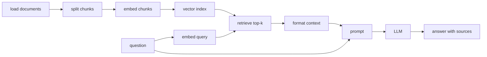

# 本地向量索引实战任务

> 目标：把今天的概念变成可运行代码。  
> 建议：每个任务单独写一个 `.py` 文件，跑通后再合并成你自己的 `local_vector_store.py`。

## 1. 项目建议结构

建议在第 4 天目录中组织为：

```text
第4天RAG Part 2 向量化与存储/
  README.md
  01-今日学习计划.md
  02-Embedding原理与FAISS-Chroma向量存储详解.md
  03-本地向量索引实战任务.md
  demos/
    demo_similarity.py
    demo_sbert_encode.py
    demo_faiss_basic.py
    demo_faiss_save_load.py
    demo_chroma_basic.py
    demo_chroma_custom_embedding.py
  data/
    rag_notes.json
  local_faiss_store/
    index.faiss
    docs.json
  chroma_db/
```

你可以先手动创建 `demos` 和 `data` 目录，也可以只把代码片段复制到单个脚本里逐步运行。

## 2. 任务一：手写相似度

文件：`demos/demo_similarity.py`

```python
import math


def dot(a, b):
    return sum(x * y for x, y in zip(a, b))


def norm(a):
    return math.sqrt(sum(x * x for x in a))


def cosine_similarity(a, b):
    denominator = norm(a) * norm(b)
    if denominator == 0:
        return 0.0
    return dot(a, b) / denominator


def l2_distance(a, b):
    return math.sqrt(sum((x - y) ** 2 for x, y in zip(a, b)))


query = [1.0, 0.0]
docs = {
    "doc_python": [0.9, 0.1],
    "doc_fastapi": [0.7, 0.3],
    "doc_music": [0.0, 1.0],
}

print("Cosine ranking:")
for name, vector in sorted(
    docs.items(),
    key=lambda item: cosine_similarity(query, item[1]),
    reverse=True,
):
    print(name, cosine_similarity(query, vector))

print("\nL2 ranking:")
for name, vector in sorted(
    docs.items(),
    key=lambda item: l2_distance(query, item[1]),
):
    print(name, l2_distance(query, vector))
```

你要回答：

1. cosine 排名第一的是谁？
2. L2 排名第一的是谁？
3. 如果把 `doc_python` 改成 `[9.0, 1.0]`，inner product 会发生什么变化？

## 3. 任务二：SentenceTransformers 编码与排序

文件：`demos/demo_sbert_encode.py`

```python
from sentence_transformers import SentenceTransformer
from sentence_transformers.util import cos_sim


docs = [
    "FAISS 是一个用于高效相似度搜索和密集向量聚类的库。",
    "Chroma 是一个面向 AI 应用的开源向量数据库。",
    "SentenceTransformers 可以把句子或段落编码为向量。",
    "FastAPI 是一个用于构建 Python Web API 的框架。",
    "RAG 会先检索相关上下文，再让大模型生成答案。",
    "文本切分会影响向量检索的召回质量。",
]

query = "如何把文本转成向量并检索相似内容？"

model = SentenceTransformer("sentence-transformers/all-MiniLM-L6-v2")

doc_embeddings = model.encode(docs)
query_embedding = model.encode(query)

print("doc_embeddings shape:", doc_embeddings.shape)
print("query_embedding shape:", query_embedding.shape)

scores = cos_sim(query_embedding, doc_embeddings)[0]

ranking = sorted(
    enumerate(scores),
    key=lambda item: float(item[1]),
    reverse=True,
)

for rank, (idx, score) in enumerate(ranking, start=1):
    print(f"rank={rank}, score={float(score):.4f}, doc={docs[idx]}")
```

你要观察：

1. 第一次运行是否会下载模型。
2. 输出 shape 是多少。
3. 排名前 3 是否符合你的直觉。

## 4. 任务三：FAISS 基础检索

文件：`demos/demo_faiss_basic.py`

```python
import numpy as np
import faiss
from sentence_transformers import SentenceTransformer


docs = [
    "FAISS 是一个用于高效相似度搜索和密集向量聚类的库。",
    "Chroma 是一个面向 AI 应用的开源向量数据库。",
    "SentenceTransformers 可以把句子或段落编码为向量。",
    "FastAPI 是一个用于构建 Python Web API 的框架。",
    "RAG 会先检索相关上下文，再让大模型生成答案。",
    "文本切分会影响向量检索的召回质量。",
]

model = SentenceTransformer("sentence-transformers/all-MiniLM-L6-v2")

doc_embeddings = np.asarray(model.encode(docs), dtype="float32")

d = doc_embeddings.shape[1]
index = faiss.IndexFlatL2(d)
index.add(doc_embeddings)

print("is_trained:", index.is_trained)
print("ntotal:", index.ntotal)

query = "什么工具适合做本地向量相似度搜索？"
query_embedding = np.asarray(model.encode([query]), dtype="float32")

k = 3
distances, indices = index.search(query_embedding, k)

for rank, idx in enumerate(indices[0], start=1):
    distance = distances[0][rank - 1]
    print(f"rank={rank}, distance={distance:.4f}, idx={idx}, doc={docs[idx]}")
```

你要回答：

1. `index.ntotal` 是多少？
2. `indices` 里的数字对应什么？
3. L2 distance 是越大越好，还是越小越好？

## 5. 任务四：FAISS cosine 风格检索

文件：`demos/demo_faiss_cosine.py`

```python
import numpy as np
import faiss
from sentence_transformers import SentenceTransformer


docs = [
    "FAISS 是一个用于高效相似度搜索和密集向量聚类的库。",
    "Chroma 是一个面向 AI 应用的开源向量数据库。",
    "SentenceTransformers 可以把句子或段落编码为向量。",
    "FastAPI 是一个用于构建 Python Web API 的框架。",
    "RAG 会先检索相关上下文，再让大模型生成答案。",
    "文本切分会影响向量检索的召回质量。",
]

model = SentenceTransformer("sentence-transformers/all-MiniLM-L6-v2")

doc_embeddings = np.asarray(model.encode(docs), dtype="float32")
faiss.normalize_L2(doc_embeddings)

d = doc_embeddings.shape[1]
index = faiss.IndexFlatIP(d)
index.add(doc_embeddings)

query = "什么是向量数据库？"
query_embedding = np.asarray(model.encode([query]), dtype="float32")
faiss.normalize_L2(query_embedding)

scores, indices = index.search(query_embedding, 3)

for rank, idx in enumerate(indices[0], start=1):
    score = scores[0][rank - 1]
    print(f"rank={rank}, score={score:.4f}, idx={idx}, doc={docs[idx]}")
```

你要回答：

1. 为什么这里使用 `IndexFlatIP`？
2. 为什么要 `faiss.normalize_L2`？
3. score 是越大越好，还是越小越好？

## 6. 任务五：FAISS 保存与加载

文件：`demos/demo_faiss_save_load.py`

```python
import json
from pathlib import Path

import numpy as np
import faiss
from sentence_transformers import SentenceTransformer


STORE_DIR = Path("local_faiss_store")
INDEX_PATH = STORE_DIR / "index.faiss"
DOCS_PATH = STORE_DIR / "docs.json"


records = [
    {
        "id": "doc-001",
        "text": "FAISS 是一个用于高效相似度搜索和密集向量聚类的库。",
        "metadata": {"topic": "faiss", "source": "day4"},
    },
    {
        "id": "doc-002",
        "text": "Chroma 是一个面向 AI 应用的开源向量数据库。",
        "metadata": {"topic": "chroma", "source": "day4"},
    },
    {
        "id": "doc-003",
        "text": "SentenceTransformers 可以把句子或段落编码为向量。",
        "metadata": {"topic": "embedding", "source": "day4"},
    },
    {
        "id": "doc-004",
        "text": "RAG 会先检索相关上下文，再让大模型生成答案。",
        "metadata": {"topic": "rag", "source": "day4"},
    },
]


def build_store():
    STORE_DIR.mkdir(exist_ok=True)

    model = SentenceTransformer("sentence-transformers/all-MiniLM-L6-v2")
    docs = [record["text"] for record in records]
    embeddings = np.asarray(model.encode(docs), dtype="float32")
    faiss.normalize_L2(embeddings)

    index = faiss.IndexFlatIP(embeddings.shape[1])
    index.add(embeddings)

    faiss.write_index(index, str(INDEX_PATH))

    with DOCS_PATH.open("w", encoding="utf-8") as f:
        json.dump(records, f, ensure_ascii=False, indent=2)

    print("saved:", INDEX_PATH, DOCS_PATH)


def search(query, k=3):
    model = SentenceTransformer("sentence-transformers/all-MiniLM-L6-v2")
    index = faiss.read_index(str(INDEX_PATH))

    with DOCS_PATH.open("r", encoding="utf-8") as f:
        loaded_records = json.load(f)

    query_embedding = np.asarray(model.encode([query]), dtype="float32")
    faiss.normalize_L2(query_embedding)

    scores, indices = index.search(query_embedding, k)

    for rank, idx in enumerate(indices[0], start=1):
        record = loaded_records[idx]
        print(
            f"rank={rank}, score={scores[0][rank - 1]:.4f}, "
            f"id={record['id']}, topic={record['metadata']['topic']}, text={record['text']}"
        )


if __name__ == "__main__":
    build_store()
    search("如何做语义检索？")
```

你要确认：

1. 目录 `local_faiss_store` 是否生成。
2. `index.faiss` 是否生成。
3. `docs.json` 是否生成。
4. 删除 `build_store()` 只保留 `search()` 后，是否仍能查询。

## 7. 任务六：Chroma 基础检索

文件：`demos/demo_chroma_basic.py`

```python
import chromadb


client = chromadb.PersistentClient(path="./chroma_db")
collection = client.get_or_create_collection(name="rag_notes")

collection.upsert(
    ids=["doc-001", "doc-002", "doc-003", "doc-004"],
    documents=[
        "FAISS 是一个用于高效相似度搜索和密集向量聚类的库。",
        "Chroma 是一个面向 AI 应用的开源向量数据库。",
        "SentenceTransformers 可以把句子或段落编码为向量。",
        "RAG 会先检索相关上下文，再让大模型生成答案。",
    ],
    metadatas=[
        {"topic": "faiss", "source": "day4"},
        {"topic": "chroma", "source": "day4"},
        {"topic": "embedding", "source": "day4"},
        {"topic": "rag", "source": "day4"},
    ],
)

results = collection.query(
    query_texts=["什么是向量数据库？"],
    n_results=3,
)

for rank, (doc_id, doc, metadata, distance) in enumerate(
    zip(
        results["ids"][0],
        results["documents"][0],
        results["metadatas"][0],
        results["distances"][0],
    ),
    start=1,
):
    print(
        f"rank={rank}, id={doc_id}, distance={distance:.4f}, "
        f"topic={metadata['topic']}, doc={doc}"
    )
```

你要确认：

1. `chroma_db` 目录是否生成。
2. 第二次运行是否仍能查到数据。
3. `distance` 排序是否符合直觉。
4. `metadata` 是否能帮助你看懂来源。

## 8. 任务七：Chroma 使用自定义 embeddings

文件：`demos/demo_chroma_custom_embedding.py`

```python
import chromadb
from sentence_transformers import SentenceTransformer


docs = [
    "FAISS 是一个用于高效相似度搜索和密集向量聚类的库。",
    "Chroma 是一个面向 AI 应用的开源向量数据库。",
    "SentenceTransformers 可以把句子或段落编码为向量。",
    "RAG 会先检索相关上下文，再让大模型生成答案。",
]

ids = ["doc-001", "doc-002", "doc-003", "doc-004"]
metadatas = [
    {"topic": "faiss", "source": "day4"},
    {"topic": "chroma", "source": "day4"},
    {"topic": "embedding", "source": "day4"},
    {"topic": "rag", "source": "day4"},
]

model = SentenceTransformer("sentence-transformers/all-MiniLM-L6-v2")
doc_embeddings = model.encode(docs).tolist()

client = chromadb.PersistentClient(path="./chroma_db")
collection = client.get_or_create_collection(name="rag_notes_custom_embedding")

collection.upsert(
    ids=ids,
    documents=docs,
    metadatas=metadatas,
    embeddings=doc_embeddings,
)

query = "怎样把文本转成向量？"
query_embedding = model.encode([query]).tolist()

results = collection.query(
    query_embeddings=query_embedding,
    n_results=3,
)

for rank, (doc_id, doc, metadata, distance) in enumerate(
    zip(
        results["ids"][0],
        results["documents"][0],
        results["metadatas"][0],
        results["distances"][0],
    ),
    start=1,
):
    print(
        f"rank={rank}, id={doc_id}, distance={distance:.4f}, "
        f"topic={metadata['topic']}, doc={doc}"
    )
```

你要回答：

1. 这和直接 `query_texts` 有什么区别？
2. 为什么自定义 embeddings 更可控？
3. 如果换 embedding 模型，旧 collection 是否应该重建？

## 9. 任务八：封装一个统一 Retriever

文件：`demos/local_retriever.py`

目标：把底层工具封装成统一接口。

```python
from dataclasses import dataclass
from typing import Any

import numpy as np
import faiss
from sentence_transformers import SentenceTransformer


@dataclass
class SearchResult:
    text: str
    score: float
    metadata: dict[str, Any]


class LocalFaissRetriever:
    def __init__(
        self,
        docs: list[str],
        metadatas: list[dict[str, Any]] | None = None,
        model_name: str = "sentence-transformers/all-MiniLM-L6-v2",
    ):
        self.docs = docs
        self.metadatas = metadatas or [{} for _ in docs]
        self.model = SentenceTransformer(model_name)

        embeddings = np.asarray(self.model.encode(docs), dtype="float32")
        faiss.normalize_L2(embeddings)

        self.index = faiss.IndexFlatIP(embeddings.shape[1])
        self.index.add(embeddings)

    def search(self, query: str, k: int = 3) -> list[SearchResult]:
        query_embedding = np.asarray(self.model.encode([query]), dtype="float32")
        faiss.normalize_L2(query_embedding)

        scores, indices = self.index.search(query_embedding, k)

        results = []
        for score, idx in zip(scores[0], indices[0]):
            results.append(
                SearchResult(
                    text=self.docs[idx],
                    score=float(score),
                    metadata=self.metadatas[idx],
                )
            )
        return results


if __name__ == "__main__":
    docs = [
        "FAISS 是一个用于高效相似度搜索和密集向量聚类的库。",
        "Chroma 是一个面向 AI 应用的开源向量数据库。",
        "SentenceTransformers 可以把句子或段落编码为向量。",
        "RAG 会先检索相关上下文，再让大模型生成答案。",
    ]
    metadatas = [
        {"topic": "faiss"},
        {"topic": "chroma"},
        {"topic": "embedding"},
        {"topic": "rag"},
    ]

    retriever = LocalFaissRetriever(docs, metadatas)
    for result in retriever.search("RAG 为什么需要检索？", k=2):
        print(result)
```

你要确认：

1. 业务侧只关心 `search(query, k)`。
2. 返回结构包含 text、score、metadata。
3. 后面接 LLM 时，可以把 results 格式化成 context。

## 10. 任务九：把检索结果格式化成 Prompt 上下文

文件：`demos/format_context.py`

```python
def format_context(results):
    blocks = []
    for idx, result in enumerate(results, start=1):
        source = result.metadata.get("source", "unknown")
        topic = result.metadata.get("topic", "unknown")
        blocks.append(
            f"[{idx}] source={source}, topic={topic}, score={result.score:.4f}\n"
            f"{result.text}"
        )
    return "\n\n".join(blocks)
```

目标输出类似：

```text
[1] source=day4, topic=rag, score=0.8123
RAG 会先检索相关上下文，再让大模型生成答案。

[2] source=day4, topic=embedding, score=0.7331
SentenceTransformers 可以把句子或段落编码为向量。
```

这一步非常重要，因为 RAG 的下一步就是：

```text
context + question -> prompt -> LLM
```

## 11. 今日挑战题

如果你已经完成基础任务，可以继续做这些：

1. 把第 2 天或第 3 天的 Markdown 文档读入，按标题切分成 chunk。
2. 给每个 chunk 添加 metadata：
   - `source_file`
   - `chunk_id`
   - `title`
3. 用 FAISS 建索引。
4. 用 Chroma 建索引。
5. 对同一个 query 比较两者结果。
6. 调整 `top_k`，观察召回变化。
7. 调整 chunk 大小，观察召回变化。
8. 写一个 `ask_retriever.py`，输入问题后打印 top-k 上下文。

## 12. 实战验收清单

你可以用下面清单检查今天是否真的掌握：

1. 我能说清楚 Embedding 是什么。
2. 我能说清楚 query vector 和 document vector 的关系。
3. 我能手写 cosine similarity。
4. 我能解释 L2 越小越相似，IP 越大越相似。
5. 我能用 SentenceTransformers 编码文本。
6. 我能用 FAISS 建立 `IndexFlatL2`。
7. 我能用 FAISS 建立 normalize + `IndexFlatIP` 的 cosine 风格检索。
8. 我能保存和加载 FAISS index。
9. 我知道 FAISS 不保存原文，需要维护 docs 映射。
10. 我能用 Chroma 创建 collection。
11. 我能用 Chroma upsert documents、ids、metadata。
12. 我能用 Chroma query top-k。
13. 我能用 `PersistentClient` 保存本地数据。
14. 我能解释 FAISS 和 Chroma 的区别。
15. 我能把检索结果格式化成 RAG prompt context。

## 13. 明天衔接

完成今天后，你明天就可以正式进入“手撕 Naive RAG 系统”。

明天要把这些模块串起来：



今天的 FAISS / Chroma 就是这条链路里的 `vector index` 和 `retrieve top-k`。

