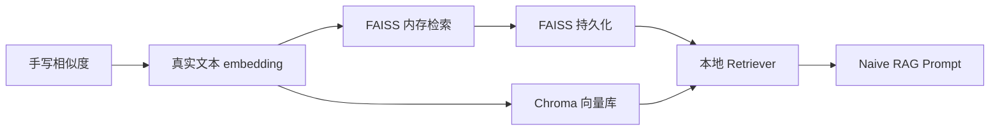
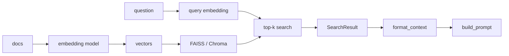
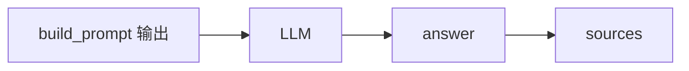

# 第4天代码实现逐行详解：Embedding、FAISS、Chroma、本地 Retriever

> 本文专门解释 `demos/` 目录下的代码。  
> 学习目标：不只是“运行成功”，而是知道每个脚本在 RAG 检索链路里解决什么问题。  
> 建议顺序：先运行 `01_similarity_basics.py`，再运行 SBERT、FAISS、Chroma，最后看 `08_naive_rag_local_retriever.py`。

## 1. 代码文件总览

本目录新增了这些代码：

```text
第4天RAG Part 2 向量化与存储/
  requirements.txt
  demos/
    01_similarity_basics.py
    02_sbert_semantic_search.py
    03_faiss_l2_search.py
    04_faiss_cosine_search.py
    05_faiss_persistent_store.py
    06_chroma_basic_store.py
    07_chroma_custom_embeddings.py
    08_naive_rag_local_retriever.py
```

每个文件的职责：

| 文件 | 主题 | 你要学会什么 |
|---|---|---|
| `requirements.txt` | 依赖列表 | 今天代码需要安装哪些包 |
| `01_similarity_basics.py` | 手写相似度 | dot、L2、cosine 的本质 |
| `02_sbert_semantic_search.py` | SBERT 语义检索 | 文本如何变成 embedding，如何用 cosine 排序 |
| `03_faiss_l2_search.py` | FAISS L2 检索 | `IndexFlatL2`、`add`、`search` |
| `04_faiss_cosine_search.py` | FAISS cosine 风格检索 | normalize + `IndexFlatIP` |
| `05_faiss_persistent_store.py` | FAISS 持久化 | index 和文档映射如何保存 |
| `06_chroma_basic_store.py` | Chroma 基础向量库 | collection、documents、ids、metadata、query |
| `07_chroma_custom_embeddings.py` | Chroma 自定义 embedding | 自己编码 embedding 再写入 Chroma |
| `08_naive_rag_local_retriever.py` | 本地 Retriever | 把向量检索封装成 RAG 可用的检索模块 |

## 2. 环境准备

进入第 4 天目录：

```powershell
cd "D:\vscode项目\AI Agent 开发工程师学习路线图（工程落地版）\第 1 周：大模型应用开发基础 + 手撕 Naive RAG\第4天RAG Part 2 向量化与存储"
```

建议创建虚拟环境：

```powershell
python -m venv .venv
.\.venv\Scripts\Activate.ps1
```

安装依赖：

```powershell
python -m pip install --upgrade pip
pip install -r requirements.txt
```

如果 `faiss-cpu` 在 Windows 上安装失败，可以先运行不依赖 FAISS 的脚本：

```powershell
python demos\01_similarity_basics.py
python demos\02_sbert_semantic_search.py
python demos\06_chroma_basic_store.py
```

FAISS 在 Windows 上有时更适合用 conda 安装：

```powershell
conda install -c pytorch faiss-cpu
```

注意：第一次运行 SentenceTransformers 会下载模型：

```text
sentence-transformers/all-MiniLM-L6-v2
```

如果网络慢，第一次会等一会儿。模型下载完成后，后续运行会使用本地缓存。

## 3. 总体运行顺序

推荐按这个顺序运行：

```powershell
python demos\01_similarity_basics.py
python demos\02_sbert_semantic_search.py
python demos\03_faiss_l2_search.py
python demos\04_faiss_cosine_search.py
python demos\05_faiss_persistent_store.py
python demos\06_chroma_basic_store.py
python demos\07_chroma_custom_embeddings.py
python demos\08_naive_rag_local_retriever.py
```

这条顺序对应 RAG 检索层的学习路径：



## 4. `requirements.txt` 解释

文件内容：

```text
numpy
sentence-transformers
faiss-cpu
chromadb
```

逐个解释：

| 依赖 | 作用 |
|---|---|
| `numpy` | 保存和处理向量矩阵 |
| `sentence-transformers` | 把文本编码成 embedding |
| `faiss-cpu` | 本地向量相似度搜索 |
| `chromadb` | 本地向量数据库 |

为什么需要 numpy？

FAISS 的 Python API 通常接收 numpy array，而且要求向量是 `float32`。

为什么需要 SentenceTransformers？

RAG 的核心不是直接把字符串塞给 FAISS，而是：

```text
字符串 -> embedding 模型 -> 数字向量 -> FAISS / Chroma
```

为什么同时写 FAISS 和 Chroma？

因为它们学习价值不一样：

1. FAISS 帮你理解向量索引底层。
2. Chroma 帮你理解应用层向量库。

## 5. `01_similarity_basics.py`：手写相似度

这个脚本不依赖任何 AI 模型，只用 Python 标准库。

运行：

```powershell
python demos\01_similarity_basics.py
```

### 5.1 代码目标

你要理解三种相似度 / 距离：

1. dot product，内积，越大通常越相似。
2. L2 distance，欧氏距离，越小通常越相似。
3. cosine similarity，余弦相似度，越大通常越相似。

### 5.2 `dot` 函数

```python
def dot(a: list[float], b: list[float]) -> float:
    """Calculate inner product."""
    return sum(x * y for x, y in zip(a, b))
```

这段代码计算：

```text
a · b = a1*b1 + a2*b2 + ... + an*bn
```

比如：

```text
a = [1, 2]
b = [3, 4]
a · b = 1*3 + 2*4 = 11
```

在向量检索里，inner product 常用于衡量相似度。

但要注意：

```text
inner product 会受向量长度影响。
```

所以脚本里故意放了：

```python
"doc_long_vector": [9.0, 1.0]
```

它方向和 query 接近，但长度也大。你会看到 inner product 很容易偏向长向量。

### 5.3 `norm` 函数

```python
def norm(a: list[float]) -> float:
    """Calculate vector length."""
    return math.sqrt(sum(x * x for x in a))
```

这是向量长度：

```text
||a|| = sqrt(a1^2 + a2^2 + ... + an^2)
```

cosine similarity 需要用它去消除向量长度影响。

### 5.4 `cosine_similarity` 函数

```python
def cosine_similarity(a: list[float], b: list[float]) -> float:
    """Calculate cosine similarity. Higher means more similar."""
    denominator = norm(a) * norm(b)
    if denominator == 0:
        return 0.0
    return dot(a, b) / denominator
```

公式：

```text
cos(a, b) = (a · b) / (||a|| * ||b||)
```

重点：

1. 分子是内积。
2. 分母是两个向量长度相乘。
3. 这样可以主要比较方向，而不是长度。

为什么有：

```python
if denominator == 0:
    return 0.0
```

因为零向量长度为 0，不能做除法。实际 embedding 正常不会是零向量，但写函数时要防御。

### 5.5 `l2_distance` 函数

```python
def l2_distance(a: list[float], b: list[float]) -> float:
    """Calculate Euclidean distance. Lower means more similar."""
    return math.sqrt(sum((x - y) ** 2 for x, y in zip(a, b)))
```

公式：

```text
L2(a, b) = sqrt((a1-b1)^2 + (a2-b2)^2 + ...)
```

重点：

```text
L2 是距离，不是相似度，所以越小越接近。
```

### 5.6 `print_ranking` 函数

```python
def print_ranking(title: str, rows: list[tuple[str, float]], reverse: bool) -> None:
    print(f"\n{title}")
    for rank, (name, score) in enumerate(
        sorted(rows, key=lambda item: item[1], reverse=reverse),
        start=1,
    ):
        print(f"rank={rank}, name={name}, score={score:.4f}")
```

这个函数做排序输出。

参数 `reverse` 很关键：

1. cosine：越大越好，所以 `reverse=True`。
2. inner product：越大越好，所以 `reverse=True`。
3. L2：越小越好，所以 `reverse=False`。

这就是很多 RAG bug 的来源：分数方向搞反。

### 5.7 你应该看到什么

这个脚本会打印三种 ranking。

你要重点观察：

1. cosine 排序更关注方向。
2. L2 排序更关注距离。
3. inner product 可能偏向长向量。

这就是为什么后面 FAISS cosine 风格检索要先 normalize。

## 6. `02_sbert_semantic_search.py`：真实文本 Embedding

运行：

```powershell
python demos\02_sbert_semantic_search.py
```

### 6.1 代码目标

这个脚本演示：

```text
中文文本 -> SentenceTransformer -> embedding -> cosine similarity -> top-k 排序
```

它还不是 FAISS，也不是 Chroma。它是最朴素的语义搜索：把 query 和所有 docs 都编码，然后逐个算相似度。

### 6.2 模型名称

```python
MODEL_NAME = "sentence-transformers/all-MiniLM-L6-v2"
```

这是一个轻量英文为主的通用 sentence embedding 模型。它速度快、体积小，适合学习。

注意：

1. 它能跑中文，但不是最强中文 embedding 模型。
2. 今天的重点是理解流程，不是追求中文效果最好。
3. 真实中文 RAG 可考虑中文或多语言 embedding 模型。

### 6.3 文档列表

```python
DOCS = [
    "FAISS 是一个用于高效相似度搜索和密集向量聚类的库。",
    "Chroma 是一个面向 AI 应用的开源向量数据库。",
    "SentenceTransformers 可以把句子或段落编码为向量。",
    ...
]
```

这些就是一个极小知识库。

在真实 RAG 里，`DOCS` 通常来自：

1. Markdown 文档切分结果。
2. PDF 切分结果。
3. 网页内容。
4. 数据库记录。
5. 用户上传文件。

### 6.4 编码文档和 query

```python
model = SentenceTransformer(MODEL_NAME)

doc_embeddings = model.encode(DOCS)
query_embedding = model.encode(query)
```

这里有两个关键点：

1. 文档要编码。
2. 用户问题也要编码。

RAG 检索成立的前提是：

```text
query vector 和 document vector 在同一个向量空间。
```

所以它们必须用同一个 embedding 模型，或者至少用同一套兼容的 query/document encoder。

### 6.5 shape 输出

```python
print("doc_embeddings shape:", doc_embeddings.shape)
print("query_embedding shape:", query_embedding.shape)
```

你可能看到：

```text
doc_embeddings shape: (7, 384)
query_embedding shape: (384,)
```

解释：

1. `(7, 384)`：7 条文档，每条 384 维。
2. `(384,)`：1 条 query，384 维。

FAISS 里一般希望 query 是二维矩阵，所以后面代码会写：

```python
model.encode([query])
```

这样得到的 shape 通常是：

```text
(1, 384)
```

### 6.6 计算 cosine 相似度

```python
scores = cos_sim(query_embedding, doc_embeddings)[0]
```

`cos_sim` 来自：

```python
from sentence_transformers.util import cos_sim
```

它会计算 query 和每条 doc 的余弦相似度。

`[0]` 是因为返回结果是二维结构，取第一条 query 的结果。

### 6.7 排序

```python
ranking = sorted(
    enumerate(scores),
    key=lambda item: float(item[1]),
    reverse=True,
)
```

`enumerate(scores)` 会得到：

```text
(doc_index, score)
```

例如：

```text
(2, 0.71)
```

表示第 2 条文档和 query 的相似度是 0.71。

`reverse=True` 是因为 cosine 越大越相似。

### 6.8 这个脚本的局限

它会对所有文档逐个算相似度。

文档少时没问题：

```text
7 条文档
```

文档多时就不合适：

```text
70 万条文档
```

所以后面需要 FAISS 或 Chroma。

## 7. `03_faiss_l2_search.py`：FAISS L2 检索

运行：

```powershell
python demos\03_faiss_l2_search.py
```

### 7.1 代码目标

这个脚本演示 FAISS 官方 Getting started 的核心流程：

```text
准备向量矩阵 -> 创建 Index -> add -> search -> 得到 D 和 I
```

### 7.2 numpy 和 FAISS

```python
import numpy as np
import faiss
```

FAISS 处理的是向量矩阵，不处理原始字符串。

所以你必须先：

```python
doc_embeddings = np.asarray(model.encode(DOCS), dtype="float32")
```

这里最重要的是：

```python
dtype="float32"
```

FAISS 通常要求 float32。很多时候模型输出是 float32，但显式转换更稳。

### 7.3 query 为什么用列表包起来

```python
query_embedding = np.asarray(model.encode([query]), dtype="float32")
```

这里是 `[query]`，不是 `query`。

因为 FAISS 的 `search` 希望输入是二维矩阵：

```text
(query_count, dimension)
```

即使只有一个 query，也要是：

```text
(1, 384)
```

而不是：

```text
(384,)
```

### 7.4 创建 IndexFlatL2

```python
dimension = doc_embeddings.shape[1]
index = faiss.IndexFlatL2(dimension)
```

`dimension` 是向量维度。

如果 doc embedding shape 是：

```text
(6, 384)
```

那么：

```text
dimension = 384
```

`IndexFlatL2` 表示：

1. Flat：不压缩，不聚类，暴力精确搜索。
2. L2：使用欧氏距离。
3. 不需要训练。
4. 适合学习和小规模数据。

### 7.5 添加文档向量

```python
index.add(doc_embeddings)
```

这行把所有文档向量加入 FAISS 索引。

之后：

```python
print("index.ntotal:", index.ntotal)
```

应该输出文档数量。

如果 `DOCS` 有 6 条：

```text
index.ntotal: 6
```

### 7.6 搜索

```python
distances, indices = index.search(query_embedding, top_k)
```

这就是 FAISS 最重要的调用。

返回两个矩阵：

1. `distances`：距离矩阵。
2. `indices`：索引矩阵。

如果有 1 个 query，top_k 是 3：

```text
distances shape = (1, 3)
indices shape = (1, 3)
```

例如：

```text
indices = [[0, 2, 4]]
```

表示最相似的是：

```python
DOCS[0]
DOCS[2]
DOCS[4]
```

### 7.7 为什么 FAISS 返回 idx 而不是文本

代码：

```python
for rank, idx in enumerate(indices[0], start=1):
    distance = distances[0][rank - 1]
    print(f"rank={rank}, distance={distance:.4f}, idx={idx}, doc={DOCS[idx]}")
```

FAISS 只知道向量，不知道原始文本。

所以你必须自己用：

```python
DOCS[idx]
```

取回文本。

这就是 FAISS 和 Chroma 的重要区别之一：

```text
FAISS 管向量索引。
Chroma 管向量、文档、metadata、ids。
```

## 8. `04_faiss_cosine_search.py`：FAISS cosine 风格检索

运行：

```powershell
python demos\04_faiss_cosine_search.py
```

### 8.1 为什么需要这个脚本

文本 embedding 常用 cosine similarity。

但 FAISS 的常用基础索引是：

1. `IndexFlatL2`
2. `IndexFlatIP`

如果想做 cosine 风格检索，可以这样做：

```text
先把向量 normalize 到单位长度
再用 inner product
```

### 8.2 normalize 文档向量

```python
doc_embeddings = np.asarray(model.encode(DOCS), dtype="float32")
faiss.normalize_L2(doc_embeddings)
```

`faiss.normalize_L2` 会原地修改向量。

修改后每个向量长度约等于 1。

### 8.3 normalize query 向量

```python
query_embedding = np.asarray(model.encode([query]), dtype="float32")
faiss.normalize_L2(query_embedding)
```

注意：

```text
文档向量和 query 向量都要 normalize。
```

只 normalize 一边是不对的。

### 8.4 使用 IndexFlatIP

```python
index = faiss.IndexFlatIP(dimension)
```

IP 是 inner product。

当向量都已经 normalize 后：

```text
inner product 排序 ≈ cosine similarity 排序
```

### 8.5 分数方向

```python
scores, indices = index.search(query_embedding, top_k)
```

这里的 `scores` 越大越相似。

对比：

| 索引 | 返回值含义 | 排序方向 |
|---|---|---|
| `IndexFlatL2` | L2 distance | 越小越相似 |
| `IndexFlatIP` | inner product score | 越大越相似 |

这个表必须记住。

## 9. `05_faiss_persistent_store.py`：FAISS 持久化

运行：

```powershell
python demos\05_faiss_persistent_store.py
```

运行后会生成：

```text
local_faiss_store/
  index.faiss
  docs.json
```

### 9.1 为什么需要持久化

如果每次启动程序都重新：

```text
读取文档 -> embedding -> 建索引
```

会很慢。

真实系统通常会：

1. 离线构建索引。
2. 保存到磁盘。
3. 查询时直接加载。

### 9.2 路径设计

```python
BASE_DIR = Path(__file__).resolve().parent.parent
STORE_DIR = BASE_DIR / "local_faiss_store"
INDEX_PATH = STORE_DIR / "index.faiss"
DOCS_PATH = STORE_DIR / "docs.json"
```

`Path(__file__).resolve()` 表示当前脚本的绝对路径。

`.parent.parent` 表示回到第 4 天目录。

所以无论你从哪里运行脚本，文件都会稳定保存到：

```text
第4天RAG Part 2 向量化与存储/local_faiss_store/
```

### 9.3 RECORDS 数据结构

```python
RECORDS = [
    {
        "id": "doc-001",
        "text": "FAISS 是一个用于高效相似度搜索和密集向量聚类的库。",
        "metadata": {"topic": "faiss", "source": "day4"},
    },
    ...
]
```

相比前面的 `DOCS: list[str]`，这里更接近真实 RAG。

每条记录包含：

1. `id`：稳定唯一标识。
2. `text`：文档 chunk 内容。
3. `metadata`：来源、主题等信息。

### 9.4 构建 store

```python
def build_store(records: list[dict[str, Any]]) -> None:
    STORE_DIR.mkdir(exist_ok=True)
```

先创建目录。

```python
model = SentenceTransformer(MODEL_NAME)
texts = [record["text"] for record in records]
```

取出所有文本。

```python
embeddings = np.asarray(model.encode(texts), dtype="float32")
faiss.normalize_L2(embeddings)
```

编码并 normalize。

```python
index = faiss.IndexFlatIP(embeddings.shape[1])
index.add(embeddings)
```

创建 cosine 风格索引。

```python
faiss.write_index(index, str(INDEX_PATH))
```

保存 FAISS index。

```python
with DOCS_PATH.open("w", encoding="utf-8") as f:
    json.dump(records, f, ensure_ascii=False, indent=2)
```

保存文档映射。

注意：

```text
FAISS index 只保存向量索引。
docs.json 保存文本、id、metadata。
两者必须一起保存。
```

### 9.5 加载 store

```python
def load_store() -> tuple[faiss.Index, list[dict[str, Any]]]:
    index = faiss.read_index(str(INDEX_PATH))

    with DOCS_PATH.open("r", encoding="utf-8") as f:
        records = json.load(f)

    return index, records
```

这就是查询服务启动时常做的事。

### 9.6 查询

```python
scores, indices = index.search(query_embedding, top_k)
```

然后：

```python
record = records[idx]
```

用 FAISS 返回的 idx 找回原文。

### 9.7 你要特别注意的坑

如果你修改了 `records` 顺序，但没重建 FAISS index，结果会错。

比如：

```python
records.sort(...)
```

会导致：

```text
FAISS idx=0 原本对应 doc-001
但 docs.json 里的第 0 条变成了 doc-004
```

所以 FAISS 持久化必须成套管理：

1. index 文件。
2. docs 映射文件。
3. embedding model name。
4. 向量维度。
5. 构建时间或版本。

## 10. `06_chroma_basic_store.py`：Chroma 基础向量库

运行：

```powershell
python demos\06_chroma_basic_store.py
```

运行后会生成：

```text
chroma_db/
```

### 10.1 代码目标

这个脚本演示 Chroma 的应用层能力：

```text
PersistentClient -> collection -> upsert documents/metadatas/ids -> query
```

### 10.2 创建 PersistentClient

```python
client = chromadb.PersistentClient(path=str(CHROMA_DIR))
```

这表示数据会保存到本地目录。

相比：

```python
chromadb.Client()
```

`PersistentClient` 的优势是：

1. 程序结束数据不丢。
2. 第二次运行可以继续使用。
3. 适合本地 RAG 知识库。

### 10.3 collection

```python
collection = client.get_or_create_collection(name="rag_notes")
```

collection 可以理解为：

```text
一个知识库 / 一个命名空间 / 一张向量表
```

`get_or_create_collection` 适合练习，因为脚本重复运行不会因为 collection 已存在而报错。

### 10.4 upsert

```python
collection.upsert(
    ids=IDS,
    documents=DOCS,
    metadatas=METADATAS,
)
```

这里没有显式提供 embeddings。

Chroma 会使用默认 embedding function 来处理 `documents`。

`upsert` 的含义：

1. id 不存在：插入。
2. id 已存在：更新。

这比 `add` 更适合反复运行脚本。

### 10.5 query

```python
results = collection.query(
    query_texts=[query],
    n_results=3,
)
```

这表示：

1. 输入 query 文本。
2. Chroma 把 query 转成向量。
3. 在 collection 中找最相关的 3 条。

### 10.6 结果结构

```python
results["ids"][0]
results["documents"][0]
results["metadatas"][0]
results["distances"][0]
```

为什么有 `[0]`？

因为 `query_texts` 可以一次传多个 query。

如果你传：

```python
query_texts=["问题1", "问题2"]
```

那么返回结果就是两组。

当前只有一个 query，所以取 `[0]`。

### 10.7 Chroma 和 FAISS 的直观区别

FAISS 输出：

```text
D: 距离或分数
I: 向量索引
```

Chroma 输出：

```text
ids
documents
metadatas
distances
```

所以 Chroma 更适合快速做应用。

## 11. `07_chroma_custom_embeddings.py`：Chroma 自定义 Embedding

运行：

```powershell
python demos\07_chroma_custom_embeddings.py
```

### 11.1 为什么需要自定义 embeddings

上一个脚本让 Chroma 自己处理 embedding。这样简单，但不够可控。

真实项目里你经常想明确指定：

1. 使用哪个 embedding 模型。
2. 是否使用中文模型。
3. 是否 normalize。
4. query 和 document 是否用不同编码方法。
5. 是否和 FAISS 使用同一批向量做对比。

所以这个脚本演示：

```text
自己用 SentenceTransformers 编码
再把 embeddings 传给 Chroma
```

### 11.2 文档编码

```python
model = SentenceTransformer(MODEL_NAME)

doc_embeddings = model.encode(DOCS).tolist()
```

为什么 `.tolist()`？

Chroma API 可以接收普通 Python list 格式的 embeddings。

numpy array 转 list 后更通用。

### 11.3 写入 Chroma

```python
collection.upsert(
    ids=IDS,
    documents=DOCS,
    metadatas=METADATAS,
    embeddings=doc_embeddings,
)
```

这里明确传了：

```python
embeddings=doc_embeddings
```

所以 Chroma 不需要自己再用默认 embedding function 编码文档。

### 11.4 查询也要自己编码

```python
query_embedding = model.encode([query]).tolist()

results = collection.query(
    query_embeddings=query_embedding,
    n_results=3,
)
```

注意：

```text
既然写入时用了自定义 embeddings，查询时也应该用同一个模型编码 query。
```

不要混用：

1. 文档用模型 A。
2. query 用模型 B。

否则它们不一定在同一个向量空间，检索质量会很差。

### 11.5 如果换模型怎么办

如果你从：

```text
sentence-transformers/all-MiniLM-L6-v2
```

换成另一个模型，建议重建 collection。

原因：

1. 向量维度可能不同。
2. 向量空间不同。
3. 新 query 和旧 document embeddings 不兼容。

## 12. `08_naive_rag_local_retriever.py`：最小 RAG 检索模块

运行：

```powershell
python demos\08_naive_rag_local_retriever.py
```

这个脚本不会调用 LLM，它只构造：

```text
检索结果 + 用户问题 -> 最终 prompt
```

也就是说，它已经完成了 Naive RAG 的前半段。

### 12.1 数据结构

```python
DOCS = [
    {
        "text": "Embedding 是把文本映射成固定维度向量的表示方法...",
        "metadata": {"source": "day4", "topic": "embedding"},
    },
    ...
]
```

这比 `list[str]` 更像真实知识库 chunk。

每条记录都有：

1. `text`：上下文内容。
2. `metadata`：来源和主题。

### 12.2 SearchResult

```python
@dataclass
class SearchResult:
    text: str
    score: float
    metadata: dict[str, Any]
```

这是检索返回对象。

为什么要封装？

因为 RAG 后续不应该只拿到字符串。它至少需要：

1. 文本内容。
2. 相似度分数。
3. 来源 metadata。

### 12.3 LocalFaissRetriever

```python
class LocalFaissRetriever:
    def __init__(
        self,
        records: list[dict[str, Any]],
        model_name: str = MODEL_NAME,
    ) -> None:
```

这是一个本地检索器。

它的目标是把 FAISS 的细节藏起来，对外只暴露：

```python
search(query, top_k)
```

这就是 RAG 里的 retriever 思想。

### 12.4 初始化时构建索引

```python
self.records = records
self.model = SentenceTransformer(model_name)

texts = [record["text"] for record in records]
embeddings = np.asarray(self.model.encode(texts), dtype="float32")
faiss.normalize_L2(embeddings)

self.index = faiss.IndexFlatIP(embeddings.shape[1])
self.index.add(embeddings)
```

这段做了 5 件事：

1. 保存原始 records。
2. 加载 embedding 模型。
3. 取出所有 text。
4. 编码成向量并 normalize。
5. 创建 FAISS cosine 风格索引。

### 12.5 search 方法

```python
def search(self, query: str, top_k: int = 3) -> list[SearchResult]:
```

输入：

1. `query`：用户问题。
2. `top_k`：取回几条相关文档。

输出：

```python
list[SearchResult]
```

### 12.6 query 编码

```python
query_embedding = np.asarray(self.model.encode([query]), dtype="float32")
faiss.normalize_L2(query_embedding)
```

仍然必须：

1. 用同一个模型。
2. 转成 float32。
3. 做 normalize。

### 12.7 FAISS 搜索并封装结果

```python
scores, indices = self.index.search(query_embedding, top_k)
```

然后：

```python
for score, idx in zip(scores[0], indices[0]):
    record = self.records[idx]
    results.append(
        SearchResult(
            text=record["text"],
            score=float(score),
            metadata=record["metadata"],
        )
    )
```

这里把 FAISS 返回的 idx 转成了业务层结果。

这一步非常关键：

```text
向量索引结果 -> RAG 可用文档结果
```

### 12.8 format_context

```python
def format_context(results: list[SearchResult]) -> str:
    blocks = []
    for idx, result in enumerate(results, start=1):
        source = result.metadata.get("source", "unknown")
        topic = result.metadata.get("topic", "unknown")
        blocks.append(
            f"[{idx}] source={source}, topic={topic}, score={result.score:.4f}\n"
            f"{result.text}"
        )
    return "\n\n".join(blocks)
```

它把检索结果转成 prompt 里的上下文。

输出类似：

```text
[1] source=day4, topic=embedding, score=0.8123
Embedding 是把文本映射成固定维度向量的表示方法...

[2] source=day4, topic=faiss, score=0.7561
FAISS 是 Facebook AI Research 开源的相似度搜索库...
```

为什么要带上 source、topic、score？

1. 方便模型引用来源。
2. 方便你调试召回结果。
3. 方便后续做答案引用。

### 12.9 build_prompt

```python
def build_prompt(question: str, context: str) -> str:
    return f"""你是一名严谨的 RAG 学习助手。
请只根据给定上下文回答问题。
如果上下文中没有答案，请回答：根据当前上下文无法确定。
回答时请给出使用到的来源编号。

上下文：
{context}

问题：
{question}

答案："""
```

这就是 Naive RAG 的 prompt。

它有几个关键约束：

1. 只根据上下文回答。
2. 没有答案就承认不知道。
3. 回答时给出来源编号。
4. 把 context 和 question 明确分开。

后面接 LLM 时，你只需要把 `prompt` 发给模型。

### 12.10 main 函数

```python
question = "为什么 RAG 需要 Embedding 和向量索引？"
retriever = LocalFaissRetriever(DOCS)

results = retriever.search(question, top_k=4)
context = format_context(results)
prompt = build_prompt(question, context)
```

这就是 RAG 前半段：

```text
question -> retriever -> results -> context -> prompt
```

脚本最后打印：

1. question
2. retrieved context
3. final prompt for LLM

你要重点看：

```text
final prompt for LLM
```

因为明天手撕 Naive RAG 时，只差最后一步：

```text
prompt -> LLM -> answer
```

## 13. 这些代码如何组成一个完整 RAG

今天代码覆盖的是：



完整 RAG 还需要：



也就是说，你明天只需要继续补：

1. 文档加载。
2. 文档切分。
3. 调用 LLM。
4. 答案引用。
5. 简单评测。

## 14. 常见报错与解决

### 14.1 `ModuleNotFoundError: No module named 'sentence_transformers'`

原因：没有安装依赖。

解决：

```powershell
pip install -r requirements.txt
```

### 14.2 `ModuleNotFoundError: No module named 'faiss'`

原因：`faiss-cpu` 没装成功。

解决方式一：

```powershell
pip install faiss-cpu
```

解决方式二：

```powershell
conda install -c pytorch faiss-cpu
```

如果暂时解决不了，先跑 Chroma 脚本。

### 14.3 模型下载很慢

原因：SentenceTransformers 第一次需要下载模型。

解决：

1. 等待下载完成。
2. 换网络环境。
3. 使用已经下载到本地的模型路径。
4. 换成你本地已有的 embedding 模型。

### 14.4 FAISS 报维度错误

常见原因：

1. index 是 384 维。
2. 你传入了 768 维 query。

解决：

1. 文档和 query 必须使用同一个 embedding 模型。
2. 不要把不同模型生成的向量放进同一个 index。
3. 打印 `embedding.shape` 检查。

### 14.5 分数方向看反

记住：

```text
IndexFlatL2: distance 越小越相似
IndexFlatIP: score 越大越相似
Chroma distances: 通常越小越接近，具体要结合 collection 的 distance metric
```

### 14.6 Chroma 重复运行报 id 问题

本代码使用的是：

```python
collection.upsert(...)
```

所以重复运行一般不会因为重复 id 出错。

如果你自己改成：

```python
collection.add(...)
```

重复 id 可能报错。

## 15. 建议你亲手改的地方

为了真正掌握，建议你做这些小改动。

### 15.1 改 query

把：

```python
query = "什么是向量数据库？"
```

改成：

```python
query = "为什么文本切分会影响检索效果？"
```

观察 top-k 是否变化。

### 15.2 改 top_k

把：

```python
top_k = 3
```

改成：

```python
top_k = 1
top_k = 5
```

观察：

1. top_k 小时是否漏召回。
2. top_k 大时是否引入噪声。

### 15.3 添加新文档

在 `DOCS` 或 `RECORDS` 中加入：

```python
"rerank 可以对向量检索召回的候选文档重新排序，提高最终上下文质量。"
```

再查询：

```text
如何提升向量检索后的排序质量？
```

### 15.4 换 embedding 模型

把：

```python
MODEL_NAME = "sentence-transformers/all-MiniLM-L6-v2"
```

替换为其他 SentenceTransformers 模型。

注意：

1. 换模型后 FAISS index 要重建。
2. Chroma 自定义 embeddings 的 collection 建议重建。
3. 向量维度可能变化。

### 15.5 把第 3 天 Markdown 当知识库

进阶任务：

1. 读取第 3 天 Markdown。
2. 按标题或段落切成 chunk。
3. 给每个 chunk 加 metadata。
4. 用 `LocalFaissRetriever` 建索引。
5. 输入问题检索 top-k。

这就非常接近手撕 Naive RAG 了。

## 16. 学完这些代码后的检查清单

如果你能回答下面问题，今天代码就真正吃透了：

1. 为什么 FAISS 需要 `float32`？
2. `model.encode(query)` 和 `model.encode([query])` 有什么区别？
3. `IndexFlatL2` 的分数方向是什么？
4. `IndexFlatIP` 的分数方向是什么？
5. 为什么 cosine 风格检索要 normalize？
6. 为什么 FAISS 还要保存 `docs.json`？
7. Chroma 的 `ids`、`documents`、`metadatas` 分别是什么？
8. `upsert` 比 `add` 更适合哪种场景？
9. 为什么 metadata 对 RAG 很重要？
10. `LocalFaissRetriever.search` 为什么返回 `SearchResult`，而不是直接返回字符串？
11. `format_context` 在 RAG 中解决什么问题？
12. `build_prompt` 里为什么要写“只根据上下文回答”？

## 17. 今日代码的最终心智模型

请把代码收束成下面这句话：

```text
Embedding 模型负责把文本变成向量；
FAISS / Chroma 负责根据 query 向量找相似文档；
Retriever 负责把底层向量搜索结果封装成 RAG 可用的上下文；
Prompt 负责把上下文和问题组织给 LLM。
```

对应代码链路：

```text
01 手写相似度
  -> 02 用真实 embedding 做相似度
  -> 03/04 用 FAISS 加速向量搜索
  -> 05 保存 FAISS 索引和文档映射
  -> 06/07 用 Chroma 管理文档、metadata、向量
  -> 08 封装成本地 Retriever，生成 Naive RAG Prompt
```

这就是第 4 天的核心成果。

