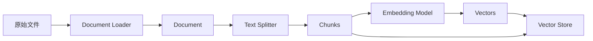
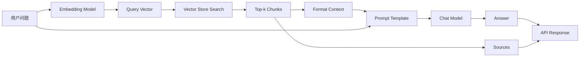
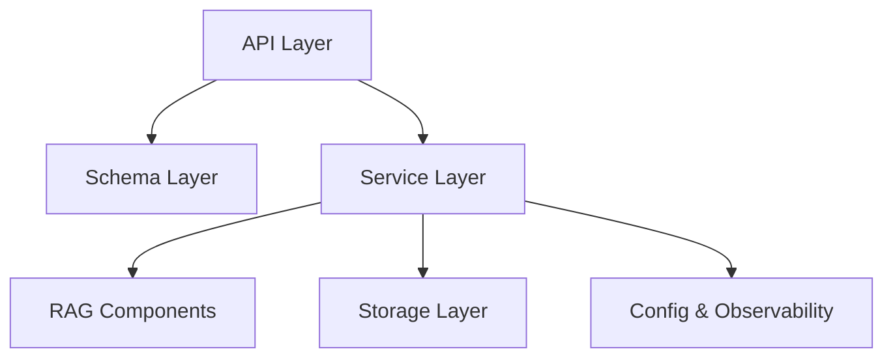
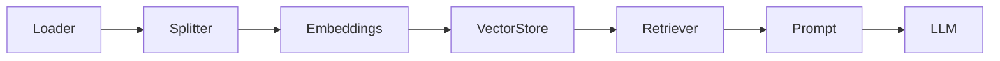

# Naive RAG 系统架构详解

> 目标：把 Naive RAG 从“几个 LangChain 调用”理解成一个可维护的后端系统。

## 1. RAG 解决的核心问题

大模型本身有几个天然限制：

1. 训练知识固定，无法自动知道你的私有文档和最新资料。
2. 上下文窗口有限，不能把所有材料都塞进 prompt。
3. 模型会生成流畅文本，但不天然保证每句话都有事实依据。
4. 私有知识经常变化，频繁微调成本高、周期长、风险大。

RAG 的思路是：

1. 先从外部知识库检索和问题相关的内容。
2. 再把这些内容作为上下文交给大模型。
3. 让模型基于上下文回答，而不是完全依赖模型参数记忆。

最朴素的 Naive RAG 可以写成：

```text
answer = LLM(question + retrieve(question))
```

但工程上你要把它拆成两个阶段。

## 2. 两条主链路

### 2.1 索引链路：Indexing Pipeline

索引链路处理“知识如何进入系统”。



职责说明：

1. 原始文件：用户上传的 PDF、Markdown、TXT、网页等。
2. Loader：把不同格式文件转成统一的 `Document`。
3. Document：LangChain 中的基础数据结构，通常包含 `page_content` 和 `metadata`。
4. Splitter：把长文档切成适合检索和放进上下文的 chunk。
5. Embedding：把 chunk 文本编码成向量。
6. Vector Store：保存向量、文本和 metadata，并支持相似度搜索。

索引链路的特点：

1. 可以慢一点，因为通常不在用户提问时临时做。
2. 必须稳定，因为一旦 metadata 错乱，后面引用来源会错。
3. 必须可重复，因为同一个文件重复上传时要避免重复索引或 ID 混乱。

### 2.2 问答链路：Retrieval + Generation Pipeline

问答链路处理“用户问题如何变成答案”。



职责说明：

1. 用户问题：API 请求输入。
2. Query Embedding：把问题编码到和文档 chunk 相同的向量空间。
3. Retriever：从向量库找 top-k 相关片段。
4. Context Formatter：把检索结果整理成 prompt 上下文。
5. Prompt Template：约束模型回答范围和格式。
6. Chat Model：生成最终答案。
7. Sources：把引用来源返回给调用方。

问答链路的特点：

1. 对延迟敏感，用户正在等。
2. 对召回质量敏感，检索错了，生成很难救。
3. 对 prompt 约束敏感，约束不清容易幻觉。
4. 对可观测性敏感，需要知道检索到了什么。

## 3. 为什么叫 Naive RAG

Naive RAG 指最基础、最直接的 RAG：

1. 用户问题直接用于检索。
2. 检索 top-k chunk。
3. 把 chunk 拼接到 prompt。
4. LLM 生成答案。

它通常不包含：

1. 查询改写。
2. 多路召回。
3. BM25 + 向量混合检索。
4. reranker 重排。
5. parent-child retrieval。
6. multi-hop 推理。
7. corrective RAG。
8. self-RAG。
9. agentic RAG。
10. 知识图谱增强。

Naive RAG 的优点：

1. 简单。
2. 易调试。
3. 适合入门。
4. 适合小型知识库原型。
5. 能快速验证业务价值。

Naive RAG 的缺点：

1. 用户问题表达差时，召回容易差。
2. chunk 切分不合理时，信息容易断裂。
3. top-k 固定，可能召回过少或噪声过多。
4. 只靠向量相似度，可能忽略关键词、数字、专有名词。
5. 没有重排，最相关内容不一定排在前面。
6. prompt 太长会增加成本和延迟。
7. 无法天然处理复杂多跳问题。

## 4. 系统模块拆解

推荐把系统拆成 6 层。



### 4.1 API Layer

位置：

```text
app/api/routes/
```

职责：

1. 定义 HTTP 路由。
2. 接收请求参数。
3. 调用 service。
4. 转换异常为 HTTP 响应。
5. 返回 Pydantic response model。

不应该做：

1. 不直接写复杂文档解析。
2. 不直接拼 prompt。
3. 不直接初始化模型。
4. 不直接操作 Chroma 细节。

### 4.2 Schema Layer

位置：

```text
app/schemas/
```

职责：

1. 定义请求体。
2. 定义响应体。
3. 给 Swagger UI 提供自动文档。
4. 限制字段类型和范围。

典型 schema：

```python
from pydantic import BaseModel, Field

class ChatRequest(BaseModel):
    question: str = Field(..., min_length=1, max_length=2000)
    top_k: int = Field(default=4, ge=1, le=10)

class SourceChunk(BaseModel):
    document_id: str
    filename: str
    chunk_index: int
    content_preview: str
    score: float | None = None

class ChatResponse(BaseModel):
    answer: str
    sources: list[SourceChunk]
```

### 4.3 Service Layer

位置：

```text
app/services/
```

职责：

1. 编排业务流程。
2. 调用 loader、splitter、vector store、LLM。
3. 管理文档 metadata。
4. 做错误处理。
5. 给 API layer 提供干净接口。

典型服务：

1. `DocumentService`
   - 保存上传文件。
   - 调用 loader。
   - 调用 splitter。
   - 调用 vector store 写入。
   - 保存文档记录。

2. `RagService`
   - 接收 question。
   - 调用 retriever。
   - 格式化 context。
   - 调用 chat model。
   - 返回 answer 和 sources。

3. `VectorStoreService`
   - 初始化 embedding。
   - 初始化 Chroma。
   - 添加 documents。
   - 相似度搜索。

### 4.4 RAG Components

核心组件：

1. Loader
2. Splitter
3. Embeddings
4. Vector Store
5. Retriever
6. Prompt
7. LLM

组件关系：



### 4.5 Storage Layer

本项目可以先用文件系统完成最小持久化。

```text
data/
  uploads/      # 原始上传文件
  chroma/       # Chroma 持久化向量库
  metadata/     # 文档记录 JSON
```

建议保存一个文档 registry：

```json
{
  "documents": [
    {
      "document_id": "6f7b...",
      "filename": "rag.md",
      "path": "data/uploads/6f7b_rag.md",
      "content_type": "text/markdown",
      "chunk_count": 12,
      "created_at": "2026-06-15T16:00:00+08:00"
    }
  ]
}
```

为什么要保存 metadata：

1. API 列表需要展示文档。
2. 删除文档需要知道哪些 chunk 属于它。
3. sources 需要返回文件名和 chunk 信息。
4. 排查问题时需要知道某个回答来自哪里。

### 4.6 Config & Observability

配置项：

```text
APP_NAME=Naive RAG API
APP_ENV=dev
UPLOAD_DIR=data/uploads
CHROMA_DIR=data/chroma
METADATA_DIR=data/metadata
CHROMA_COLLECTION=naive_rag
CHUNK_SIZE=1000
CHUNK_OVERLAP=200
DEFAULT_TOP_K=4
OPENAI_API_KEY=...
DEEPSEEK_API_KEY=...
DEEPSEEK_BASE_URL=https://api.deepseek.com
DEEPSEEK_MODEL=deepseek-chat
CHAT_PROVIDER=deepseek
CHAT_MODEL=gpt-4o-mini
EMBEDDING_MODEL=text-embedding-3-small
```

日志建议记录：

1. request_id。
2. 上传文件名。
3. 文件大小。
4. document_id。
5. chunk_count。
6. question 长度。
7. top_k。
8. retrieved chunk ids。
9. LLM 调用耗时。
10. 错误堆栈。

## 5. API 设计

### 5.1 健康检查

```http
GET /health
```

响应：

```json
{
  "status": "ok",
  "app": "Naive RAG API",
  "vector_store": "ok"
}
```

### 5.2 上传文档

```http
POST /api/v1/documents/upload
Content-Type: multipart/form-data
```

表单字段：

1. `file`: 上传文件。

响应：

```json
{
  "document_id": "uuid",
  "filename": "rag_notes.md",
  "chunk_count": 18,
  "status": "indexed"
}
```

### 5.3 文档列表

```http
GET /api/v1/documents
```

响应：

```json
{
  "documents": [
    {
      "document_id": "uuid",
      "filename": "rag_notes.md",
      "chunk_count": 18,
      "created_at": "2026-06-15T16:00:00+08:00"
    }
  ]
}
```

### 5.4 文档问答

```http
POST /api/v1/chat/query
Content-Type: application/json
```

请求：

```json
{
  "question": "RAG 的索引阶段包括哪些步骤？",
  "top_k": 4
}
```

响应：

```json
{
  "answer": "RAG 的索引阶段通常包括文档加载、文本切分、Embedding 编码和向量存储。",
  "sources": [
    {
      "document_id": "uuid",
      "filename": "rag_notes.md",
      "chunk_index": 2,
      "content_preview": "索引阶段包括加载、切分、向量化和存储...",
      "score": 0.18
    }
  ]
}
```

## 6. Prompt 设计

基础 prompt：

```text
你是一个严谨的文档问答助手。
请只根据给定的上下文回答问题。

要求：
1. 如果上下文中有答案，请用中文简洁回答。
2. 如果上下文中没有答案，请回答：“根据已上传文档，我不知道。”
3. 不要编造事实、数字、链接或来源。
4. 如果上下文之间存在冲突，请指出冲突。

上下文：
{context}

问题：
{question}

回答：
```

为什么这样写：

1. 明确角色：文档问答助手。
2. 明确依据：只根据上下文。
3. 明确拒答：不知道就说不知道。
4. 明确输出语言：中文。
5. 明确反幻觉：不编造。

Prompt 不能完全消除幻觉，但能显著降低系统性胡编。

## 7. chunk 策略

推荐起点：

```text
chunk_size = 1000
chunk_overlap = 200
top_k = 4
```

调参理解：

1. chunk 太小
   - 优点：检索更精确。
   - 缺点：上下文不完整，容易丢定义前后解释。

2. chunk 太大
   - 优点：上下文更完整。
   - 缺点：向量语义变稀释，检索粒度变粗，占用更多 prompt token。

3. overlap 太小
   - 优点：存储少。
   - 缺点：跨段信息容易断裂。

4. overlap 太大
   - 优点：减少边界丢失。
   - 缺点：重复内容多，检索结果容易冗余。

5. top_k 太小
   - 优点：成本低，噪声少。
   - 缺点：可能漏掉关键证据。

6. top_k 太大
   - 优点：召回更多。
   - 缺点：上下文噪声多，成本高。

## 8. Embedding 和 LLM 选型

学习阶段可以有两套方案。

### 8.1 DeepSeek 生成 + 本地 Embedding 方案

这是本项目当前推荐默认方案：

```text
EMBEDDING_PROVIDER=hash
CHAT_PROVIDER=deepseek
DEEPSEEK_BASE_URL=https://api.deepseek.com
DEEPSEEK_MODEL=deepseek-chat
```

优点：

1. DeepSeek 负责最终答案生成，接入方式兼容 OpenAI Chat API。
2. 本地 hash embedding 不需要额外模型下载或 embedding API。
3. 适合快速跑通 FastAPI + LangChain + Chroma 的端到端链路。

缺点：

1. hash embedding 不是高质量语义向量，召回质量有限。
2. DeepSeek 不能弥补检索阶段漏召回的问题。
3. 如果要提升真实问答质量，后续应接入更强的中文或多语言 embedding 模型。

### 8.2 云模型方案

优点：

1. 质量通常更好。
2. 配置简单。
3. 和 LangChain 适配成熟。

缺点：

1. 需要 API key。
2. 有调用成本。
3. 需要网络。

典型选择：

```text
Chat model: deepseek-chat、gpt-4o-mini 或其他当前可用 chat model
Embedding model: text-embedding-3-small
```

### 8.3 本地模型方案

优点：

1. 无 API 成本。
2. 私有数据不出本地。
3. 适合学习 embedding 原理。

缺点：

1. 首次下载慢。
2. 中文效果取决于模型。
3. 本地机器性能影响速度。

典型选择：

```text
Embedding model: sentence-transformers/all-MiniLM-L6-v2
Chat model: 暂时用远程 API，或者接 Ollama
```

## 9. 失败模式

### 9.1 检索不到

可能原因：

1. 文档没有入库成功。
2. chunk 太大或太小。
3. embedding 模型不适合中文。
4. 用户问题和文档表达差异太大。
5. top_k 太小。
6. metadata filter 过滤掉了结果。

排查：

1. 打印 chunk_count。
2. 直接调用 `similarity_search` 看结果。
3. 输出 retrieved chunks。
4. 用文档原句提问测试。
5. 增大 top_k。

### 9.2 检索到了但回答错

可能原因：

1. prompt 约束弱。
2. 检索结果里有噪声。
3. 上下文太长，模型忽略关键片段。
4. 模型能力不足。
5. 问题需要跨 chunk 综合。

排查：

1. 在响应中返回 sources。
2. 检查上下文是否真的包含答案。
3. 减少 top_k 看噪声是否降低。
4. 改写 prompt。
5. 尝试更强模型。

### 9.3 来源引用错

可能原因：

1. chunk metadata 没有正确写入。
2. ID 映射错乱。
3. 重复上传导致旧数据混入。
4. 删除文档时没有删除向量。

排查：

1. 打印 document_id、filename、chunk_index。
2. 检查 Chroma collection 里的 metadata。
3. 清空向量库重新索引。

## 10. Naive RAG 到 Advanced RAG 的路线

你完成 Naive RAG 后，可以按这个顺序进阶：

1. Query Rewrite
   - 把用户口语化问题改写成更适合检索的问题。

2. Multi Query Retrieval
   - 生成多个查询，从多个角度召回。

3. Hybrid Search
   - 向量检索 + BM25 关键词检索。

4. Reranker
   - 先召回 20 条，再用重排模型选前 4 条。

5. Parent-Child Retrieval
   - 小 chunk 用于检索，大 chunk 用于回答。

6. Metadata Filter
   - 按文档、时间、用户、类型过滤。

7. Context Compression
   - 压缩检索结果，减少无关 token。

8. Evaluation
   - 构造标准问题集，评估 faithfulness、answer relevance、context recall。

9. Observability
   - 接 LangSmith 或自建日志，记录每次检索和生成。

10. Agentic RAG
   - 让模型决定何时检索、如何检索、是否再次检索。
