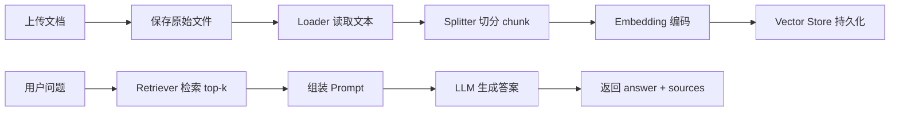

# 第5-6天：手撕 Naive RAG 系统

> 今日主题：整合 FastAPI + LangChain，完成一个端到端的文档问答 API。
>
> 核心目标：把前 4 天学到的 FastAPI、LangChain、文档加载、文本分块、Embedding、向量存储串成一个能运行、能上传文档、能检索、能回答、能返回来源的 Naive RAG 服务。

## 建议阅读顺序

1. [01-两天学习计划.md](01-两天学习计划.md)
2. [02-Naive-RAG系统架构详解.md](02-Naive-RAG系统架构详解.md)
3. [03-FastAPI-LangChain文档问答API实战.md](03-FastAPI-LangChain文档问答API实战.md)
4. [04-测试评估排障与进阶方向.md](04-测试评估排障与进阶方向.md)

## 两天最终产出

1. 一个可运行的 FastAPI 文档问答服务。
2. 一个清晰的 RAG 项目目录结构。
3. 支持文档上传、入库、提问、返回答案和引用来源。
4. 支持本地持久化向量库，服务重启后仍可查询。
5. 支持最小化的配置管理、错误处理、日志、健康检查。
6. 支持用 curl / Swagger UI / pytest 做基本验证。
7. 能解释 Naive RAG 的完整链路、边界、缺陷和下一步优化方向。

## 今日关键链路

## 参考资料

1. LangChain RAG From Scratch: https://github.com/langchain-ai/rag-from-scratch
2. LangChain RAG 官方教程: https://docs.langchain.com/oss/python/langchain/rag
3. Lilian Weng: LLM Powered Autonomous Agents: https://lilianweng.github.io/posts/2023-06-23-agent/
4. Datawhale 动手学大模型应用开发: https://datawhalechina.github.io/llm-universe/
5. Datawhale LLM Cookbook: https://github.com/datawhalechina/llm-cookbook
6. FastAPI 文件上传: https://fastapi.tiangolo.com/tutorial/request-files/
7. LangChain Chroma 集成: https://docs.langchain.com/oss/python/integrations/vectorstores/chroma

## 核心关键词

1. Naive RAG
2. FastAPI
3. LangChain
4. UploadFile
5. Document Loader
6. Text Splitter
7. Embedding
8. Vector Store
9. Chroma
10. Retriever
11. Prompt Template
12. Chat Model
13. Source Citation
14. API Schema
15. Indexing Pipeline
16. Retrieval Pipeline
17. Hallucination
18. Evaluation
19. Observability
20. Production Readiness

