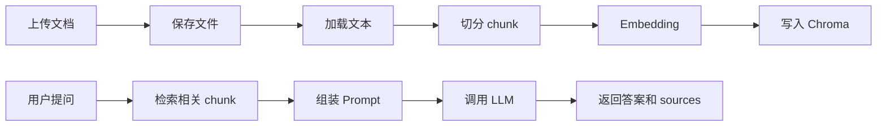
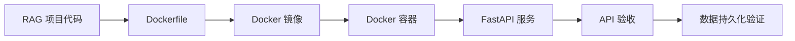

# 周度总结与项目验收清单

> 目标：把第 1 周学到的 FastAPI、LangChain、RAG、向量数据库、测试、Docker 部署串成一个完整闭环。

## 一、本周主题回顾

本周主题是：

```text
大模型应用开发基础 + 手撕 Naive RAG
```

你完成的是一个最小但完整的文档问答系统：



第 7 天新增的是部署闭环：



## 二、本周知识地图

### 1. FastAPI

你应该掌握：

1. 如何创建 `FastAPI()` 应用。
2. 如何编写 GET / POST 接口。
3. 如何使用 Pydantic 定义请求和响应。
4. 如何使用 `UploadFile` 接收文件。
5. 如何用 `APIRouter` 拆分路由。
6. 如何用 Swagger UI 调试接口。
7. 如何返回清晰的错误信息。
8. 如何写 `/health` 健康检查。

你应该能解释：

1. route 层为什么不应该堆复杂业务逻辑。
2. schema 层为什么要和 service 层分开。
3. 为什么健康检查是部署必备接口。

### 2. LangChain

你应该掌握：

1. `Document` 的 `page_content` 和 `metadata`。
2. loader 的作用。
3. splitter 的作用。
4. embedding model 的作用。
5. vector store 的作用。
6. retriever 的作用。
7. prompt template 的作用。
8. chat model 的调用方式。

你应该能解释：

1. LangChain 不是魔法，它只是帮你组织 LLM 应用链路。
2. RAG 的关键不只是“调用模型”，而是“把正确上下文交给模型”。
3. metadata 对溯源、删除、过滤、多用户隔离都很重要。

### 3. RAG

你应该掌握：

1. 索引阶段：加载、切分、向量化、存储。
2. 查询阶段：问题向量化、检索、组装上下文、生成答案。
3. chunk size 和 chunk overlap 的影响。
4. top_k 的影响。
5. sources 的价值。
6. 无答案问题的拒答策略。
7. prompt injection 的基本风险。

你应该能解释：

1. 为什么不把全文直接塞给大模型。
2. 为什么索引阶段和查询阶段要分开。
3. 为什么检索质量决定回答上限。
4. 为什么 RAG 回答必须带 sources。
5. 为什么 API 返回 200 不代表 RAG 答得对。

### 4. Chroma / 向量存储

你应该掌握：

1. 什么是 embedding。
2. 什么是向量相似度检索。
3. Chroma 如何持久化。
4. collection 的作用。
5. chunk id 为什么要稳定。
6. metadata 如何随 chunk 写入。

你应该能解释：

1. 为什么上传后要检查 `data/chroma`。
2. 为什么重启后还能查询才算持久化成功。
3. 为什么删除文档不能只删 metadata，还要删向量库里的 chunk。

### 5. Docker 部署

你应该掌握：

1. Dockerfile 的基本结构。
2. 镜像和容器的区别。
3. build context 的含义。
4. `.dockerignore` 的作用。
5. `docker build` 的作用。
6. `docker run` 的基本参数。
7. `docker compose` 的价值。
8. port mapping 的含义。
9. volume 的含义。
10. env file 的含义。

你应该能解释：

1. 为什么 `uvicorn` 在容器里要监听 `0.0.0.0`。
2. 为什么 `.env` 不能打进镜像。
3. 为什么 `data` 不能打进镜像。
4. 为什么 `requirements.txt` 要先复制。
5. 为什么容器重启后数据仍在才算部署合格。

## 三、项目最终验收清单

### 1. 代码结构验收

| 检查项 | 是否完成 |
|---|---|
| `app/main.py` 是 FastAPI 入口 |  |
| `app/core/config.py` 统一管理配置 |  |
| `app/api/routes` 拆分路由 |  |
| `app/schemas` 定义请求和响应结构 |  |
| `app/services` 承载业务逻辑 |  |
| `app/prompts` 管理 prompt |  |
| `data/uploads` 保存原始文件 |  |
| `data/chroma` 保存向量库 |  |
| `data/metadata` 保存文档 registry |  |
| `requirements.txt` 存在 |  |
| `.env.example` 存在 |  |
| `.env` 不提交 |  |

### 2. API 功能验收

| 接口 | 目标 | 是否完成 |
|---|---|---|
| `GET /health` | 健康检查 |  |
| `POST /api/v1/documents/upload` | 上传并索引文档 |  |
| `GET /api/v1/documents` | 查看文档列表 |  |
| `POST /api/v1/chat/query` | 文档问答 |  |

### 3. RAG 质量验收

| 检查项 | 合格标准 | 是否完成 |
|---|---|---|
| 文档相关问题 | 能基于文档回答 |  |
| sources | 返回可追溯片段 |  |
| 无答案问题 | 不明显编造 |  |
| top_k | 支持请求参数控制 |  |
| metadata | 包含 document_id、filename、chunk_index |  |
| 重启后查询 | 仍能查到已上传文档 |  |

### 4. Docker 部署验收

| 检查项 | 合格标准 | 是否完成 |
|---|---|---|
| `Dockerfile` | 能构建镜像 |  |
| `.dockerignore` | 排除 `.env`、`.venv`、`data` |  |
| `docker-compose.yml` | 能一键启动 |  |
| 环境变量 | 通过 `.env` 注入 |  |
| 端口映射 | 宿主机可访问 8000 |  |
| volume | `./data:/app/data` |  |
| 健康检查 | compose 中配置 healthcheck |  |
| 持久化 | 容器重启后数据仍可用 |  |

## 四、最终验收命令记录

你可以把实际执行结果记录在这里。

### 1. 构建镜像

命令：

```powershell
docker build -t naive-rag-api:dev .
```

结果记录：

```text
填写：成功 / 失败 / 报错摘要
```

### 2. 启动服务

命令：

```powershell
docker compose up --build -d
```

结果记录：

```text
填写：容器是否 running
```

### 3. 查看日志

命令：

```powershell
docker compose logs rag-api
```

结果记录：

```text
填写：是否有 traceback
```

### 4. 健康检查

命令：

```powershell
curl http://127.0.0.1:8000/health
```

结果记录：

```json
{
  "status": "填写实际返回"
}
```

### 5. 上传文档

命令：

```powershell
curl -X POST "http://127.0.0.1:8000/api/v1/documents/upload" `
  -F "file=@.\samples\rag_notes.md"
```

结果记录：

```json
{
  "document_id": "填写实际值",
  "filename": "rag_notes.md",
  "chunk_count": 0,
  "status": "填写实际值"
}
```

### 6. RAG 问答

命令：

```powershell
curl -X POST "http://127.0.0.1:8000/api/v1/chat/query" `
  -H "Content-Type: application/json" `
  -d "{\"question\":\"RAG 的索引阶段包括哪些步骤？\",\"top_k\":4}"
```

结果记录：

```text
answer:

sources:
```

### 7. 持久化验证

命令：

```powershell
docker compose down
docker compose up -d
curl -X POST "http://127.0.0.1:8000/api/v1/chat/query" `
  -H "Content-Type: application/json" `
  -d "{\"question\":\"metadata 有什么作用？\",\"top_k\":4}"
```

结果记录：

```text
重启后是否仍能回答：
```

## 五、周度复盘模板

把下面模板复制到你的学习笔记里，认真填一遍。

```markdown
# 第 1 周学习复盘：大模型应用开发基础 + Naive RAG

## 1. 本周我完成了什么

1. ...
2. ...
3. ...

## 2. 我真正理解的核心概念

### FastAPI

我理解了：

1. ...

### LangChain

我理解了：

1. ...

### RAG

我理解了：

1. ...

### Docker

我理解了：

1. ...

## 3. 我踩过的坑

| 问题 | 现象 | 原因 | 解决方式 |
|---|---|---|---|
| 例：容器访问不到服务 | 127.0.0.1:8000 打不开 | uvicorn 监听了 127.0.0.1 | 改成 0.0.0.0 |
|  |  |  |  |

## 4. 当前项目能力

当前项目已经支持：

1. 文档上传
2. 文档切分
3. 向量化
4. Chroma 持久化
5. 相似度检索
6. 基于上下文问答
7. sources 返回
8. Docker 部署

## 5. 当前项目不足

当前项目还不支持：

1. 用户体系
2. 多用户数据隔离
3. 文档删除
4. 文档更新
5. 异步索引
6. 流式回答
7. reranker
8. 混合检索
9. 自动评估
10. 生产级鉴权和限流

## 6. 我对 RAG 链路的理解

用自己的话解释：

索引阶段：

查询阶段：

为什么 sources 重要：

为什么无答案问题要拒答：

## 7. Docker 部署总结

我这次新增了：

1. `Dockerfile`
2. `.dockerignore`
3. `docker-compose.yml`

我理解了：

1. 镜像负责：
2. 容器负责：
3. volume 负责：
4. `.env` 负责：

## 8. 下周优化计划

优先级从高到低：

1. ...
2. ...
3. ...
```

## 六、面试级自测问题

如果你能不看资料回答这些问题，第 1 周就学得比较扎实。

### FastAPI

1. FastAPI 中 `APIRouter` 的作用是什么？
2. 为什么请求和响应要用 Pydantic schema？
3. `UploadFile` 和普通 bytes 上传有什么区别？
4. `/health` 接口在部署中有什么价值？
5. route 层、service 层、schema 层分别负责什么？

### LangChain

1. `Document.page_content` 和 `Document.metadata` 分别放什么？
2. loader、splitter、embedding、vector store 分别负责什么？
3. retriever 和 vector store 是什么关系？
4. Prompt Template 的价值是什么？
5. 为什么 LangChain 项目仍然要保持清晰的工程分层？

### RAG

1. RAG 为什么能减少幻觉？
2. RAG 为什么不能完全消除幻觉？
3. chunk size 太大和太小分别有什么问题？
4. top_k 太大和太小分别有什么问题？
5. 如何判断是检索问题还是生成问题？
6. 为什么 sources 是 RAG 系统的关键输出？
7. 无答案问题应该如何处理？
8. Prompt injection 在 RAG 中为什么危险？
9. 多用户 RAG 为什么必须做 metadata 过滤？
10. Naive RAG 的下一步优化方向有哪些？

### Docker

1. 镜像和容器有什么区别？
2. Dockerfile 中 `WORKDIR` 的作用是什么？
3. 为什么容器里要监听 `0.0.0.0`？
4. `.dockerignore` 的作用是什么？
5. 为什么 `.env` 不能打进镜像？
6. 为什么向量库数据要用 volume？
7. `docker run -p 8000:8000` 是什么意思？
8. `docker compose up --build` 做了什么？
9. 如何查看容器日志？
10. 如何验证容器重启后数据仍然存在？

## 七、下周建议路线

第 1 周你完成的是 Naive RAG。第 2 周可以逐步走向 Advanced RAG 和 Agent 工程化。

建议顺序：

1. 增加文档删除和更新。
2. 增加文件 hash 去重。
3. 增加异步索引任务。
4. 增加 streaming 输出。
5. 增加 query rewrite。
6. 增加 hybrid search。
7. 增加 reranker。
8. 增加 RAG 自动评估集。
9. 增加 LangSmith 或自建日志观测。
10. 把 RAG 封装成 Agent 可调用工具。

## 八、本周结束标准

当你完成下面这段话，就可以认为第 1 周正式收官：

```text
我已经完成了一个 FastAPI + LangChain + Chroma 的 Naive RAG API。
它支持文档上传、文本切分、向量化入库、相似度检索、基于上下文回答和 sources 返回。
我已经用 Dockerfile 和 docker-compose.yml 把它容器化。
我可以通过 docker compose up --build 启动服务，并通过 health、upload、documents、query 四类接口完成验收。
我知道当前系统的不足，也知道下一步应该从删除更新、异步索引、检索优化、评估观测和 Agent 工具化继续推进。
```

