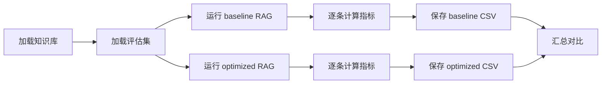

# 代码实战详解：用 RAGAs 评估优化前后的 RAG 系统

这份文档专门解释本目录下 `code_examples/` 的代码。目标是让你不仅能“跑起来”，还知道每一段代码在 RAG 评估闭环里承担什么角色。

## 一、你会得到什么

本实战包含两套代码：

| 文件 | 作用 | 是否需要 API |
|---|---|---|
| `code_examples/local_rag_eval.py` | 本地可运行的 RAG 评估闭环，包含 baseline、optimized、检索指标、答案质量代理指标、CSV 输出 | 不需要 |
| `code_examples/ragas_eval_real.py` | 使用真实 RAGAs 指标评估同一批 baseline/optimized 输出 | 需要 OpenAI API |
| `code_examples/data/knowledge_base.jsonl` | 示例知识库 | 不需要 |
| `code_examples/data/rag_eval_examples.jsonl` | 示例评估集 | 不需要 |

为什么要同时给两套？

1. `local_rag_eval.py` 让你马上看懂整个流程，不受 API key、网络、RAGAs 版本影响。
2. `ragas_eval_real.py` 展示如何接入真实 RAGAs，把代理指标替换成 LLM Judge 指标。

## 二、项目结构

```text
第10-11天RAG 评估体系/
├── code_examples/
│   ├── data/
│   │   ├── knowledge_base.jsonl
│   │   └── rag_eval_examples.jsonl
│   ├── local_rag_eval.py
│   ├── ragas_eval_real.py
│   └── outputs/
│       ├── baseline_per_sample.csv
│       ├── optimized_per_sample.csv
│       ├── summary.csv
│       └── comparison.csv
└── 05_代码实战详解：用RAGAs评估优化前后的RAG系统.md
```

`outputs/` 是运行后自动生成的目录。

## 三、如何运行本地版本

在项目根目录执行：

```powershell
python "第10-11天RAG 评估体系\code_examples\local_rag_eval.py"
```

或者进入当前周目录后执行：

```powershell
python ".\第10-11天RAG 评估体系\code_examples\local_rag_eval.py"
```

运行后会生成：

```text
baseline_per_sample.csv
optimized_per_sample.csv
summary.csv
comparison.csv
```

你最应该先看：

1. `comparison.csv`：优化前后总体指标变化。
2. `baseline_per_sample.csv`：baseline 每条样本错在哪里。
3. `optimized_per_sample.csv`：optimized 是否真的修复了问题。

## 四、如何运行真实 RAGAs 版本

安装依赖：

```powershell
pip install ragas langchain-openai openai
```

设置 API Key：

```powershell
$env:OPENAI_API_KEY="你的 OpenAI API Key"
```

运行：

```powershell
python ".\第10-11天RAG 评估体系\code_examples\ragas_eval_real.py"
```

真实 RAGAs 脚本使用当前官方文档中的基本模式：

```python
evaluation_dataset = EvaluationDataset.from_list(rows)
result = evaluate(
    dataset=evaluation_dataset,
    metrics=[LLMContextRecall(), Faithfulness(), FactualCorrectness()],
    llm=evaluator_llm,
)
```

RAGAs 官方文档的 RAG 教程强调：先收集 `user_input`、`retrieved_contexts`、`response`、`reference`，再构造 `EvaluationDataset` 并调用 `evaluate`。当前官方示例也使用 `LLMContextRecall`、`Faithfulness`、`FactualCorrectness` 作为常见 RAG 指标组合。

## 五、评估集代码详解

文件：

```text
code_examples/data/rag_eval_examples.jsonl
```

每一行是一条评估样本：

```json
{
  "id": "q001",
  "question": "RAGAs 中 Faithfulness 主要评估什么？",
  "reference": "Faithfulness 评估生成答案中的声明是否能被检索到的上下文支持，用于衡量答案是否忠实于上下文、是否存在幻觉。",
  "reference_context_ids": ["ragas#faithfulness#001"],
  "must_have_facts": ["评估答案声明", "检查是否被 retrieved contexts 支持", "衡量忠实性或幻觉"],
  "forbidden_claims": ["Faithfulness 只评估答案是否相关"],
  "question_type": "definition",
  "difficulty": "easy"
}
```

字段解释：

| 字段 | 含义 |
|---|---|
| `id` | 样本唯一 ID，方便定位失败样本 |
| `question` | 用户问题 |
| `reference` | 标准答案，用来评估答案正确性 |
| `reference_context_ids` | 正确答案应该依赖的 gold chunk |
| `must_have_facts` | 答案必须覆盖的事实点 |
| `forbidden_claims` | 答案不能出现的错误说法 |
| `question_type` | 问题类型，后续可按类型统计 |
| `difficulty` | 难度，后续可按难度统计 |

这里设计了 6 条样本，覆盖：

| 样本 | 类型 | 测什么 |
|---|---|---|
| q001 | definition | Faithfulness 定义 |
| q002 | multi_hop | Context Recall 低 + Faithfulness 高的诊断 |
| q003 | comparison | RAGAs vs DeepEval |
| q004 | comparison | LightEval 和 RAG 应用评估的边界 |
| q005 | no_answer | 文档无答案时是否拒答 |
| q006 | definition | FlashRAG 的适用场景 |

## 六、知识库代码详解

文件：

```text
code_examples/data/knowledge_base.jsonl
```

每行是一个 chunk：

```json
{
  "id": "ragas#faithfulness#001",
  "title": "Faithfulness 指标",
  "text": "Faithfulness 用来衡量生成答案中的声明是否能够被检索到的上下文支持。分数越高，说明答案越少依赖编造或模型参数记忆。"
}
```

字段解释：

| 字段 | 含义 |
|---|---|
| `id` | chunk ID，也是检索评估的 gold label |
| `title` | chunk 标题 |
| `text` | chunk 内容 |

真实项目里，这些 chunk 会来自：

- Markdown 文档切分。
- PDF 解析切分。
- HTML 页面清洗后切分。
- 数据库记录转文本。
- FAQ 或知识库文章。

你要记住一个工程原则：RAG 评估最好保留 `retrieved_context_ids`。如果只有文本，没有 ID，很多检索指标会很难稳定计算。

## 七、`local_rag_eval.py` 总流程

主函数：

```python
def main() -> None:
    docs = load_documents()
    cases = load_eval_cases()

    all_summaries = []
    all_rows_by_mode: dict[str, list[dict]] = {}

    for mode in ["baseline", "optimized"]:
        rows = []
        for case in cases:
            result = run_rag(case, docs, mode=mode)
            rows.append(evaluate_case(case, result))
        all_rows_by_mode[mode] = rows
        write_csv(OUT_DIR / f"{mode}_per_sample.csv", rows)
        all_summaries.append(summarize(rows, mode))

    write_csv(OUT_DIR / "summary.csv", all_summaries)
    comparison = compare_summaries(all_summaries[0], all_summaries[1])
    write_csv(OUT_DIR / "comparison.csv", comparison)
```

这就是完整评估闭环：



## 八、数据结构详解

代码用了三个 `dataclass`：

```python
@dataclass
class Document:
    id: str
    title: str
    text: str
```

`Document` 表示知识库中的一个 chunk。

```python
@dataclass
class EvalCase:
    id: str
    question: str
    reference: str
    reference_context_ids: list[str]
    must_have_facts: list[str]
    forbidden_claims: list[str]
    question_type: str
    difficulty: str
```

`EvalCase` 表示一条评估样本。

```python
@dataclass
class RagResult:
    response: str
    retrieved_context_ids: list[str]
    retrieved_contexts: list[str]
    latency_ms: int
```

`RagResult` 表示一次 RAG 调用的输出。

真实项目里你至少要保证 RAG 输出：

```python
{
    "response": "...",
    "retrieved_contexts": ["...", "..."],
    "retrieved_context_ids": ["doc_1#chunk_3", "doc_8#chunk_2"]
}
```

## 九、Baseline RAG 实现

### 1. Baseline 检索器

```python
def retrieve_baseline(question: str, docs: list[Document], top_k: int = 3) -> list[Document]:
    query_vec = term_frequency(tokenize(question))
    scored = []
    for doc in docs:
        doc_vec = term_frequency(tokenize(doc.title + " " + doc.text))
        scored.append((cosine_similarity(query_vec, doc_vec), doc))
    scored.sort(key=lambda item: item[0], reverse=True)
    return [doc for _, doc in scored[:top_k]]
```

这个 baseline 做了三件事：

1. 把问题切成 token。
2. 把每个文档也切成 token。
3. 用余弦相似度排序，取前 3 个。

这模拟了一个很朴素的检索器。它的问题是：

- 只看词面重叠。
- 不理解同义词。
- 不理解中文问题和英文指标名之间的关系。
- 没有重排。
- 容易被表面相关的噪声 chunk 干扰。

### 2. Baseline 生成器

```python
def generate_baseline_answer(question: str, contexts: list[Document]) -> str:
    top_text = contexts[0].text if contexts else ""
    if "PDF" in question:
        return "当前产品支持 PDF 导出。"
    if "Faithfulness" in question:
        return "Faithfulness 主要评估答案是否相关，也可以看答案是否自然流畅。"
    if "Context Recall" in question:
        return "应该优先优化生成模型，因为 Faithfulness 高说明检索没有问题。"
    return top_text
```

这里故意让 baseline 犯几类常见错误：

| 错误 | 对应真实 RAG 问题 |
|---|---|
| PDF 问题直接编造支持 | no-answer 场景幻觉 |
| Faithfulness 说成答案相关性 | 指标概念混淆 |
| Context Recall 低却建议换生成模型 | 根因诊断错误 |
| 直接复述 top context | 答案没有针对问题组织 |

这样设计的目的是让 optimized 版本能展示“优化前后”的差异。

## 十、Optimized RAG 实现

optimized 版本做了三件事：

1. Query expansion。
2. 取更大的候选集。
3. Toy reranker 精排。
4. Grounded generator 保守回答。

### 1. Query Expansion

```python
QUERY_EXPANSIONS = {
    "忠实": ["faithfulness", "上下文支持", "幻觉"],
    "召回": ["context recall", "找全", "必要证据"],
    "排序": ["context precision", "靠前", "重排"],
}
```

当问题中出现“召回”，代码会补充：

```text
context recall 找全 必要证据
```

这模拟真实项目中的 query rewrite/query expansion。

适合解决：

- 用户问题太短。
- 中英文术语混用。
- 专业术语同义表达多。
- 检索器需要更多关键词才能召回正确 chunk。

### 2. Reranker

```python
def rerank(question: str, candidates: list[Document], top_n: int = 3) -> list[Document]:
    expanded_question = expand_query(question)
    query_vec = term_frequency(tokenize(expanded_question))
    scored = []
    for doc in candidates:
        doc_text = doc.title + " " + doc.text
        score = cosine_similarity(query_vec, term_frequency(tokenize(doc_text)))
        if "Faithfulness" in question and "faithfulness" in doc.id:
            score += 0.35
        scored.append((score, doc))
    scored.sort(key=lambda item: item[0], reverse=True)
    return [doc for _, doc in scored[:top_n]]
```

这只是 toy reranker。真实项目可以替换成：

| 方案 | 说明 |
|---|---|
| BGE Reranker | 中文/英文常用开源 cross-encoder reranker |
| Cohere Rerank | 商业 API，接入简单 |
| Jina Reranker | 多语言/长文本场景常见 |
| FlashRank | 本地轻量 reranker |
| 自训练 reranker | 有领域标注数据时使用 |

Reranker 的目标不是增加召回，而是让真正有用的 chunk 排在最终上下文窗口前面。

### 3. Optimized 检索器

```python
def retrieve_optimized(question: str, docs: list[Document], top_k: int = 8, top_n: int = 3) -> list[Document]:
    expanded_question = expand_query(question)
    candidates = retrieve_baseline(expanded_question, docs, top_k=top_k)
    return rerank(question, candidates, top_n=top_n)
```

这个流程对应真实 RAG 架构：

```text
用户问题
  -> query expansion
  -> vector/hybrid search top_k=8
  -> reranker top_n=3
  -> LLM 生成答案
```

### 4. Grounded Generator

```python
def generate_optimized_answer(question: str, contexts: list[Document]) -> str:
    ids = {doc.id for doc in contexts}

    if "PDF" in question:
        if "rag#prompt#001" in ids:
            return "根据已提供资料无法确认当前产品是否支持 PDF 导出，不能编造，也不能把其他产品的 PDF 能力迁移到当前产品。"
        return "根据已提供资料无法确认。"
```

这个版本模拟了更严格的 prompt：

```text
只基于给定资料回答。
如果资料不足，回答无法确认。
不要把无关产品的信息迁移到当前产品。
不要编造。
```

这主要改善：

- Faithfulness。
- No-answer accuracy。
- Noise Sensitivity。
- Forbidden claim rate。

## 十一、本地指标详解

注意：`local_rag_eval.py` 里的生成侧指标是 proxy，不等于 RAGAs 真指标。它们的价值是帮助你理解评估逻辑，并在无 API 时跑通闭环。

### 1. Hit Rate@K

```python
def hit_rate_at_k(retrieved_ids, gold_ids, k):
    return 1.0 if set(retrieved_ids[:k]) & set(gold_ids) else 0.0
```

含义：

```text
前 K 个检索结果中，只要出现任意一个 gold chunk，就算命中。
```

适合回答：

```text
系统至少找到了一条能回答问题的资料吗？
```

### 2. Recall@K

```python
def recall_at_k(retrieved_ids, gold_ids, k):
    return len(set(retrieved_ids[:k]) & set(gold_ids)) / len(set(gold_ids))
```

含义：

```text
所有应该找回的 gold chunks 中，有多少出现在前 K 个检索结果里。
```

适合回答：

```text
多跳问题所需证据有没有找全？
```

### 3. Precision@K

```python
def precision_at_k(retrieved_ids, gold_ids, k):
    return len(set(retrieved_ids[:k]) & set(gold_ids)) / k
```

含义：

```text
前 K 个结果里有多少是 gold chunks。
```

适合回答：

```text
送给 LLM 的上下文里噪声多不多？
```

### 4. MRR

```python
def mrr(retrieved_ids, gold_ids):
    for rank, doc_id in enumerate(retrieved_ids, start=1):
        if doc_id in gold:
            return 1.0 / rank
    return 0.0
```

含义：

```text
第一个相关文档越靠前，分数越高。
```

如果第一个 gold chunk 排第 1：

```text
MRR = 1.0
```

如果排第 3：

```text
MRR = 0.333
```

### 5. Context Precision Proxy

```python
def context_precision_proxy(retrieved_ids, gold_ids):
    gold = set(gold_ids)
    running_hits = 0
    precision_sum = 0.0
    relevant_seen = 0
    for index, doc_id in enumerate(retrieved_ids, start=1):
        if doc_id in gold:
            running_hits += 1
            relevant_seen += 1
            precision_sum += running_hits / index
    return precision_sum / max(1, relevant_seen)
```

它模拟 RAGAs Context Precision 的直觉：

```text
相关 chunk 越靠前，分数越高。
```

举例：

```text
gold = [A, B]
retrieved = [A, X, B]
第 1 位 A 命中：precision@1 = 1/1 = 1.0
第 3 位 B 命中：precision@3 = 2/3 = 0.667
context_precision_proxy = (1.0 + 0.667) / 2 = 0.833
```

### 6. Faithfulness Proxy

```python
def faithfulness_proxy(response, retrieved_contexts):
    response_tokens = set(tokenize(response))
    context_tokens = set(tokenize(" ".join(retrieved_contexts)))
    return len(response_tokens & context_tokens) / len(response_tokens)
```

它粗略计算：

```text
答案里的 token 有多少能在上下文中找到。
```

真实 RAGAs Faithfulness 更强：它会用 LLM 把答案拆成 claims，再判断每个 claim 是否能被 retrieved contexts 支持。

所以你应该这样理解：

| 指标 | 用途 |
|---|---|
| `faithfulness_proxy` | 本地演示，帮你理解概念 |
| RAGAs `Faithfulness` | 真实评估，应该用于正式报告 |

### 7. Fact Coverage

```python
def fact_coverage(response, must_have_facts):
    ...
```

它检查答案是否覆盖 `must_have_facts` 中的关键事实。

例如 q001 的 must-have：

```json
[
  "评估答案声明",
  "检查是否被 retrieved contexts 支持",
  "衡量忠实性或幻觉"
]
```

如果答案只说“Faithfulness 评估答案是否相关”，那 coverage 会很低。

### 8. Forbidden Claim Rate

```python
def forbidden_claim_rate(response, forbidden_claims):
    ...
```

它检查答案是否出现不允许的错误说法。

例如：

```json
"forbidden_claims": ["当前产品一定支持 PDF 导出"]
```

如果 response 是：

```text
当前产品支持 PDF 导出。
```

这类错误就会被标记出来。

## 十二、Pass 规则详解

```python
pass_flag = (
    recall_at_k(retrieved_ids, gold_ids, k=len(retrieved_ids)) >= 0.5
    and coverage >= 0.67
    and forbidden == 0.0
    and faithfulness >= 0.45
)
```

这条规则表示：

1. 至少找回一半必要证据。
2. 答案覆盖至少三分之二关键事实。
3. 没有 forbidden claim。
4. 答案和上下文有足够重合。

真实项目中，pass 规则应该根据业务调整：

| 场景 | 建议 |
|---|---|
| 普通知识库问答 | correctness + faithfulness + relevance |
| 法律/医疗/金融 | 任何严重事实错误直接 fail |
| 客服机器人 | 还要看是否解决用户问题 |
| 内部研发助手 | 还要看引用是否正确 |
| no-answer 场景 | 错误编造比拒答更严重 |

## 十三、输出文件怎么看

### 1. `baseline_per_sample.csv`

每一行是一条 baseline 结果：

| 字段 | 说明 |
|---|---|
| `id` | 样本 ID |
| `question` | 问题 |
| `response` | baseline 答案 |
| `retrieved_context_ids` | baseline 检索到的 chunk |
| `hit_rate_at_3` | top3 是否命中 |
| `recall_at_3` | top3 召回 |
| `faithfulness_proxy` | 答案是否受上下文支持 |
| `fact_coverage` | 是否覆盖关键事实 |
| `forbidden_claim_rate` | 是否出现禁止说法 |
| `pass` | 是否通过 |

你可以用它做失败样本分析。

### 2. `optimized_per_sample.csv`

结构和 baseline 一样，但代表优化后的系统。

重点看：

```text
baseline pass=false
optimized pass=true
```

这类样本就是优化带来的直接收益。

也要看：

```text
baseline pass=true
optimized pass=false
```

这类样本是回归风险。真实项目必须重点分析。

### 3. `summary.csv`

每个实验一行：

```text
baseline
optimized
```

它告诉你每个指标的平均值。

### 4. `comparison.csv`

最适合放进报告：

| metric | baseline | optimized | delta |
|---|---:|---:|---:|
| context_precision_proxy |  |  |  |
| context_recall_proxy |  |  |  |
| faithfulness_proxy |  |  |  |
| fact_coverage |  |  |  |
| forbidden_claim_rate |  |  |  |
| pass_rate |  |  |  |

看 delta 时要注意方向：

| 指标 | 越高越好？ |
|---|---|
| hit_rate_at_3 | 是 |
| recall_at_3 | 是 |
| precision_at_3 | 是 |
| mrr | 是 |
| context_precision_proxy | 是 |
| context_recall_proxy | 是 |
| faithfulness_proxy | 是 |
| answer_relevancy_proxy | 通常是 |
| fact_coverage | 是 |
| forbidden_claim_rate | 否，越低越好 |
| latency_ms | 否，越低越好 |
| pass_rate | 是 |

## 十四、真实 RAGAs 脚本详解

文件：

```text
code_examples/ragas_eval_real.py
```

### 1. 构造 RAGAs 数据集

```python
def build_ragas_dataset(mode: str) -> EvaluationDataset:
    docs = load_documents()
    cases = load_eval_cases()
    rows = []
    for case in cases:
        result = run_rag(case, docs, mode=mode)
        rows.append(
            {
                "user_input": case.question,
                "retrieved_contexts": result.retrieved_contexts,
                "response": result.response,
                "reference": case.reference,
            }
        )
    return EvaluationDataset.from_list(rows)
```

RAGAs 需要的核心字段：

| 字段 | 作用 |
|---|---|
| `user_input` | 用户问题 |
| `retrieved_contexts` | RAG 检索到的上下文 |
| `response` | RAG 生成的答案 |
| `reference` | 标准答案 |

这些字段刚好对应 RAG 评估的四件事：

```text
问题是什么？
检索到了什么？
回答了什么？
标准答案是什么？
```

### 2. 初始化 evaluator LLM

```python
evaluator_llm = LangchainLLMWrapper(ChatOpenAI(model="gpt-4o-mini", temperature=0))
```

这里的 evaluator LLM 是“裁判模型”，不是你的 RAG 业务模型。真实项目里可以：

- 业务模型用一个便宜模型。
- evaluator 用一个更强、更稳定的模型。

但注意成本。评估 1000 条样本时，LLM Judge 也会产生明显费用。

### 3. 调用 RAGAs evaluate

```python
result = evaluate(
    dataset=evaluation_dataset,
    metrics=[
        LLMContextRecall(),
        Faithfulness(),
        FactualCorrectness(),
    ],
    llm=evaluator_llm,
)
```

这三个指标分别回答：

| 指标 | 问题 |
|---|---|
| `LLMContextRecall` | retrieved contexts 是否覆盖 reference 所需信息 |
| `Faithfulness` | response 是否被 retrieved contexts 支持 |
| `FactualCorrectness` | response 是否和 reference 事实一致 |

这是非常适合初学阶段的三件套：

```text
检索有没有找全？
答案有没有编？
答案事实对不对？
```

后续你可以继续增加：

- Context Precision。
- Response Relevancy。
- Noise Sensitivity。
- Semantic Similarity。
- 自定义 rubric 指标。

## 十五、如何替换成你自己的 RAG 系统

你只需要替换一个函数：

```python
def run_rag(case: EvalCase, docs: list[Document], mode: str) -> RagResult:
    ...
```

真实项目中可能变成：

```python
def run_rag(case: EvalCase, config: dict) -> RagResult:
    retrieved = vector_store.similarity_search(case.question, k=config["top_k"])

    if config["reranker"]:
        retrieved = reranker.rerank(case.question, retrieved)[:config["rerank_top_n"]]

    context = "\n\n".join(chunk.text for chunk in retrieved)
    response = llm.invoke(prompt.format(question=case.question, context=context))

    return RagResult(
        response=response,
        retrieved_context_ids=[chunk.id for chunk in retrieved],
        retrieved_contexts=[chunk.text for chunk in retrieved],
        latency_ms=latency_ms,
    )
```

最关键的是：不管你的 RAG 内部多复杂，评估输出字段要统一。

## 十六、如何从代码结果写实验结论

假设 `comparison.csv` 显示：

```text
context_precision_proxy: 0.55 -> 0.83
context_recall_proxy: 0.67 -> 0.89
faithfulness_proxy: 0.48 -> 0.76
forbidden_claim_rate: 0.20 -> 0.00
pass_rate: 0.33 -> 0.83
```

可以写成：

```text
本轮 optimized 版本通过 query expansion、larger candidate pool、reranker 和 grounded generation，
显著改善了检索排序、证据覆盖与答案忠实性。Context Precision Proxy 从 0.55 提升到 0.83，
说明 gold chunks 更靠前；Context Recall Proxy 从 0.67 提升到 0.89，说明必要证据覆盖更完整；
Forbidden Claim Rate 从 0.20 降到 0.00，说明 no-answer 场景的编造问题得到控制。
```

但也要写副作用：

```text
由于 optimized 版本引入更大的 top_k 和 reranker，真实系统中延迟可能上升。
下一步需要在真实 embedding/reranker/LLM 上测 p95 latency 和 cost。
```

## 十七、从本地 proxy 过渡到 RAGAs

建议路线：

1. 先跑 `local_rag_eval.py`，理解字段和 CSV。
2. 把 toy `run_rag` 替换成你自己的 RAG pipeline。
3. 保留本地检索指标：Hit Rate、Recall@K、MRR。
4. 接入 `ragas_eval_real.py`，加入 LLM-based 指标。
5. 每次改 RAG pipeline 后都输出 comparison report。

最终组合：

| 指标类型 | 推荐保留 |
|---|---|
| ID-based 检索指标 | Hit Rate@K、Recall@K、MRR、nDCG |
| RAGAs LLM 指标 | LLMContextRecall、Faithfulness、FactualCorrectness、ResponseRelevancy |
| 业务指标 | pass_rate、人工评分、no-answer accuracy |
| 工程指标 | latency、cost、token usage |

## 十八、参考资料

- RAGAs 官方首页：https://docs.ragas.io/en/latest/index.html
- RAGAs Evaluate a simple RAG system：https://docs.ragas.io/en/latest/getstarted/rag_eval/
- RAGAs Evaluate and Improve a RAG App：https://docs.ragas.io/en/latest/howtos/applications/evaluate-and-improve-rag/
- FlashRAG：https://github.com/RUC-NLPIR/FlashRAG
- DeepEval：https://github.com/confident-ai/deepeval
- LightEval：https://github.com/huggingface/lighteval
