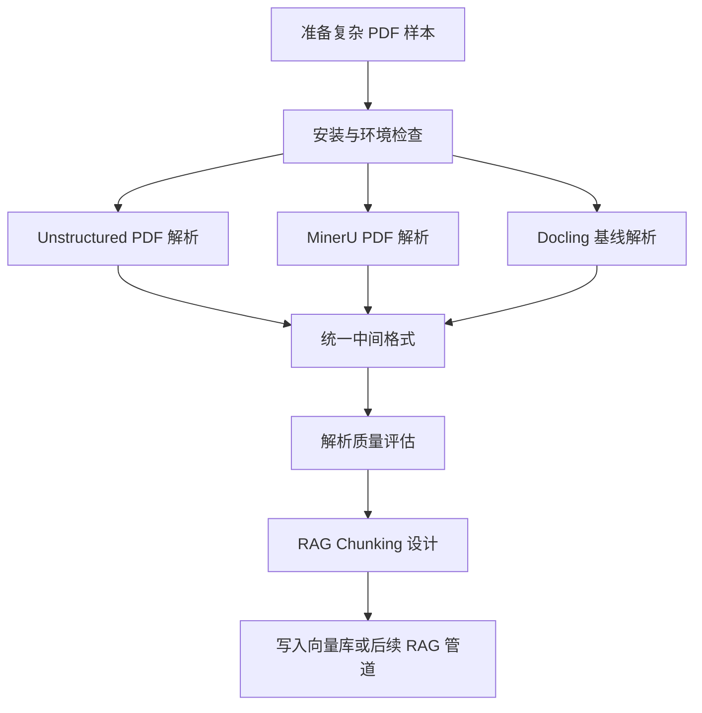
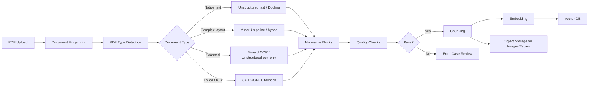

# 第13天 高级数据处理：复杂 PDF 解析与 RAG 数据生产

> 学习日期：2026-06-15  
> 今日主题：高级数据处理  
> 核心目标：使用 Unstructured / MinerU 解析包含表格、图片、公式、扫描页、多栏布局的复杂 PDF，并将结果整理成适合 Advanced RAG 的结构化数据资产。

---

## 0. 今日最终交付物

今天不只是“跑通一个 PDF 解析工具”，而是要完成一套可复用的复杂文档数据处理流水线。

你今天结束时应该产出：

1. 一份复杂 PDF 样本文档集，至少包含：
   - 原生文本 PDF。
   - 含表格 PDF。
   - 含图片 / 图表 PDF。
   - 扫描版 PDF。
   - 多栏论文 / 报告 PDF。
2. 一套解析实验结果：
   - Unstructured 输出 JSON / Markdown / 表格 HTML / 图片块。
   - MinerU 输出 Markdown / content_list.json / middle.json / layout.pdf / span.pdf。
   - Docling 作为基线对照输出 Markdown / JSON。
3. 一份解析质量评估表：
   - 文本抽取完整率。
   - 阅读顺序正确率。
   - 表格结构保持度。
   - 图片 / 图表召回率。
   - 公式识别质量。
   - OCR 准确率。
   - 下游 RAG 可用性。
4. 一套面向 RAG 的标准化中间格式：
   - `document_id`
   - `source_file`
   - `page_idx`
   - `block_id`
   - `block_type`
   - `text`
   - `html`
   - `image_path`
   - `bbox`
   - `metadata`
5. 一个最小可复用目录结构：

```text
第13天高级数据处理/
├── README.md
├── data/
│   ├── raw_pdfs/
│   ├── samples/
│   └── gold/
├── outputs/
│   ├── unstructured/
│   ├── mineru/
│   ├── docling/
│   └── normalized/
├── scripts/
│   ├── parse_unstructured.py
│   ├── parse_mineru_cli.ps1
│   ├── parse_docling.py
│   ├── normalize_blocks.py
│   └── evaluate_parse_quality.py
└── notes/
    ├── tool_comparison.md
    └── error_cases.md
```

---

## 1. 资料与工具定位

### 1.1 Unstructured

官方资料：

- 旧入口：<https://unstructured-io.github.io/unstructured/>
- 当前文档：<https://docs.unstructured.io/open-source/>
- PDF partition 文档：<https://docs.unstructured.io/open-source/core-functionality/partitioning>
- 图片和表格块抽取：<https://docs.unstructured.io/open-source/how-to/extract-image-block-types>
- 完整安装：<https://docs.unstructured.io/open-source/installation/full-installation>

定位：

- 更像“文档元素切分器”和“RAG 前处理工具”。
- 输出是 Element 列表，例如 `Title`、`NarrativeText`、`ListItem`、`Table`、`Image`。
- 适合把文档拆成下游检索、chunking、embedding 需要的结构化元素。
- 对 PDF 支持 `fast`、`hi_res`、`ocr_only`、`auto` 等策略。
- 表格结构一般需要使用 `hi_res` 相关策略，并打开表格结构推断。

优点：

- 与 RAG 数据管道结合自然。
- Python API 简洁。
- 元数据比较适合后续 chunking、embedding、溯源。
- 可以直接抽取 table HTML、image base64 等信息。

限制：

- 复杂多栏扫描 PDF 的阅读顺序可能不稳定。
- `hi_res` 模式依赖更多模型和系统组件。
- OCR 质量受 Tesseract / OCR agent 配置影响。
- 对图表语义理解不是它的最强项。

适用场景：

- 企业知识库文档。
- 规章制度、合同、报告、说明书。
- 需要把 PDF 快速变成 RAG 可检索元素。

### 1.2 MinerU

官方资料：

- GitHub：<https://github.com/opendatalab/MinerU>
- 文档：<https://opendatalab.github.io/MinerU/>
- Quick Start：<https://opendatalab.github.io/MinerU/quick_start/>
- 输出文件格式：<https://opendatalab.github.io/MinerU/reference/output_files/>

定位：

- 面向复杂文档理解的数据生产工具。
- 输入支持 PDF、图片、DOCX、PPTX、XLSX。
- 输出 Markdown、JSON、图片、布局可视化 PDF、span 可视化 PDF。
- 对科学论文、公式、表格、图像、扫描件、多栏布局更友好。
- 适合复杂 PDF 解析主力工具。

当前重要能力点：

- 支持 PDF / 图片 / Office 文件解析。
- 支持表格转 HTML。
- 支持公式转 LaTeX。
- 支持图片、图片描述、表格标题、脚注抽取。
- 支持扫描 PDF 自动 OCR。
- OCR 支持多语言。
- 支持 CLI、API、WebUI。
- 支持 CPU、GPU、Apple Silicon、部分国产 AI 芯片环境。
- 3.x 版本中引入 pipeline、vlm、hybrid 等后端思路。

优点：

- 对复杂版面、表格、公式、多栏论文更强。
- 输出 `content_list.json` 很适合作为 RAG 标准化入口。
- `layout.pdf` 和 `span.pdf` 对质量检查特别实用。
- Markdown 输出方便人工检查。

限制：

- 本地部署依赖重，模型与显存要求要提前评估。
- 不同后端输出结构存在差异。
- 版本升级较快，生产系统需要固定版本。
- 如果使用 VLM / hybrid，需要关注速度、成本、显存、许可证。

适用场景：

- 科研论文知识库。
- 招股书、年报、财报、审计报告。
- 含大量公式、复杂表格、图表的 PDF。
- 对版面还原和视觉块定位要求高的数据生产任务。

### 1.3 PDF-Extract-Kit

官方资料：

- GitHub：<https://github.com/opendatalab/PDF-Extract-Kit>
- 文档：<https://pdf-extract-kit.readthedocs.io/>

定位：

- 更偏“底层模型工具箱”，不是最方便的一站式 PDF 转 Markdown 工具。
- 覆盖 layout detection、formula detection、formula recognition、OCR、table recognition 等任务。
- 官方 README 明确建议：如果目标是高质量 PDF 转 Markdown，优先使用 MinerU；如果你要开发自己的文档翻译、文档问答、文档助手等应用，可以基于 PDF-Extract-Kit 组合模型能力。

今天的使用方式：

- 不作为主线工具。
- 作为理解 MinerU 底层能力和调研复杂 PDF 模型模块的参考。
- 在后续你要做自研版解析器时，再深入 PDF-Extract-Kit。

### 1.4 Docling

官方资料：

- GitHub：<https://github.com/docling-project/docling>
- 文档：<https://docling-project.github.io/docling/>
- 最小示例：<https://docling-project.github.io/docling/examples/minimal/>

定位：

- IBM / LF AI 生态下的通用文档转换与理解工具。
- 支持 PDF、DOCX、PPTX、XLSX、HTML、图片、音频、视频字幕、邮件等多种格式。
- PDF 理解能力包含页面布局、阅读顺序、表格结构、代码、公式、图片分类等。
- 输出 DoclingDocument，可导出 Markdown、HTML、JSON 等。

今天的使用方式：

- 作为对照基线。
- 同一份 PDF 同时跑 Unstructured、MinerU、Docling，比较解析质量。
- 如果 Docling 某类文档比 Unstructured 更稳，可以作为 fallback。

### 1.5 GOT-OCR2.0

官方资料：

- GitHub：<https://github.com/Ucas-HaoranWei/GOT-OCR2.0>
- HuggingFace 相关模型页面可从仓库 README 进入。

定位：

- 面向 OCR-2.0 的统一端到端 OCR 模型。
- 适合复杂图像 OCR、截图 OCR、扫描页局部识别、疑难 OCR fallback。

今天的使用方式：

- 不作为主解析器。
- 作为 OCR fallback 思路记录：
  - 当 MinerU / Unstructured 对扫描页识别失败。
  - 当表格截图、图中小字、公式周边文字识别质量差。
  - 当需要对图片块再做独立 OCR。

---

## 2. 今日学习路线总览



建议时间安排：

| 时间 | 模块 | 目标 |
|---|---|---|
| 30 分钟 | 工具定位与样本准备 | 明确不同工具边界，准备 3-5 个复杂 PDF |
| 60 分钟 | Unstructured 实战 | 跑通 `partition_pdf`、表格 HTML、图片块抽取 |
| 90 分钟 | MinerU 实战 | 跑通 CLI，理解 Markdown、content_list、middle、layout 可视化 |
| 45 分钟 | Docling 对照 | 跑同一批 PDF，记录差异 |
| 60 分钟 | 标准化设计 | 把不同工具输出映射到统一 block schema |
| 45 分钟 | 质量评估 | 建立解析质量 checklist 与误差案例库 |
| 60 分钟 | RAG 对接 | 设计 chunking、metadata、向量库写入策略 |

---

## 3. 环境准备

### 3.1 推荐 Python 环境

建议使用独立虚拟环境，不要把这些重依赖安装进全局 Python。

Windows PowerShell 示例：

```powershell
cd "D:\vscode项目\AI Agent 开发工程师学习路线图（工程落地版）\第 2 周：Advanced RAG 与生产级向量数据库\第13天高级数据处理"
python -m venv .venv
.\.venv\Scripts\Activate.ps1
python -m pip install --upgrade pip
pip install uv
```

如果你使用 Conda：

```powershell
conda create -n adv_pdf python=3.11 -y
conda activate adv_pdf
python -m pip install --upgrade pip
pip install uv
```

推荐 Python 版本：

- Unstructured：建议 Python 3.10 / 3.11。
- MinerU：官方文档显示 Python 3.10-3.13，但 Windows 上受依赖限制建议 3.10-3.12。
- Docling：Python 3.9+。

保守建议：今天统一使用 Python 3.11。

### 3.2 系统依赖

Unstructured 处理 PDF / 图片时常见系统依赖：

- `poppler-utils`：PDF 转图片、页面渲染相关。
- `tesseract-ocr`：OCR。
- `libmagic`：文件类型检测。
- `libreoffice`：Office 文档转换。
- `pandoc`：某些富文本 / 标记文档转换。

Windows 上可选安装方式：

```powershell
winget install UB-Mannheim.TesseractOCR
winget install oschwartz10612.Poppler
winget install GnuWin32.File
winget install TheDocumentFoundation.LibreOffice
winget install JohnMacFarlane.Pandoc
```

安装后检查：

```powershell
tesseract --version
pdftoppm -v
soffice --version
pandoc --version
```

注意：

- Windows 下 PATH 配置经常是最容易卡住的地方。
- 如果命令找不到，先重启终端，再检查环境变量。
- 如果今天只做 PDF，LibreOffice / Pandoc 可以先不装。

---

## 4. 安装工具

### 4.1 安装 Unstructured

只处理 PDF：

```powershell
uv pip install "unstructured[pdf]"
```

处理更多文档格式：

```powershell
uv pip install "unstructured[all-docs]"
```

可选依赖：

```powershell
uv pip install pillow pandas beautifulsoup4 lxml html5lib
```

验证：

```powershell
python -c "import unstructured; print('unstructured ok')"
```

### 4.2 安装 MinerU

官方快速安装：

```powershell
pip install --upgrade pip
pip install uv
uv pip install -U "mineru[all]"
```

验证：

```powershell
mineru --help
```

GPU 环境满足要求时，最简单命令：

```powershell
mineru -p "data/raw_pdfs/sample.pdf" -o "outputs/mineru"
```

CPU 环境使用 pipeline 后端：

```powershell
mineru -p "data/raw_pdfs/sample.pdf" -o "outputs/mineru" -b pipeline
```

注意：

- MinerU 模型体积较大，首次运行可能下载模型。
- 如果网络或模型源不稳定，优先用官方文档的模型源配置。
- Windows 下如果 GPU / CUDA 不顺，先用 `-b pipeline` 跑通。
- 生产环境要固定 MinerU 版本和模型版本，避免输出结构变化。

### 4.3 安装 Docling

```powershell
uv pip install docling
```

验证：

```powershell
docling --help
python -c "from docling.document_converter import DocumentConverter; print('docling ok')"
```

### 4.4 GOT-OCR2.0 的定位安装

今天不建议一开始安装 GOT-OCR2.0。先把主线跑通：

1. Unstructured。
2. MinerU。
3. Docling。
4. 发现 OCR 失败样例后，再评估 GOT-OCR2.0。

原因：

- GOT-OCR2.0 更像 OCR 专项模型，不是完整 PDF 解析流水线。
- 它适合针对图片块、扫描页、局部截图做补救。
- 直接把它加入主链路会增加依赖复杂度。

---

## 5. 样本数据准备

### 5.1 样本类型

至少准备 5 类 PDF：

| 编号 | 类型 | 目的 |
|---|---|---|
| S1 | 原生文本 PDF | 测试基础文本抽取、标题识别、段落切分 |
| S2 | 表格密集 PDF | 测试表格召回、表格结构、跨页表格 |
| S3 | 图片 / 图表 PDF | 测试图片块、图表说明、图像路径、caption |
| S4 | 扫描版 PDF | 测试 OCR、页面阅读顺序、噪声容忍 |
| S5 | 多栏论文 PDF | 测试 layout、reading order、公式、参考文献 |

目录：

```text
data/raw_pdfs/
├── s1_text_native.pdf
├── s2_tables.pdf
├── s3_figures.pdf
├── s4_scanned.pdf
└── s5_multicolumn_paper.pdf
```

### 5.2 人工 gold 标注

不要一开始标整篇文档，太重。只标每份 PDF 的 1-3 页。

建议创建：

```text
data/gold/
├── s1_text_native.page1.md
├── s2_tables.page2.table.html
├── s3_figures.page3.assets.json
├── s4_scanned.page1.txt
└── s5_multicolumn.page1.reading_order.md
```

标注内容：

- 页面上应该出现哪些标题。
- 正文段落顺序。
- 表格行列结构。
- 图片数量、caption、所在页。
- 公式是否被保留。
- 页眉页脚是否应该删除。

---

## 6. Unstructured 实战

### 6.1 最小 PDF 解析

创建 `scripts/parse_unstructured.py`：

```python
from __future__ import annotations

import json
from pathlib import Path

from unstructured.partition.pdf import partition_pdf
from unstructured.staging.base import elements_to_json


def parse_pdf(input_pdf: Path, output_dir: Path) -> None:
    output_dir.mkdir(parents=True, exist_ok=True)

    elements = partition_pdf(
        filename=str(input_pdf),
        strategy="hi_res",
        infer_table_structure=True,
        include_page_breaks=True,
        languages=["eng", "chi_sim"],
    )

    json_path = output_dir / f"{input_pdf.stem}.elements.json"
    elements_to_json(elements, filename=str(json_path))

    md_path = output_dir / f"{input_pdf.stem}.preview.md"
    with md_path.open("w", encoding="utf-8") as f:
        for idx, element in enumerate(elements):
            category = element.category
            page = getattr(element.metadata, "page_number", None)
            f.write(f"\n\n<!-- block={idx} category={category} page={page} -->\n")
            f.write(str(element))

    stats = {}
    for element in elements:
        stats[element.category] = stats.get(element.category, 0) + 1

    stats_path = output_dir / f"{input_pdf.stem}.stats.json"
    stats_path.write_text(json.dumps(stats, ensure_ascii=False, indent=2), encoding="utf-8")


if __name__ == "__main__":
    input_pdf = Path("data/raw_pdfs/s2_tables.pdf")
    output_dir = Path("outputs/unstructured")
    parse_pdf(input_pdf, output_dir)
```

运行：

```powershell
python scripts/parse_unstructured.py
```

### 6.2 关键参数解释

`strategy`：

- `fast`：使用 pdfminer 抽取可复制文本，速度快，适合原生文本 PDF。
- `hi_res`：使用布局检测模型，适合复杂版面、表格、图片块。
- `ocr_only`：对页面做 OCR，再用文本切分逻辑处理，适合扫描 PDF。
- `auto`：自动选择策略，但生产实验阶段建议显式指定，便于复现实验。

`infer_table_structure=True`：

- 尝试识别表格结构。
- 通常需要 `hi_res` 才能发挥作用。
- 输出中可关注 `Table` 元素的 `metadata.text_as_html`。

`include_page_breaks=True`：

- 保留分页信息。
- 对 RAG 溯源、页码引用、答案引用很重要。

`languages=["eng", "chi_sim"]`：

- OCR 语言。
- 需要本地 OCR 引擎支持对应语言包。
- 中文简体通常为 `chi_sim`，英文为 `eng`。

### 6.3 抽取表格 HTML

```python
from pathlib import Path

from unstructured.partition.pdf import partition_pdf


input_pdf = Path("data/raw_pdfs/s2_tables.pdf")
output_dir = Path("outputs/unstructured/tables")
output_dir.mkdir(parents=True, exist_ok=True)

elements = partition_pdf(
    filename=str(input_pdf),
    strategy="hi_res",
    infer_table_structure=True,
)

for i, element in enumerate(elements):
    if element.category != "Table":
        continue

    html = getattr(element.metadata, "text_as_html", None)
    page = getattr(element.metadata, "page_number", None)

    if html:
        (output_dir / f"{input_pdf.stem}.page{page}.table{i}.html").write_text(
            html,
            encoding="utf-8",
        )
    else:
        (output_dir / f"{input_pdf.stem}.page{page}.table{i}.txt").write_text(
            str(element),
            encoding="utf-8",
        )
```

表格质量检查：

- 表头是否完整。
- 合并单元格是否丢失。
- 数字列是否错位。
- 跨页表是否被断开。
- 表格 caption 是否和 table block 关联。
- 脚注是否被误识别成正文。

### 6.4 抽取图片 / 表格块的 base64

Unstructured 支持通过 `extract_image_block_types` 抽取图片类块。典型思路：

```python
from pathlib import Path

from unstructured.partition.pdf import partition_pdf


input_pdf = Path("data/raw_pdfs/s3_figures.pdf")
output_dir = Path("outputs/unstructured/assets")
output_dir.mkdir(parents=True, exist_ok=True)

elements = partition_pdf(
    filename=str(input_pdf),
    strategy="hi_res",
    extract_image_block_types=["Image", "Table"],
    extract_image_block_to_payload=True,
)

for i, element in enumerate(elements):
    metadata = element.metadata.to_dict()
    image_base64 = metadata.get("image_base64")
    if not image_base64:
        continue

    item = {
        "index": i,
        "category": element.category,
        "text": str(element),
        "metadata": metadata,
    }
    out = output_dir / f"{input_pdf.stem}.block{i}.json"
    out.write_text(json.dumps(item, ensure_ascii=False, indent=2), encoding="utf-8")
```

注意：

- 不同版本参数可能有轻微变化，实际以当前安装版本 `help(partition_pdf)` 为准。
- 如果直接保存图片更方便，也可以使用输出目录参数，把图片落到文件系统。
- 对 RAG 来说，图片本身不是最终答案，但图片路径、caption、页码、bbox 是很重要的证据索引。

### 6.5 Unstructured 输出标准化

建议把每个 Element 转成统一 block：

```python
def unstructured_element_to_block(element, idx: int, source_file: str) -> dict:
    metadata = element.metadata.to_dict()
    return {
        "document_id": Path(source_file).stem,
        "source_file": source_file,
        "parser": "unstructured",
        "block_id": f"unstructured-{idx}",
        "block_type": element.category,
        "text": str(element),
        "html": metadata.get("text_as_html"),
        "image_base64": metadata.get("image_base64"),
        "image_path": metadata.get("image_path"),
        "page_idx": metadata.get("page_number"),
        "bbox": metadata.get("coordinates"),
        "metadata": metadata,
    }
```

---

## 7. MinerU 实战

### 7.1 最小 CLI 解析

GPU / 默认后端：

```powershell
mineru -p "data/raw_pdfs/s5_multicolumn_paper.pdf" -o "outputs/mineru"
```

CPU / pipeline：

```powershell
mineru -p "data/raw_pdfs/s5_multicolumn_paper.pdf" -o "outputs/mineru" -b pipeline
```

批量目录：

```powershell
mineru -p "data/raw_pdfs" -o "outputs/mineru" -b pipeline
```

PowerShell 脚本 `scripts/parse_mineru_cli.ps1`：

```powershell
param(
    [string]$InputPath = "data/raw_pdfs",
    [string]$OutputPath = "outputs/mineru",
    [string]$Backend = "pipeline"
)

New-Item -ItemType Directory -Force -Path $OutputPath | Out-Null

mineru -p $InputPath -o $OutputPath -b $Backend
```

运行：

```powershell
powershell -ExecutionPolicy Bypass -File scripts/parse_mineru_cli.ps1
```

### 7.2 MinerU 输出理解

典型输出包括：

| 文件 | 用途 |
|---|---|
| `*.md` | 主 Markdown 输出，适合人工检查和直接进入文本管道 |
| `*_content_list.json` | 扁平化可读内容块，适合 RAG 标准化 |
| `*_middle.json` | 中间结构，包含页面、block、line、span 等详细结构 |
| `*_model.json` | 模型推理结果，适合调试 layout detection |
| `*_layout.pdf` | 布局可视化，检查阅读顺序、块分类 |
| `*_span.pdf` | span 可视化，检查文本、公式、表格细节 |
| `images/` | 图片、表格截图、公式图等资产 |

对 RAG 最重要的是：

1. Markdown：快速验证整体效果。
2. `content_list.json`：结构化入库入口。
3. 图片目录：多模态证据资产。
4. `layout.pdf`：调试阅读顺序和块分类。

### 7.3 content_list.json 的核心字段

MinerU 的 `content_list.json` 通常是按阅读顺序排列的扁平内容块。你要重点关注：

| 字段 | 说明 |
|---|---|
| `type` | 内容类型，例如 text、image、table、equation、chart、list |
| `text` | 文本内容 |
| `text_level` | 标题层级 |
| `img_path` | 图片、表格截图、公式图路径 |
| `table_body` | 表格内容，可能为 HTML / Markdown / LaTeX |
| `table_caption` | 表格标题 |
| `image_caption` | 图片标题 |
| `bbox` | block 坐标，通常映射到 0-1000 |
| `page_idx` | 页码，从 0 开始 |

### 7.4 MinerU 标准化

```python
from pathlib import Path
import json


def normalize_mineru_content_list(content_list_path: Path, source_file: str) -> list[dict]:
    items = json.loads(content_list_path.read_text(encoding="utf-8"))
    blocks = []

    for idx, item in enumerate(items):
        block_type = item.get("type")

        text_parts = []
        if item.get("text"):
            text_parts.append(item["text"])
        if item.get("table_caption"):
            text_parts.extend(item["table_caption"])
        if item.get("image_caption"):
            text_parts.extend(item["image_caption"])
        if item.get("table_body"):
            text_parts.append(item["table_body"])

        blocks.append(
            {
                "document_id": Path(source_file).stem,
                "source_file": source_file,
                "parser": "mineru",
                "block_id": f"mineru-{idx}",
                "block_type": block_type,
                "text": "\n".join(text_parts).strip(),
                "html": item.get("table_body") if block_type == "table" else None,
                "image_path": item.get("img_path"),
                "page_idx": item.get("page_idx"),
                "bbox": item.get("bbox"),
                "metadata": item,
            }
        )

    return blocks
```

### 7.5 MinerU 质量检查流程

每份 PDF 解析后，按这个顺序检查：

1. 打开 Markdown：
   - 标题层级是否合理。
   - 段落是否被拆碎。
   - 表格是否转成可读结构。
   - 公式是否保留 LaTeX。
2. 打开 `layout.pdf`：
   - 块识别是否正确。
   - 阅读顺序编号是否符合人类阅读顺序。
   - 多栏是否按列正确排序。
3. 打开 `span.pdf`：
   - 行内公式是否错切。
   - 表格内部文字是否漏识别。
   - 图片 caption 是否关联。
4. 检查 `content_list.json`：
   - block 数量是否合理。
   - table / image / equation 是否有 `page_idx` 和 `bbox`。
   - 图片路径是否真实存在。
5. 记录错误案例：
   - 错误页码。
   - 错误类型。
   - 是否影响 RAG。
   - 可能 fallback 工具。

---

## 8. Docling 对照实验

### 8.1 最小解析

创建 `scripts/parse_docling.py`：

```python
from pathlib import Path

from docling.document_converter import DocumentConverter


def parse_pdf(input_pdf: Path, output_dir: Path) -> None:
    output_dir.mkdir(parents=True, exist_ok=True)

    converter = DocumentConverter()
    result = converter.convert(input_pdf)
    doc = result.document

    (output_dir / f"{input_pdf.stem}.md").write_text(
        doc.export_to_markdown(),
        encoding="utf-8",
    )

    (output_dir / f"{input_pdf.stem}.json").write_text(
        doc.export_to_json(),
        encoding="utf-8",
    )


if __name__ == "__main__":
    parse_pdf(
        Path("data/raw_pdfs/s5_multicolumn_paper.pdf"),
        Path("outputs/docling"),
    )
```

运行：

```powershell
python scripts/parse_docling.py
```

### 8.2 Docling 评估重点

用 Docling 重点对照：

- Markdown 可读性。
- 表格结构。
- 多栏阅读顺序。
- 公式保留情况。
- 图片 / 表格导出能力。
- 速度和资源消耗。

如果某一类 PDF：

- Unstructured 表格差。
- MinerU 部署太重。
- Docling 结果足够好。

则可以把 Docling 作为生产 fallback。

---

## 9. 工具选型矩阵

| 任务 | 首选 | 备选 | 原因 |
|---|---|---|---|
| 原生文本 PDF 快速切分 | Unstructured `fast` | Docling | 快、轻、便于 RAG |
| 复杂表格 PDF | MinerU | Unstructured `hi_res` / Docling | MinerU 表格、版面、图片资产更完整 |
| 科研论文 PDF | MinerU | Docling | 公式、多栏、图表更关键 |
| 扫描 PDF | MinerU pipeline / OCR | Unstructured `ocr_only` | OCR 与版面结合更重要 |
| 图片块 / 表格截图抽取 | MinerU | Unstructured | MinerU 输出资产更直接 |
| 企业文档批处理 | Unstructured | Docling / MinerU | 元数据和 RAG 管道简单 |
| 自研解析模型组合 | PDF-Extract-Kit | MinerU 二次开发 | PDF-Extract-Kit 是模型工具箱 |
| OCR 疑难页补救 | GOT-OCR2.0 | PaddleOCR / Tesseract | 专项 OCR fallback |

推荐主线：

```text
简单 PDF：Unstructured
复杂 PDF：MinerU
基线对照：Docling
底层研究：PDF-Extract-Kit
OCR fallback：GOT-OCR2.0
```

---

## 10. 统一中间格式设计

### 10.1 为什么要统一格式

不同解析器输出结构差异很大：

- Unstructured 输出 Element 对象。
- MinerU 输出 Markdown、content_list、middle。
- Docling 输出 DoclingDocument。

如果下游 RAG 直接依赖某个工具的原始结构，会导致：

- 换工具成本高。
- chunking 逻辑混乱。
- 元数据不统一。
- 评估指标难复用。
- 多解析器 ensemble 很难做。

所以建议设计一个稳定的 `NormalizedBlock`。

### 10.2 NormalizedBlock schema

```json
{
  "document_id": "s5_multicolumn_paper",
  "source_file": "data/raw_pdfs/s5_multicolumn_paper.pdf",
  "parser": "mineru",
  "block_id": "mineru-42",
  "block_type": "table",
  "text": "Table 1 ...",
  "html": "<table>...</table>",
  "image_path": "outputs/mineru/images/table_42.jpg",
  "page_idx": 3,
  "bbox": [123, 80, 900, 420],
  "parent_id": null,
  "section_path": ["2 Methods", "2.1 Dataset"],
  "metadata": {
    "table_caption": ["Table 1 Dataset statistics"],
    "quality_score": 0.87
  }
}
```

字段说明：

| 字段 | 必填 | 说明 |
|---|---|---|
| `document_id` | 是 | 文档唯一 ID |
| `source_file` | 是 | 原始文件路径 |
| `parser` | 是 | 解析器名称 |
| `block_id` | 是 | block 唯一 ID |
| `block_type` | 是 | text、title、table、image、equation、list、chart |
| `text` | 否 | 可参与 embedding 的文本 |
| `html` | 否 | 表格 HTML 或富结构 |
| `image_path` | 否 | 图片、表格截图、公式图 |
| `page_idx` | 否 | 页码，建议从 0 开始统一 |
| `bbox` | 否 | 页面坐标 |
| `parent_id` | 否 | 父级 block 或 section |
| `section_path` | 否 | 标题路径 |
| `metadata` | 是 | 原始解析器元数据 |

### 10.3 block_type 规范

建议统一成：

| 标准类型 | Unstructured 映射 | MinerU 映射 | Docling 映射 |
|---|---|---|---|
| `title` | `Title` | `text` + `text_level` | heading |
| `text` | `NarrativeText` / `Text` | `text` | paragraph |
| `list` | `ListItem` | `list` | list |
| `table` | `Table` | `table` | table |
| `image` | `Image` | `image` | picture |
| `chart` | `Image` + metadata | `chart` | picture/chart |
| `equation` | Formula-like text | `equation` | formula |
| `page_break` | `PageBreak` | page boundary | page boundary |

---

## 11. 面向 RAG 的 chunking 策略

### 11.1 不要把 PDF 直接按固定长度切块

复杂 PDF 的核心问题不是“文本太长”，而是“结构复杂”：

- 表格不能随便切断。
- 图片 caption 要和图片绑定。
- 公式要和上下文绑定。
- 多栏文本要先恢复阅读顺序。
- 页眉页脚要去掉。
- 标题路径要保留。

所以推荐：

```text
PDF -> parser blocks -> normalized blocks -> structure-aware chunking -> embedding
```

### 11.2 文本 chunk

规则：

- 按标题层级聚合。
- 每个 chunk 保留 `section_path`。
- chunk 长度建议 500-1200 tokens。
- overlap 控制在 80-150 tokens。
- 不跨越一级标题。
- 尽量不把列表项和前置句子拆开。

示例：

```json
{
  "chunk_id": "s5-0007",
  "chunk_type": "text",
  "text": "2.1 Dataset\nWe collect ...",
  "source_blocks": ["mineru-12", "mineru-13", "mineru-14"],
  "page_range": [2, 3],
  "section_path": ["2 Methods", "2.1 Dataset"],
  "metadata": {
    "source_file": "s5_multicolumn_paper.pdf",
    "parser": "mineru"
  }
}
```

### 11.3 表格 chunk

表格不要只 embedding HTML。建议生成三层表示：

1. 原始 HTML：用于展示。
2. Markdown 表格或 CSV：用于可读文本。
3. 表格摘要：用于语义检索。

表格 chunk 示例：

```json
{
  "chunk_id": "s2-table-0003",
  "chunk_type": "table",
  "text": "Table 2 Revenue by region. Columns: Region, 2023 Revenue, 2024 Revenue, YoY Growth...",
  "html": "<table>...</table>",
  "image_path": "images/table_0003.jpg",
  "source_blocks": ["mineru-31"],
  "page_range": [5, 5],
  "metadata": {
    "table_caption": "Table 2 Revenue by region",
    "bbox": [80, 210, 920, 650]
  }
}
```

表格入库建议：

- `text_for_embedding`：caption + 表头 + 关键行摘要 + 单位说明。
- `payload.html`：完整表格 HTML。
- `payload.image_path`：表格截图。
- `payload.page_idx` / `bbox`：证据定位。

### 11.4 图片 / 图表 chunk

图片 chunk 不一定直接 embedding 图片。今天先做文本化：

```text
image_caption + nearby_text + OCR_text + optional_visual_summary
```

图片 chunk 示例：

```json
{
  "chunk_id": "s3-image-0005",
  "chunk_type": "image",
  "text": "Figure 3 System architecture. The figure shows a three-stage RAG pipeline...",
  "image_path": "images/figure_0005.jpg",
  "source_blocks": ["mineru-52"],
  "page_range": [7, 7],
  "metadata": {
    "caption": "Figure 3 System architecture",
    "nearby_blocks": ["mineru-50", "mineru-51", "mineru-53"],
    "bbox": [120, 160, 850, 530]
  }
}
```

增强方向：

- 对图片块调用多模态模型生成 caption。
- 对图表调用 OCR / 图表理解模型。
- 对流程图提取节点和边。
- 对架构图生成 Mermaid。

### 11.5 公式 chunk

公式处理建议：

- 保存 LaTeX。
- 保存公式截图。
- 合并公式前后段落。
- embedding 文本中加入“公式说明”。

示例：

```json
{
  "chunk_type": "equation",
  "text": "The loss function is defined as: $$ L = ... $$ where ...",
  "latex": "$$ L = ... $$",
  "image_path": "images/equation_0012.jpg",
  "page_idx": 4
}
```

---

## 12. 解析质量评估

### 12.1 质量维度

| 维度 | 评分 | 说明 |
|---|---:|---|
| 文本完整性 | 0-5 | 是否漏段、乱码、重复 |
| 阅读顺序 | 0-5 | 多栏、页眉页脚、脚注顺序是否正确 |
| 标题层级 | 0-5 | 标题识别是否准确 |
| 表格召回 | 0-5 | 表格是否被识别出来 |
| 表格结构 | 0-5 | 行列、合并单元格、表头是否正确 |
| 图片召回 | 0-5 | 图片 / 图表是否被抽取 |
| caption 关联 | 0-5 | 图片 / 表格 caption 是否绑定正确 |
| 公式识别 | 0-5 | LaTeX 是否准确 |
| OCR 准确率 | 0-5 | 扫描页文字是否准确 |
| RAG 可用性 | 0-5 | 能否直接 chunk、embedding、引用溯源 |

### 12.2 评估表模板

```markdown
| 文件 | 页码 | 工具 | 文本 | 顺序 | 表格 | 图片 | 公式 | OCR | RAG 可用性 | 主要问题 |
|---|---:|---|---:|---:|---:|---:|---:|---:|---:|---|
| s2_tables.pdf | 2 | Unstructured | 4 | 4 | 3 | 2 | - | - | 3 | 表格合并单元格丢失 |
| s2_tables.pdf | 2 | MinerU | 4 | 5 | 4 | 4 | - | - | 4 | 表格脚注混入正文 |
| s2_tables.pdf | 2 | Docling | 4 | 4 | 4 | 3 | - | - | 4 | 表格 caption 不稳定 |
```

### 12.3 自动统计指标

可自动统计：

- block 数量。
- 每页 block 数量。
- 表格数量。
- 图片数量。
- 平均文本长度。
- 空文本 block 比例。
- 重复文本比例。
- 有 page_idx 的 block 比例。
- 有 bbox 的 block 比例。
- 图片路径存在率。

示例脚本思路：

```python
def evaluate_blocks(blocks: list[dict]) -> dict:
    total = len(blocks)
    if total == 0:
        return {"total": 0}

    return {
        "total": total,
        "by_type": count_by(blocks, "block_type"),
        "with_text_ratio": sum(bool(b.get("text")) for b in blocks) / total,
        "with_page_ratio": sum(b.get("page_idx") is not None for b in blocks) / total,
        "with_bbox_ratio": sum(b.get("bbox") is not None for b in blocks) / total,
        "with_image_ratio": sum(bool(b.get("image_path")) for b in blocks) / total,
    }
```

---

## 13. 生产级解析流水线设计

### 13.1 推荐架构



### 13.2 文档类型检测

解析前先判断：

1. PDF 是否可复制文本。
2. 页面是否大多是扫描图。
3. 是否多栏。
4. 是否表格密集。
5. 是否图片 / 图表密集。
6. 是否包含公式。
7. 页数和文件大小。

简单规则：

```text
如果可抽取文本比例高、布局简单 -> Unstructured fast
如果可抽取文本比例高但表格/图表复杂 -> MinerU
如果扫描页比例高 -> MinerU pipeline 或 Unstructured ocr_only
如果 OCR 质量差 -> GOT-OCR2.0 fallback
如果部署资源有限 -> Docling / Unstructured 优先
```

### 13.3 多解析器融合策略

不要一开始做复杂 ensemble。建议分三阶段：

阶段 1：单工具主线

- 复杂 PDF 全部用 MinerU。
- 失败样例手动记录。

阶段 2：规则 fallback

- MinerU 失败时尝试 Docling。
- Docling 失败时尝试 Unstructured。
- 扫描页 OCR 失败时单页转图片给 GOT-OCR。

阶段 3：block 级融合

- 文本块取阅读顺序更好的工具。
- 表格取 HTML 更完整的工具。
- 图片资产取召回更高的工具。
- OCR 文本取置信度更高的工具。

---

## 14. 常见问题与排查

### 14.1 Unstructured 安装失败

优先检查：

- Python 版本。
- 是否在虚拟环境内。
- `pip install --upgrade pip`。
- Poppler / Tesseract 是否安装并加入 PATH。
- Windows 编译依赖是否缺失。

解决顺序：

1. 先只装 `unstructured[pdf]`，不要直接 `all-docs`。
2. 跑原生文本 PDF。
3. 再跑 `hi_res`。
4. 最后加图片和表格抽取。

### 14.2 Unstructured 表格没有 HTML

可能原因：

- 没有打开 `infer_table_structure=True`。
- 没有使用 `hi_res`。
- 当前 PDF 表格是图片，OCR 没识别出结构。
- 依赖模型没有正常加载。

处理：

- 改用 MinerU。
- 检查是否有 `Table` 元素。
- 检查 `metadata.text_as_html`。
- 对表格截图使用单独表格识别模型。

### 14.3 MinerU 首次运行慢

常见原因：

- 首次下载模型。
- CPU 模式处理复杂文档很慢。
- PDF 页数太多。
- 输出图片和可视化文件较多。

处理：

- 先用 1-3 页样本测试。
- 固定模型缓存目录。
- 优先用 GPU / MPS。
- 长文档分批或异步处理。

### 14.4 多栏论文顺序错乱

处理顺序：

1. 看 `layout.pdf` 的阅读顺序编号。
2. 对比 MinerU / Docling / Unstructured。
3. 如果只有少数页错误，把错误页加入 error cases。
4. 后处理不要轻易按 bbox 排序，因为跨栏、脚注、图表会更复杂。

### 14.5 页眉页脚污染

处理：

- MinerU 通常会尝试去除页眉页脚。
- Unstructured 可能需要后处理。
- 可基于重复文本检测：
  - 同一文档多页重复出现。
  - 坐标接近页面顶部 / 底部。
  - 文本长度较短。
  - 包含页码、公司名、报告名等。

---

## 15. 今日实战任务清单

### A. 准备

- [ ] 创建 `data/raw_pdfs`。
- [ ] 放入 3-5 个复杂 PDF。
- [ ] 创建 `outputs/unstructured`、`outputs/mineru`、`outputs/docling`、`outputs/normalized`。
- [ ] 安装 Python 3.11 虚拟环境。
- [ ] 安装 Unstructured。
- [ ] 安装 MinerU。
- [ ] 安装 Docling。

### B. Unstructured

- [ ] 使用 `fast` 跑原生文本 PDF。
- [ ] 使用 `hi_res` 跑复杂 PDF。
- [ ] 打开 `infer_table_structure=True`。
- [ ] 抽取 Table HTML。
- [ ] 抽取 Image / Table 图片块。
- [ ] 输出 Element JSON。
- [ ] 统计 Element 类型。

### C. MinerU

- [ ] 使用 `mineru -p input -o output` 跑通。
- [ ] CPU 环境测试 `-b pipeline`。
- [ ] 查看 Markdown。
- [ ] 查看 `content_list.json`。
- [ ] 查看 `layout.pdf`。
- [ ] 查看 `span.pdf`。
- [ ] 检查图片目录。

### D. Docling

- [ ] 跑同一批 PDF。
- [ ] 导出 Markdown。
- [ ] 导出 JSON。
- [ ] 和 Unstructured / MinerU 做对照。

### E. 标准化与评估

- [ ] 设计 `NormalizedBlock`。
- [ ] 写 Unstructured -> NormalizedBlock。
- [ ] 写 MinerU -> NormalizedBlock。
- [ ] 写 Docling -> NormalizedBlock。
- [ ] 写质量统计。
- [ ] 建立 `notes/error_cases.md`。

### F. RAG 对接

- [ ] 设计 text chunk。
- [ ] 设计 table chunk。
- [ ] 设计 image chunk。
- [ ] 保留 `page_idx`、`bbox`、`source_file`。
- [ ] 写入向量库前进行重复文本清理。

---

## 16. 推荐最终工程结构

```text
advanced_pdf_processing/
├── pyproject.toml
├── README.md
├── data/
│   ├── raw_pdfs/
│   └── gold/
├── outputs/
│   ├── unstructured/
│   ├── mineru/
│   ├── docling/
│   ├── normalized/
│   └── reports/
├── scripts/
│   ├── parse_unstructured.py
│   ├── parse_mineru_cli.ps1
│   ├── parse_docling.py
│   ├── normalize_unstructured.py
│   ├── normalize_mineru.py
│   ├── normalize_docling.py
│   ├── build_chunks.py
│   └── evaluate_parse_quality.py
└── src/
    └── adv_pdf/
        ├── schema.py
        ├── parsers/
        │   ├── unstructured_parser.py
        │   ├── mineru_parser.py
        │   └── docling_parser.py
        ├── normalizers/
        ├── chunkers/
        └── evaluators/
```

---

## 17. 关键结论

1. 今天的主线应该是 MinerU + Unstructured，而不是把所有工具都深入到底。
2. Unstructured 适合 RAG 元素切分和轻量企业文档处理。
3. MinerU 更适合复杂 PDF，尤其是表格、图片、公式、多栏、扫描页。
4. Docling 很适合作为基线和 fallback。
5. PDF-Extract-Kit 是底层模型工具箱，适合后续自研解析模块。
6. GOT-OCR2.0 是 OCR fallback，不是完整 PDF 解析主线。
7. 生产级 RAG 不能直接吃 Markdown，必须建立统一 block schema。
8. 对复杂 PDF，质量检查文件比主输出更重要：`layout.pdf`、`span.pdf`、`content_list.json` 要一起看。
9. 解析质量评估要围绕“下游 RAG 是否可用”，而不只是“看起来像 Markdown”。

---

## 18. 明天或后续扩展

后续可以继续做：

1. 把 `NormalizedBlock` 写入 Milvus / Qdrant / Elasticsearch。
2. 对 table chunk 生成自然语言摘要。
3. 对 image chunk 调用多模态模型生成 caption。
4. 用 LLM 做解析质量自动评估。
5. 建立复杂 PDF benchmark。
6. 做多解析器融合。
7. 加入任务队列和异步处理。
8. 设计解析缓存，避免重复解析同一文件。
9. 做可视化审阅界面，让人工快速标注错误页。

---

## 19. 今日参考链接

- Unstructured 旧入口：<https://unstructured-io.github.io/unstructured/>
- Unstructured 当前文档：<https://docs.unstructured.io/open-source/>
- Unstructured Partitioning：<https://docs.unstructured.io/open-source/core-functionality/partitioning>
- Unstructured Extract images and tables：<https://docs.unstructured.io/open-source/how-to/extract-image-block-types>
- Unstructured Full installation：<https://docs.unstructured.io/open-source/installation/full-installation>
- MinerU GitHub：<https://github.com/opendatalab/MinerU>
- MinerU 文档：<https://opendatalab.github.io/MinerU/>
- MinerU Quick Start：<https://opendatalab.github.io/MinerU/quick_start/>
- MinerU Output Files：<https://opendatalab.github.io/MinerU/reference/output_files/>
- PDF-Extract-Kit GitHub：<https://github.com/opendatalab/PDF-Extract-Kit>
- Docling GitHub：<https://github.com/docling-project/docling>
- Docling 文档：<https://docling-project.github.io/docling/>
- Docling Simple conversion：<https://docling-project.github.io/docling/examples/minimal/>
- GOT-OCR2.0 GitHub：<https://github.com/Ucas-HaoranWei/GOT-OCR2.0>
