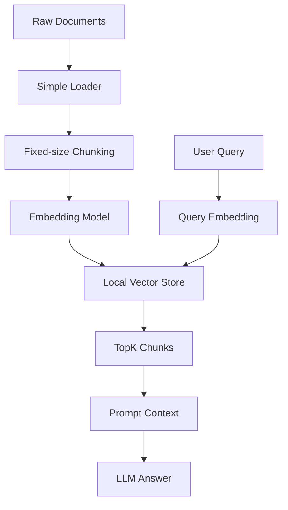
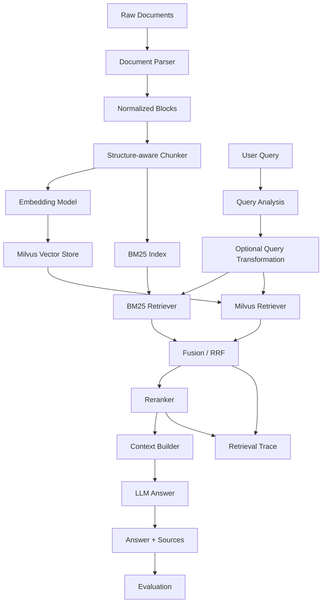

# 02 第一周 RAG 系统升级技术方案

> 本文档是第 14 天的核心技术方案。目标是把第一周的基础 RAG 系统升级为 Advanced RAG v2，重点集成 Milvus、混合检索、Reranker、Query Transformation、评估与可观测性。

---

## 1. 系统升级总览

### 1.1 RAG v1 假设架构

第一周系统通常是一个最小可运行版本：



优点：

1. 链路简单。
2. 容易理解。
3. 容易调试。
4. 适合第一周入门。

缺点：

1. 检索路径单一。
2. 没有生产级向量数据库。
3. 无法很好处理精确词匹配。
4. top-k 排序质量不稳定。
5. 缺少评估与日志。
6. 难以扩展和替换模块。

### 1.2 RAG v2 目标架构

升级后的架构：



### 1.3 核心升级点

| 模块 | RAG v1 | RAG v2 |
|---|---|---|
| 数据解析 | 简单读取 | 结构化解析、保留元数据 |
| Chunk | 固定长度 | 按标题、段落、表格、图片等结构切分 |
| 向量库 | 本地轻量存储 | Milvus |
| 稀疏检索 | 无 | BM25 |
| 稠密检索 | 简单 vector search | Milvus dense retrieval |
| 融合 | 无 | RRF / 加权融合 |
| 精排 | 无 | Cross-encoder / API Reranker |
| Query 改写 | 无 | HyDE / Multi-Query / Decomposition |
| 上下文构造 | 简单拼接 | token budget + 去重 + 来源保留 |
| 评估 | 无或人工感觉 | Hit@K、Recall@K、MRR、NDCG、Faithfulness |
| 日志 | print | retrieval_trace.jsonl |

---

## 2. 模块边界设计

建议把系统拆成 10 个核心模块。

| 模块 | 输入 | 输出 | 责任 |
|---|---|---|---|
| Loader | 文件路径、URL、数据库记录 | RawDocument | 加载原始文档 |
| Parser | RawDocument | NormalizedBlock | 解析 PDF、Markdown、网页等 |
| Chunker | NormalizedBlock | Chunk | 生成适合检索的 chunk |
| Embedder | text list | vector list | 文本向量化 |
| VectorStore | Chunk + vector | Milvus collection | 存储和检索向量 |
| SparseIndex | Chunk | BM25 index | 关键词召回 |
| Retriever | query | Candidate | 召回候选 chunk |
| Fusion | 多路 candidates | fused candidates | 融合、去重、排序 |
| Reranker | query + candidates | reranked candidates | 二阶段精排 |
| Generator | query + contexts | answer | 生成答案和引用 |
| Evaluator | query + results + gold | metrics | 评估检索和答案质量 |
| TraceLogger | pipeline events | jsonl | 可观测性与调试 |

---

## 3. 数据 schema 设计

### 3.1 RawDocument

```python
from dataclasses import dataclass

@dataclass
class RawDocument:
    doc_id: str
    source_path: str
    file_name: str
    file_type: str
    raw_text: str | None
    metadata: dict
```

### 3.2 NormalizedBlock

用于承接第 13 天高级数据处理的结果。

```python
@dataclass
class NormalizedBlock:
    document_id: str
    source_file: str
    parser: str
    block_id: str
    block_type: str
    text: str
    html: str | None
    image_path: str | None
    page_idx: int | None
    bbox: list[float] | None
    parent_id: str | None
    section_path: list[str]
    metadata: dict
```

常见 `block_type`：

| 类型 | 用途 |
|---|---|
| title | 标题 |
| text | 正文段落 |
| list | 列表 |
| table | 表格 |
| image | 图片 |
| chart | 图表 |
| equation | 公式 |
| code | 代码 |

### 3.3 Chunk

```python
@dataclass
class Chunk:
    chunk_id: str
    doc_id: str
    text: str
    chunk_type: str
    source: str
    page_start: int | None
    page_end: int | None
    section_path: list[str]
    source_block_ids: list[str]
    metadata: dict
```

`text` 应该是用于 embedding 和 BM25 的文本，不一定等于原始文本。比如表格 chunk 的 `text` 可以是：

```text
表格标题 + 表头 + 关键行摘要 + 单位说明 + 表格自然语言总结
```

### 3.4 Candidate

```python
@dataclass
class Candidate:
    chunk_id: str
    text: str
    source: str
    metadata: dict
    retriever: str
    rank: int
    score: float | None
```

### 3.5 RerankedCandidate

```python
@dataclass
class RerankedCandidate:
    chunk_id: str
    text: str
    source: str
    metadata: dict
    fusion_score: float | None
    rerank_score: float
    final_rank: int
```

---

## 4. Milvus 接入设计

### 4.1 Milvus 在系统中的位置

Milvus 负责存储和检索 dense vectors：

```text
Chunk text -> Embedding -> Milvus insert
Query text -> Embedding -> Milvus search
```

它解决：

1. 向量持久化。
2. 大规模 TopK 相似度搜索。
3. metadata filter。
4. index 参数调优。
5. 后续生产部署和扩展。

它不解决：

1. 文档解析质量。
2. chunk 是否合理。
3. query 是否表达清楚。
4. top-k 是否最终排序最好。
5. 答案是否忠实。

所以 Milvus 是检索基础设施，不是完整 RAG 方案。

### 4.2 推荐 Collection Schema

```text
collection: rag_chunks_v2

id: int64 primary key
chunk_id: varchar
doc_id: varchar
vector: float_vector
text: varchar
source: varchar
title: varchar
section_path: varchar
chunk_type: varchar
page_start: int64
page_end: int64
tenant_id: varchar
corpus_version: varchar
created_at: int64
metadata: json
```

设计原则：

1. `id` 作为 Milvus 主键。
2. `chunk_id` 作为业务稳定 ID。
3. `doc_id` 用于文档级删除、更新、追踪。
4. `tenant_id` 用于多租户或知识库隔离。
5. `corpus_version` 用于评估复现。
6. `text` 不要超过字段上限，长原文可以放对象存储，只存 preview。
7. 常用过滤字段单独建 scalar field，不要全部塞进 metadata。

### 4.3 Milvus 写入链路

```text
chunks
  -> embed chunk.text
  -> build milvus rows
  -> insert / upsert
  -> flush
  -> create index
  -> load collection
```

伪代码：

```python
def ingest_chunks(chunks, embedder, milvus_client):
    texts = [chunk.text for chunk in chunks]
    vectors = embedder.embed_documents(texts)

    rows = []
    for idx, (chunk, vector) in enumerate(zip(chunks, vectors)):
        rows.append({
            "id": stable_int_id(chunk.chunk_id),
            "chunk_id": chunk.chunk_id,
            "doc_id": chunk.doc_id,
            "vector": vector,
            "text": chunk.text,
            "source": chunk.source,
            "title": chunk.metadata.get("title", ""),
            "section_path": " / ".join(chunk.section_path),
            "chunk_type": chunk.chunk_type,
            "page_start": chunk.page_start or -1,
            "page_end": chunk.page_end or -1,
            "tenant_id": chunk.metadata.get("tenant_id", "default"),
            "corpus_version": chunk.metadata.get("corpus_version", "v1"),
            "created_at": current_timestamp(),
            "metadata": chunk.metadata,
        })

    milvus_client.upsert(
        collection_name="rag_chunks_v2",
        data=rows,
    )
```

### 4.4 Milvus 检索链路

```python
def milvus_retrieve(query, embedder, milvus_client, top_k=20, filters=None):
    query_vector = embedder.embed_query(query)

    results = milvus_client.search(
        collection_name="rag_chunks_v2",
        data=[query_vector],
        anns_field="vector",
        limit=top_k,
        filter=build_filter_expr(filters),
        output_fields=[
            "chunk_id",
            "doc_id",
            "text",
            "source",
            "title",
            "section_path",
            "chunk_type",
            "page_start",
            "page_end",
            "metadata",
        ],
        search_params={
            "metric_type": "COSINE",
        },
    )

    return convert_milvus_hits_to_candidates(results)
```

### 4.5 Milvus 参数建议

初始参数：

```yaml
milvus:
  uri: http://localhost:19530
  collection_name: rag_chunks_v2
  vector_field: vector
  metric_type: COSINE
  index_type: AUTOINDEX
  dense_top_k: 20
```

调优建议：

| 场景 | 建议 |
|---|---|
| 小规模实验 | AUTOINDEX |
| 低延迟高召回 | HNSW |
| 数据量较大、希望控制内存 | IVF_FLAT / IVF_SQ8 |
| 需要过滤 | 保证 metadata scalar field 设计清晰 |
| 需要多租户 | `tenant_id` filter 或 partition |

---

## 5. BM25 接入设计

### 5.1 BM25 负责什么

BM25 负责 sparse lexical retrieval，也就是按词匹配。

适合：

1. 函数名：`BM25Retriever`、`CohereRerank`
2. 参数名：`similarity_top_k`、`chunk_overlap`
3. 错误信息：`Connection refused`
4. 文件名：`retrieval.yaml`
5. 产品名：`Milvus`、`Qdrant`
6. 数字和版本号：`19530`、`9091`

### 5.2 BM25 index 构建

BM25 应该基于同一批 chunk 构建：

```python
def build_bm25_index(chunks):
    corpus = []
    id_to_chunk = {}

    for chunk in chunks:
        corpus.append(chunk.text)
        id_to_chunk[chunk.chunk_id] = chunk

    bm25 = BM25Okapi(tokenize_corpus(corpus))
    return bm25, id_to_chunk
```

中文资料注意：

1. 需要分词。
2. 可以使用 jieba、pkuseg、HanLP，或接入 Elasticsearch/OpenSearch。
3. 中英混合技术文档中，英文 token、代码符号、参数名要保留。

### 5.3 BM25 检索输出

BM25 输出也要转成统一 Candidate：

```python
def bm25_retrieve(query, bm25, chunks, top_k=20):
    tokens = tokenize(query)
    scores = bm25.get_scores(tokens)
    ranked_indices = argsort_desc(scores)[:top_k]

    candidates = []
    for rank, idx in enumerate(ranked_indices, start=1):
        chunk = chunks[idx]
        candidates.append(Candidate(
            chunk_id=chunk.chunk_id,
            text=chunk.text,
            source=chunk.source,
            metadata=chunk.metadata,
            retriever="bm25",
            rank=rank,
            score=float(scores[idx]),
        ))

    return candidates
```

---

## 6. Hybrid Retrieval 设计

### 6.1 双路召回

```text
query
  -> BM25 top_k=20
  -> Milvus dense top_k=20
  -> merge candidates
  -> deduplicate by chunk_id
  -> fusion scoring
```

建议初始参数：

```yaml
retrieval:
  bm25_top_k: 20
  dense_top_k: 20
  fusion_top_k: 30
  fusion_method: rrf
  rrf_k: 60
```

### 6.2 为什么不用直接相加分数

BM25 分数和 embedding similarity 不是同一个尺度：

```text
BM25 score: 可能是 1.2、8.7、23.5
Cosine score: 可能是 0.62、0.77、0.84
```

直接相加会造成不稳定，所以初始方案建议用 RRF。

### 6.3 RRF 融合

公式：

```text
RRF(d) = sum(1 / (k + rank_i(d)))
```

含义：

1. 一个 chunk 在多个检索器里都靠前，分数更高。
2. 不依赖原始分数尺度。
3. 实现简单、鲁棒性好。

伪代码：

```python
from collections import defaultdict

def rrf_fusion(candidate_lists, top_k=30, k=60):
    scores = defaultdict(float)
    payload = {}
    trace = defaultdict(list)

    for candidates in candidate_lists:
        for candidate in candidates:
            chunk_id = candidate.chunk_id
            scores[chunk_id] += 1.0 / (k + candidate.rank)
            payload[chunk_id] = candidate
            trace[chunk_id].append({
                "retriever": candidate.retriever,
                "rank": candidate.rank,
                "score": candidate.score,
            })

    ranked = sorted(
        scores.items(),
        key=lambda item: item[1],
        reverse=True,
    )

    fused = []
    for final_rank, (chunk_id, fusion_score) in enumerate(ranked[:top_k], start=1):
        candidate = payload[chunk_id]
        candidate.metadata["fusion_score"] = fusion_score
        candidate.metadata["fusion_trace"] = trace[chunk_id]
        candidate.metadata["fusion_rank"] = final_rank
        fused.append(candidate)

    return fused
```

### 6.4 去重策略

去重优先级：

1. 完全相同 `chunk_id`：必须去重。
2. 相同 `doc_id` + 相同 `page` + 高文本相似度：可以去重。
3. 相邻 chunk：不一定去重，可能上下文互补。
4. 表格和表格摘要：不要轻易去重，可能分别用于展示和语义检索。

### 6.5 Metadata Filter

所有 retriever 都必须使用相同权限过滤。

例如：

```python
filters = {
    "tenant_id": "team_a",
    "corpus_version": "2026_06_15",
    "category": "rag",
}
```

Milvus filter：

```text
tenant_id == "team_a" and corpus_version == "2026_06_15"
```

BM25 filter：

```python
filtered_chunks = [
    chunk for chunk in chunks
    if chunk.metadata["tenant_id"] == "team_a"
]
```

原则：

```text
权限过滤必须发生在召回阶段之前或召回阶段之中，不能等 fusion 后再补救。
```

---

## 7. Reranker 设计

### 7.1 Reranker 的位置

```text
Retriever: 从大规模语料中召回候选
Fusion: 合并多路候选
Reranker: 在较小候选集上精排
Generator: 基于精排结果生成答案
```

Reranker 不负责扩大召回，它只负责重新排序已经召回的候选。

### 7.2 Reranker 输入输出

输入：

```text
query
candidate_chunks top 20-50
```

输出：

```text
reranked_chunks top 3-10
```

### 7.3 Provider 选择

| Provider | 优点 | 缺点 | 建议场景 |
|---|---|---|---|
| BGE Reranker | 中文/中英混合效果常用，本地可控 | 需要下载模型和本地推理资源 | 本地实验、中文知识库 |
| Cohere Rerank | API 简单、效果稳定 | 外部服务成本和隐私依赖 | 快速验证、英文/多语言 |
| Cross Encoder MiniLM | 轻量、速度快 | 中文效果可能一般 | 英文轻量实验 |
| LLM Rerank | 可解释、可加入复杂规则 | 成本高、延迟高、格式不稳 | 小候选集、复杂判断 |

今天建议：

1. 本地优先用 `BAAI/bge-reranker-base`。
2. 如果有在线 API，再对比 Cohere Rerank。
3. 将 reranker 抽象成 provider，避免写死。

### 7.4 Reranker 抽象

```python
from typing import Protocol

class Reranker(Protocol):
    def rerank(
        self,
        query: str,
        candidates: list[Candidate],
        top_n: int,
    ) -> list[RerankedCandidate]:
        ...
```

### 7.5 本地 BGE Reranker 伪代码

```python
class BGEReranker:
    def __init__(self, model_name: str):
        self.model = CrossEncoder(model_name)

    def rerank(self, query, candidates, top_n=5):
        pairs = [(query, c.text) for c in candidates]
        scores = self.model.predict(pairs)

        reranked = []
        for candidate, score in zip(candidates, scores):
            reranked.append((candidate, float(score)))

        reranked.sort(key=lambda item: item[1], reverse=True)

        return [
            RerankedCandidate(
                chunk_id=c.chunk_id,
                text=c.text,
                source=c.source,
                metadata=c.metadata,
                fusion_score=c.metadata.get("fusion_score"),
                rerank_score=score,
                final_rank=rank,
            )
            for rank, (c, score) in enumerate(reranked[:top_n], start=1)
        ]
```

### 7.6 Rerank 参数建议

| 场景 | Fusion TopK | Rerank TopN |
|---|---:|---:|
| 小实验 | 10 | 3 |
| 日常开发 | 20-30 | 5 |
| 高召回需求 | 50 | 5-10 |
| 复杂问答 | 80-100 | 10 |

原则：

1. Rerank 前候选不能太少，否则召回不足。
2. Rerank 后上下文不能太多，否则 LLM 被噪声污染。
3. Rerank 越多，延迟越高。

---

## 8. Query Transformation 接入设计

### 8.1 接入位置

Query Transformation 应该发生在检索前：

```text
user query
  -> query transformation
  -> transformed queries
  -> hybrid retrieval for each query
  -> fusion
  -> rerank with original query
```

注意：最终 Reranker 建议使用原始 query 作为判断依据，避免改写 query 偏离用户意图。

### 8.2 支持策略

| 策略 | 输入 | 输出 | 适合场景 |
|---|---|---|---|
| original | 原始 query | 原始 query | 默认 |
| rewrite | 原始 query | 更清晰 query | 口语化问题 |
| HyDE | 原始 query | 假设性文档 | 短问题、概念问题 |
| Multi-Query | 原始 query | 多个 query | 宽泛问题 |
| Decomposition | 复杂 query | 子问题列表 | 多跳、比较、综合 |

### 8.3 TransformedQuery schema

```python
@dataclass
class TransformedQuery:
    text: str
    strategy: str
    weight: float
    metadata: dict
```

### 8.4 查询执行策略

```python
def retrieve_with_query_transformations(original_query, transformers):
    transformed_queries = []

    for transformer in transformers:
        transformed_queries.extend(transformer.transform(original_query))

    all_candidate_lists = []
    for tq in transformed_queries:
        bm25_candidates = bm25_retrieve(tq.text)
        dense_candidates = milvus_retrieve(tq.text)
        all_candidate_lists.extend([bm25_candidates, dense_candidates])

    fused = rrf_fusion(all_candidate_lists)
    reranked = reranker.rerank(
        query=original_query,
        candidates=fused,
        top_n=5,
    )

    return reranked
```

### 8.5 Query Transformation 风险控制

1. 始终保留 original query。
2. 改写 query 只用于检索，不直接作为答案证据。
3. Rerank 使用 original query。
4. 对精确事实问题减少 HyDE 权重。
5. 对多 query 数量设置上限。
6. 记录每个 transformed query 的来源和结果。

---

## 9. Context Builder 设计

### 9.1 为什么需要 Context Builder

不能把 reranked chunks 简单拼起来。Context Builder 需要处理：

1. token budget。
2. 去重。
3. 来源格式。
4. 顺序。
5. 表格和文本的展示差异。
6. 相邻 chunk 补全。

### 9.2 Context item 格式

```text
[Source 1]
chunk_id: docA-0007
source: docs/rag_eval.md
page: 3
section: Retrieval Metrics / Recall@K
content:
...
```

### 9.3 Prompt 模板

```text
你是一个严谨的 RAG 学习助手。
请只根据给定上下文回答用户问题。
如果上下文不足以回答，请明确说明“当前资料不足以回答”。
回答时请引用使用到的 Source 编号。

用户问题：
{query}

上下文：
{context}

回答要求：
1. 先给出直接答案。
2. 再给出关键依据。
3. 如果涉及对比，请用表格。
4. 不要编造上下文中没有的信息。
5. 最后列出引用来源。
```

---

## 10. Retrieval Trace 设计

### 10.1 为什么必须记录 trace

没有 trace，就无法判断错误来自哪里：

1. query 改写错了。
2. BM25 没召回。
3. Milvus 没召回。
4. fusion 把正确结果排低了。
5. reranker 排错了。
6. context builder 截断了正确内容。
7. LLM 生成时幻觉。

### 10.2 Trace JSONL 示例

保存到：

```text
outputs/retrieval_trace.jsonl
```

单条记录：

```json
{
  "trace_id": "20260615_001",
  "query": "为什么生产级 RAG 需要混合检索和 rerank？",
  "strategy": "hybrid_rerank",
  "transformed_queries": [
    {
      "strategy": "original",
      "text": "为什么生产级 RAG 需要混合检索和 rerank？"
    }
  ],
  "bm25_results": [
    {
      "rank": 1,
      "chunk_id": "day9-0012",
      "score": 12.5,
      "source": "day9_hybrid.md",
      "preview": "BM25 适合精确词匹配..."
    }
  ],
  "dense_results": [
    {
      "rank": 1,
      "chunk_id": "day9-0021",
      "score": 0.83,
      "source": "day9_hybrid.md",
      "preview": "Hybrid Retrieval 将 sparse 和 dense..."
    }
  ],
  "fused_results": [
    {
      "rank": 1,
      "chunk_id": "day9-0021",
      "fusion_score": 0.0322,
      "matched_by": ["dense", "bm25"]
    }
  ],
  "reranked_results": [
    {
      "rank": 1,
      "chunk_id": "day9-0021",
      "rerank_score": 0.91,
      "source": "day9_hybrid.md"
    }
  ],
  "latency_ms": {
    "query_transform": 0,
    "bm25": 12,
    "milvus": 35,
    "fusion": 2,
    "rerank": 180,
    "generation": 1200
  },
  "config": {
    "bm25_top_k": 20,
    "dense_top_k": 20,
    "fusion_top_k": 30,
    "rerank_top_n": 5
  }
}
```

### 10.3 Trace 观察重点

每次调试回答这些问题：

1. BM25 有没有找到精确关键词？
2. Milvus 有没有找到语义相关 chunk？
3. 正确 chunk 是在哪一路被召回的？
4. Fusion 后正确 chunk 排第几？
5. Rerank 后正确 chunk 排第几？
6. 进入 LLM 的上下文是否包含答案？
7. 答案是否引用了正确 source？

---

## 11. 评估设计

### 11.1 Eval Query 格式

保存到：

```text
data/eval/eval_queries.jsonl
```

示例：

```json
{"query_id":"q001","query":"什么是 Hybrid Retrieval？","query_type":"concept","relevant_chunk_ids":["day9-0010","day9-0011"],"relevant_sources":["第9天混合检索与重排 README.md"]}
{"query_id":"q002","query":"Milvus 的 HNSW 参数 M 和 efConstruction 分别影响什么？","query_type":"exact_term","relevant_chunk_ids":["day12-0032"],"relevant_sources":["第12天生产级向量数据库 README.md"]}
{"query_id":"q003","query":"如何把复杂 PDF 解析结果变成适合 RAG 的 chunk？","query_type":"complex","relevant_chunk_ids":["day13-0040","day13-0041"],"relevant_sources":["第13天高级数据处理 README.md"]}
```

### 11.2 Query 类型覆盖

至少覆盖：

| 类型 | 数量 | 示例 |
|---|---:|---|
| 概念解释 | 3-5 | 什么是 Rerank |
| 精确术语 | 3-5 | `BM25Retriever` 如何使用 |
| 对比问题 | 2-3 | BM25 和 Embedding 区别 |
| 多跳综合 | 2-3 | Query Transformation 和 Rerank 如何配合 |
| 故障排查 | 2-3 | Milvus 连接失败如何排查 |
| 生产设计 | 2-3 | 如何设计多租户 metadata filter |

### 11.3 检索指标

#### Hit@K

```text
Hit@K = top K 中是否出现至少一个相关 chunk
```

#### Recall@K

```text
Recall@K = top K 中命中的相关 chunk 数 / 全部相关 chunk 数
```

#### MRR

```text
MRR = mean(1 / 第一个相关 chunk 的排名)
```

#### NDCG@K

适合有 0、1、2、3 多级相关性标注时使用。

### 11.4 方法对比表

最终输出：

```markdown
| 方法 | Hit@3 | Hit@5 | Recall@5 | MRR | NDCG@5 | 平均延迟 | 备注 |
|---|---:|---:|---:|---:|---:|---:|---|
| baseline_vector |  |  |  |  |  |  | 第一周方案 |
| milvus_dense |  |  |  |  |  |  | Milvus 替换向量库 |
| bm25_only |  |  |  |  |  |  | 精确词强 |
| hybrid_rrf |  |  |  |  |  |  | 召回更稳 |
| hybrid_rerank |  |  |  |  |  |  | 排序更好 |
| hyde_hybrid_rerank |  |  |  |  |  |  | 短问题增强 |
```

### 11.5 预期现象

通常你会看到：

1. `bm25_only` 对精确术语更强。
2. `milvus_dense` 对语义问题更强。
3. `hybrid_rrf` 的 Recall@K 更稳定。
4. `hybrid_rerank` 的 MRR 和 NDCG 更好。
5. `HyDE` 对短问题可能有帮助，但对精确事实问题可能引入偏差。
6. 如果 `hybrid_rerank` 效果不好，常见原因是候选召回太少、chunk 质量差、reranker 语言不匹配。

---

## 12. 配置文件设计

### 12.1 `configs/retrieval.yaml`

```yaml
data:
  corpus_version: "2026_06_15_v1"
  raw_dir: "./data/raw"
  processed_dir: "./data/processed"

chunking:
  chunk_size: 800
  chunk_overlap: 120
  keep_section_path: true
  include_metadata_in_text: true

embedding:
  provider: "openai"
  model: "text-embedding-3-small"
  dimension: 1536
  batch_size: 64

milvus:
  uri: "http://localhost:19530"
  token: "root:Milvus"
  collection_name: "rag_chunks_v2"
  vector_field: "vector"
  metric_type: "COSINE"
  index_type: "AUTOINDEX"

bm25:
  enabled: true
  tokenizer: "jieba"
  persist_dir: "./storage/bm25"

retrieval:
  dense_top_k: 20
  bm25_top_k: 20
  fusion_method: "rrf"
  fusion_top_k: 30
  rrf_k: 60

query_transformation:
  enabled: false
  strategies:
    - original
  max_queries: 5

rerank:
  enabled: true
  provider: "bge"
  model: "BAAI/bge-reranker-base"
  top_n: 5

generation:
  context_top_n: 5
  max_context_tokens: 6000
  cite_sources: true

trace:
  enabled: true
  output_path: "./outputs/retrieval_trace.jsonl"
```

---

## 13. 推荐实现顺序

### Step 1：整理 v1 代码

先不要急着加新功能，先找出第一周代码中这些部分：

1. 文档加载。
2. chunking。
3. embedding。
4. vector store。
5. retrieve。
6. generate。

把它们拆成函数或类。

### Step 2：定义 schema

新增：

1. `Chunk`
2. `Candidate`
3. `RerankedCandidate`
4. `RetrievalTrace`

### Step 3：接入 Milvus

先让 dense retrieval 跑通：

```text
chunks -> embeddings -> Milvus -> query search
```

验收：

1. 能创建 collection。
2. 能写入 chunk。
3. 能检索 top_k。
4. 能返回 source metadata。

### Step 4：接入 BM25

基于同一批 chunk 构建 BM25。

验收：

1. 能检索精确术语。
2. 能返回 Candidate。
3. 能和 Milvus 候选保持同一数据结构。

### Step 5：接入 RRF

验收：

1. 能合并 BM25 和 Milvus。
2. 能去重。
3. 能记录每个 chunk 被哪一路召回。

### Step 6：接入 Reranker

验收：

1. 能对 fused candidates 排序。
2. 能输出 rerank_score。
3. 能控制 top_n。

### Step 7：接入 Context Builder

验收：

1. 能构造带 source 的上下文。
2. 能控制 token 数。
3. 能输出引用。

### Step 8：接入 Trace

验收：

1. 每次 query 都有 trace_id。
2. 能看到 BM25、Milvus、Fusion、Rerank 的结果。
3. 能记录延迟。

### Step 9：接入 Evaluation

验收：

1. 能读取 eval_queries。
2. 能对多个策略跑评估。
3. 能输出表格报告。

---

## 14. 常见问题与排查

### 14.1 Milvus 检索结果不相关

可能原因：

1. 使用随机向量。
2. 文档 embedding 和 query embedding 不是同一个模型。
3. metric type 不匹配。
4. chunk 切得太碎或太长。
5. output_fields 没返回足够信息，导致误判。

排查：

1. 打印 query。
2. 打印 top_k 的 text preview。
3. 检查 embedding 维度。
4. 检查 collection schema。
5. 用非常明确的 query 测试。

### 14.2 BM25 检索结果不相关

可能原因：

1. 中文没有分词。
2. 停用词处理不合适。
3. chunk 太长，关键词密度被稀释。
4. query 和文档用词差异大。

排查：

1. 打印 tokenized query。
2. 打印 chunk tokens。
3. 用精确关键词测试。
4. 对比 Elasticsearch / OpenSearch。

### 14.3 Hybrid 没有提升

可能原因：

1. 两路召回高度重叠。
2. 测试 query 太少。
3. fusion_top_k 太小。
4. 相关 chunk 本来就没入库。
5. Gold 标注不准确。

排查：

1. 分别看 BM25 top_k 和 Milvus top_k。
2. 看正确 chunk 是否至少被一路召回。
3. 增大 top_k。
4. 加更多 query 类型。

### 14.4 Rerank 后变差

可能原因：

1. Reranker 模型语言不匹配。
2. candidate 里没有正确 chunk。
3. chunk 缺少标题上下文。
4. query 太复杂，没有拆解。
5. rerank_top_n 太小。

排查：

1. 增大 fusion_top_k。
2. 换中文 reranker。
3. 把标题和 section_path 拼进 chunk text。
4. 对复杂 query 先 decomposition。

### 14.5 LLM 答案仍然幻觉

可能原因：

1. 上下文没有包含答案。
2. Prompt 没限制基于上下文。
3. 引用格式不明确。
4. 检索结果有相似但错误的信息。

排查：

1. 看进入 LLM 的 context。
2. 要求模型“不知道就说不知道”。
3. 输出 source 编号。
4. 评估 faithfulness。

---

## 15. 最小可运行升级版本

如果今天要写代码，最小版本可以只做 5 个文件：

```text
rag_system_v2/
  configs/retrieval.yaml
  scripts/ingest.py
  scripts/query.py
  src/hybrid_retriever.py
  src/reranker.py
```

必须支持：

```bash
python scripts/ingest.py --data_dir ./data/raw
python scripts/query.py --strategy hybrid_rerank --query "为什么生产级 RAG 需要混合检索？"
```

输出示例：

```text
Query:
为什么生产级 RAG 需要混合检索？

Top Sources:
1. day9_hybrid.md chunk=day9-0012 rerank_score=0.91
2. day9_hybrid.md chunk=day9-0015 rerank_score=0.87
3. day12_milvus.md chunk=day12-0030 rerank_score=0.76

Answer:
生产级 RAG 通常需要混合检索，因为 BM25 擅长精确词匹配，而向量检索擅长语义召回...

Trace saved to outputs/retrieval_trace.jsonl
```

---

## 16. 最终技术结论

RAG v2 的关键不是某一个单独组件，而是组件之间的分工：

1. Milvus 负责可靠的 dense vector storage 和 search。
2. BM25 负责精确词和符号召回。
3. Fusion 负责把多路候选合并成统一候选集。
4. Reranker 负责对候选做更细粒度相关性判断。
5. Query Transformation 负责改善检索前的 query 表达。
6. Context Builder 负责把最有价值的信息交给 LLM。
7. Evaluation 负责证明系统变好了。
8. Trace 负责解释系统为什么好或为什么坏。

升级完成后，你的系统应该从“能回答问题的 demo”变成“可以持续调试和优化的 RAG 工程”。
